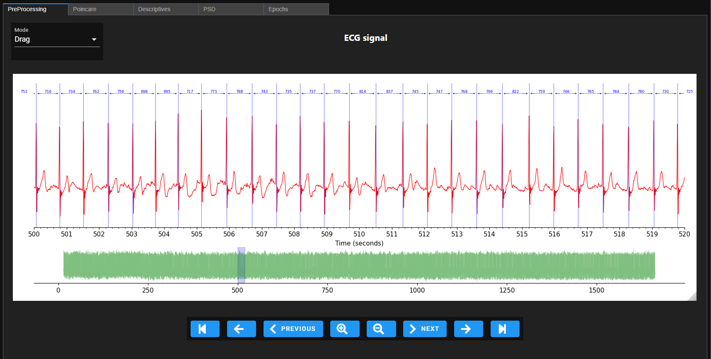
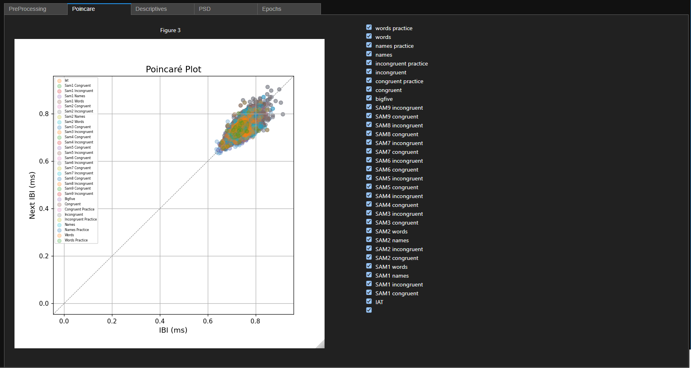
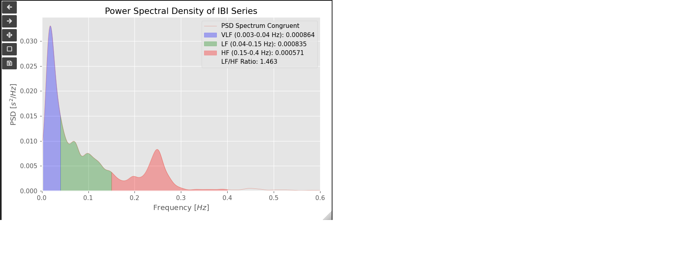
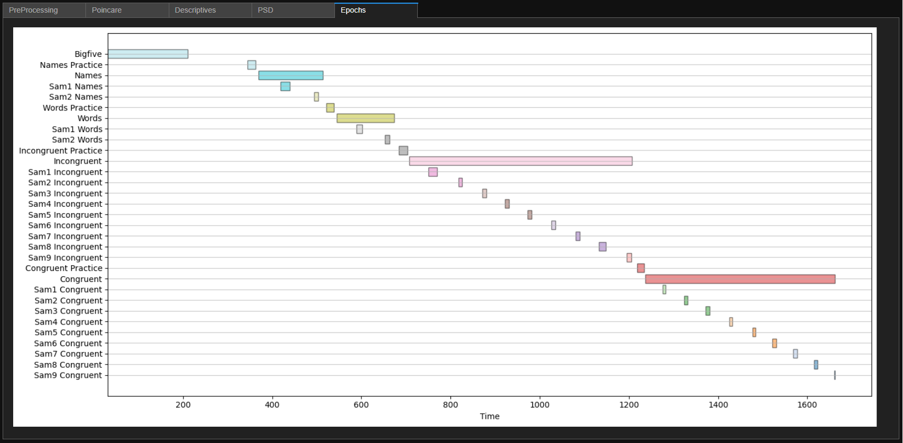

[](https://binderhub.app.rug.nl/v2/gh/ArjanOnGithup/Experimental-Skills/HEAD)

> **⚠️ CAUTION:**  
> <p style="color: red;">This project is work in progress. It can not be used for data analysis yet. Breathing and blood pressure data are totally untested/not yet implemented.</p>

This project is mainly the introduction of a library. The idea is that library can be used without knowledge of `python` by using the App. The App runs primarily in Jupyter.

# HRApp: An Interactive Heart Rate Variability (HRV) Analysis Tool

## Overview

The **HRApp** is an interactive tool designed to assist in the analysis of heart rate variability (HRV) data. It provides a graphical user interface (GUI) within Jupyter Notebooks to explore, preprocess, and visualize HRV data. The app organizes its features into multiple tabs, each focusing on a specific aspect of HRV analysis.

## Features

1. **PreProcessing Tab**  
   - Provides tools to preprocess HRV data, such as cleaning and inspecting inter-beat intervals (IBI).
   - Displays a customizable GUI for manipulating the dataset.

2. **Poincare Tab**  
   - Visualizes HRV data using Poincaré plots, which highlight the relationships between successive IBIs.
   - Ideal for assessing nonlinear dynamics in heart rate data.

3. **Descriptives Tab**  
   - Computes detailed descriptive statistics for IBIs, grouped by epochs.
   - Includes metrics such as mean, standard deviation, RMSSD, SDNN, SD1, SD2, and others.
   - Integrates power spectral density (PSD) results into the statistics, if available.

4. **PSD Tab**  
   - Uses Welch's method to compute power spectral density (PSD) for HRV data.
   - Groups PSD results by epochs, providing insights into the frequency domain features of HRV.

5. **Epochs Tab**  
   - Visualizes epochs of HRV data using a Gantt chart.
   - Offers a clear representation of time-based data segmentation.

## How It Works

### Inputs
- **Dataset**: The app requires a dataset containing HRV-related data, such as IBIs, epochs, and other time-series information. This dataset is expected to support operations defined in the `spectHR` library.

### Workflow
1. **Launch the App**  
   Call the `HRApp(DataSet)` function with the appropriate dataset as input. This displays the GUI with five tabs.
   
2. **Switch Between Tabs**  
   Navigate through tabs to explore different aspects of HRV analysis. The selected tab dynamically updates its content:
   - Preprocessing tools in the **PreProcessing** tab.
   - Poincaré plot in the **Poincare** tab.
   - Statistical summaries in the **Descriptives** tab.
   - PSD analysis in the **PSD** tab.
   - Epoch visualizations in the **Epochs** tab.

3. **Real-Time Updates**  
   The app dynamically updates visualizations and calculations as you interact with each tab. Outputs are recalculated and displayed in real-time.

4. **Data Saving**  
   Changes to the dataset, such as computed statistics or PSD values, are saved automatically.

### Outputs
- Visualizations (e.g., plots, charts) for exploring HRV dynamics.
- Computed metrics and summaries for HRV data.
- Processed datasets ready for further analysis.

## Dependencies

- **Python Libraries**:  
  - `pyxdf`: For reading .XDF files.
  - `ipywidgets`: For interactive UI elements.
  - `spectHR`: Custom library for HRV preprocessing and analysis.
  - `pyhrv`: For HRV metrics calculation.
  - `pandas`: For data manipulation and statistics.

- **Environment**:  
  - Jupyter Notebook or JupyterLab (preferred) for running and displaying the app.

## Example Usage

```python
import spectHR as cs
%matplotlib widget

DataSet = cs.SpectHRDataset("SUB_005.xdf", use_webdav=True, reset = False)
DataSet = cs.borderData(DataSet)
DataSet = cs.filterECGData(DataSet, {"filterType": "highpass", "cutoff": .50})
if not hasattr(DataSet, 'RTops'):
    DataSet = cs.calcPeaks(DataSet)

# Launch the HRV analysis application
App = cs.HRApp(DataSet)
```

## Screenshots

Because everybody likes screenshots:










---

This tool is ideal for researchers, clinicians, and students who work with HRV data and require an interactive, user-friendly interface for their analyses.

# spectHR - Cardiovascular Spectral Analysis Toolkit

`spectHR` is a Python library designed for interactive analysis of time series data, particularly focused on ECG and breathing patterns. The library provides tools for detecting peaks (R-tops) in ECG data, spectral analysis, and interactive visualization of time series data. It includes various modes for modifying, selecting, and analyzing R-tops and other key events in the data.

## Features
- **Reads XDF**: It reads [labstreaminglayers](https://github.com/sccn/labstreaminglayer) .XDF files. the ECG stream is detected if its label contains 'polar'. Generally for use with the PolarBand H10 and the
[PolarGUI](https://github.com/markspan/PolarBand2lsl) application. Markers are ready from a seperate stream, and should follow the patterns `start label` and `end label` to mark an epoch (named 'label').
- **ECG and Breathing Pattern Analysis**: Process and analyze time series data, including ECG and breathing patterns.
- **Peak Detection (R-tops)**: Automatically detect R-top times in ECG signals.
- **Interactive Plotting**: Use draggable vertical lines to visualize and manipulate R-tops within a plot.
- **Zoom and Epoch Selection**: Interactively zoom into regions of interest and select epochs for marking.
- **Spectral Analysis**: Perform cardiovascular spectral analysis to study heart rate variability and other metrics.


## Installation

### Requirements

- Python 3.7+
- Jupyter notebook or JupyterLab
- ipywidgets
- pyhrv
- ipyvuetify (for nicer looking widgets)


### Install the library
<not yet. but you can clone this repo...>
 
You can install `spectHR` using pip:

```bash
pip install spectHR
```
Or, if you're developing locally, clone the repository and install it in editable mode:

```bash
git clone https://github.comA/rjanOnGithup/Experimental-Skills.git
cd spectHR
pip install -e .
```

## Usage
To use `spectHR` in your Jupyter notebook, import the necessary components and load your ECG data for analysis.

```python
import spectHR as cs

# Example: Load ECG data and perform peak detection
DataSet = cs.SpectHRDataset("Example Data/SUB_002.xdf") 
DataSet = cs.calcPeaks(DataSet)
```
This function systematically classifies Inter-Beat Intervals (IBIs) derived from R-top times in an ECG dataset based on statistical thresholds. Each classification captures specific temporal characteristics or patterns in the intervals between successive heartbeats:

- "N" (Normal): IBIs that fall within the expected range, determined by a rolling average and a standard deviation envelope (lower and higher thresholds). These intervals represent the individual's typical cardiac rhythm, without deviations beyond defined statistical boundaries.


- "S" (Short): An IBI is labeled as "Short" if it is significantly smaller than the lower threshold (lower). This classification highlights faster-than-usual intervals that deviate from the individual's baseline rhythm.


- "L" (Long): IBIs exceeding the upper threshold (higher) are categorized as "Long." These represent slower-than-usual intervals, reflecting a departure from the individual's expected rhythm.


- "TL" (Too Long): An IBI is marked as "Too Long" if it surpasses an absolute duration threshold (Tmax), signifying intervals that are exceptionally prolonged and may indicate abnormalities or measurement artifacts.


- "SL" (Short-Long): This classification identifies a specific pattern where a "Short" IBI is immediately followed by a "Long" IBI. Such sequences may indicate variability in cardiac timing, often observed in transitional patterns or measurement noise.


- "SNS" (Short-Normal-Short): This label applies to a sequence of three consecutive IBIs, where a "Short" IBI is followed by a "Normal" IBI, then another "Short" IBI. This pattern highlights irregularities interspersed with typical intervals.


The algorithm calculates a moving average and standard deviation of IBIs over a sliding time window (Tw), defining dynamic, individual-specific thresholds for classifying deviations. Each IBI is assessed against these thresholds and assigned an appropriate label. Subsequent steps ensure detection of sequential patterns like "SL" and "SNS," enhancing the granularity of the classification.

The function also provides a summary of detected classifications, logging the frequency of each label. This systematic approach helps identify deviations from regular heartbeat intervals and potential artifacts, supporting detailed analysis of ECG data.


### Parameters used in the classification:

#### Tw (Window Size):

Description: Specifies the size of the rolling window (in beats) used to calculate the moving average (avIBIr) and standard deviation (SDavIBIr) of the Inter-Beat Intervals (IBIs).

Usage:

Affects the dynamic thresholds (lower and higher) by smoothing the IBIs over a range defined by this window.

Larger values of Tw create smoother thresholds but may overlook short-term variability, while smaller values result in more sensitive thresholds that reflect short-term changes.

Default: **Tw = 51.**

#### Nsd (Number of Standard Deviations):

Description: Determines the multiplier for the standard deviation when calculating the dynamic thresholds (lower and higher) for classifying IBIs as "Short" (S) or "Long" (L).

Usage:

Affects the boundaries of normal IBIs:

The thresholds are calculated as:

$$
lower,upper = avIBIr ± (Nsd * SD(avIBI)r)`
$$

Higher values of Nsd result in wider thresholds, reducing sensitivity to variations, while lower values make the classification more sensitive to smaller deviations.

Default: **Nsd = 4.**

#### Tmax (Maximum Interval Threshold):

Description: Sets an absolute upper limit (in seconds) for classifying IBIs as "Too Long" (TL).

Usage:

Any IBI exceeding this value is immediately labeled as "Too Long," irrespective of the dynamic thresholds (higher and lower).

Provides a fixed boundary to capture extreme outliers that may indicate significant irregularities or artifacts in the data.

Default: **Tmax = 5.**

### How These Parameters Influence the Function

#### Calculation of Dynamic Thresholds:

The rolling window size (Tw) and standard deviation multiplier (Nsd) work together to create individual-specific thresholds. These thresholds adapt to the temporal variability of the IBIs, classifying deviations as either "Short" (S) or "Long" (L).

#### Absolute Threshold (Tmax):

Serves as an override for dynamic thresholds by assigning the "Too Long" (TL) label to any IBI that exceeds this fixed value. This ensures extreme outliers are captured even if they fall within the dynamic thresholds.

#### Impact on Classification:

Dynamic Adjustments: The combination of Tw and Nsd tailors the classification to the individual's data, ensuring the function is sensitive to relative changes while minimizing false positives.

Outlier Detection: Tmax ensures robustness by capturing exceptionally long intervals, regardless of variability in the moving averages.

#### Summary of Parameter Roles

This parameter structure allows flexibility in adapting the function to different datasets and use cases, balancing sensitivity and robustness in IBI classification.

Once the data is loaded, you can visualize it with interactive plots:

```python
GUI = cs.prepPlot(DataSet)  # Plot ECG with draggable R-top lines
```

### Available Modes

- Drag: Move the vertical lines (R-tops) along the x-axis to adjust detection.
- Remove: Select and remove individual R-tops by clicking on the lines.
- Add: Add a new R-top at a specific location on the plot.

This will allow you to interact with the ECG plot, dragging R-top lines and updating the dataset accordingly.

## Poincaré Plots

Poincaré plots are widely used tools for visualizing and analyzing heart rate variability (HRV) from ECG data. They provide a two-dimensional representation of consecutive inter-beat intervals (IBIs), where each interval is plotted against the subsequent one.

In `spectHR`, Poincaré plots help assess the regularity and variability of the heart rhythm and provide quantifiable measures that describe short-term and long-term HRV.

### How It Works

Given a sequence of inter-beat intervals (IBI):

$$
IBI_1, IBI_2, IBI_3, \dots, IBI_n
$$
Then: 

$$
(IBI_i, IBI_{i+1})
$$

creates a scatter plot where the x-axis represents  (current interval) and the y-axis represents  (next interval).

### Key Features

- Scatter Visualization: Visualizes the beat-to-beat dynamics of the cardiac rhythm.

- Shape Analysis: The distribution and clustering of points provide insights into autonomic nervous system regulation.

- Quantitative Measures: Calculates specific parameters describing the spread and organization of points.

---

### Parameters Calculated from Poincaré Plots

#### SD<sub>1</sub> (Short-term Variability)

SD<sub>1</sub> measures the standard deviation of points perpendicular to the line of identity ().

Represents short-term HRV, reflecting beat-to-beat variability.

Formula:

$$
SD_1 = \sqrt{\frac{1}{2} \text{Var}(IBI_{i+1} - IBI_i)}
$$

#### SD<sub>2</sub> (Long-term Variability)

SD<sub>2</sub> measures the standard deviation of points along the line of identity ().

Represents long-term HRV, capturing overall variability of the IBIs.

Formula:

$$
SD_2 = \sqrt{2 \cdot \text{Var}(IBI_i) - \frac{1}{2} \text{Var}(IBI_{i+1} - IBI_i)}
$$

#### SD<sub>2</sub>/SD<sub>1</sub> Ratio

The ratio between SD<sub>1</sub> and SD<sub>2</sub> is used to analyze the balance between short-term and long-term HRV.
$$
 SD_{ratio} = \frac{SD_2}{SD_1}
$$

#### Ellipse Fitting

The Poincaré plot can be approximated by an ellipse centered on the line of identity.

SD<sub>1</sub> corresponds to the width of the ellipse (short axis).

SD<sub>2</sub> corresponds to the length of the ellipse (long axis).
The area of the ellipse is often calculated as:

\[
\text{Area} = \pi \cdot SD_1 \cdot SD_2
\]

---

### Interpretation of Poincaré Plots

- Tight Clustering Around Identity Line: Indicates low HRV and reduced autonomic regulation (e.g., under stress or disease states).

- Elliptical Shape with Large Spread: Suggests healthy HRV with dynamic autonomic modulation.

- (x,y) points that are topographically district, are an indication of a mis-trigger of the r-top.

---

#### Example Code

Here is how to generate a Poincaré plot and calculate parameters in `spectHR`:

```python
cs.poincare(DataSet)
```

This will display a scatter plot of  vs  and compute SD<sub>1</sub>, SD<sub>2</sub>, and SD<sub>1</sub>/SD<sub>2</sub> ratio, along with other descriptive statistics.
The plot also allows for selecting relevant epochs in the data. In the standard views of the data in the library, these selections are upheld.

## Contributing
If you'd like to contribute to `spectHR`, feel free to fork the repository and submit pull requests. Please ensure that your code follows the existing style and includes appropriate tests.

## License
`spectHR` is released under the GNU License. See the LICENSE file for more details.

