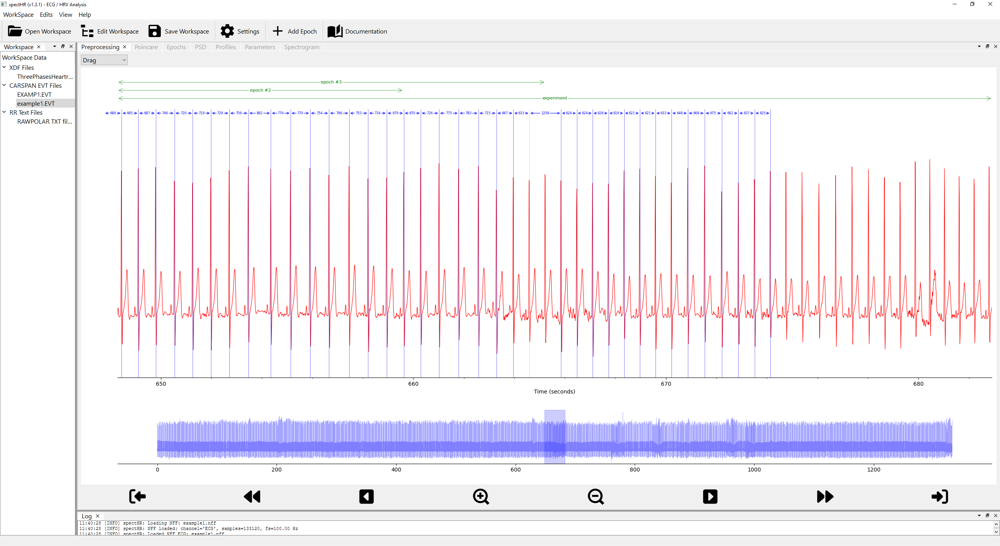
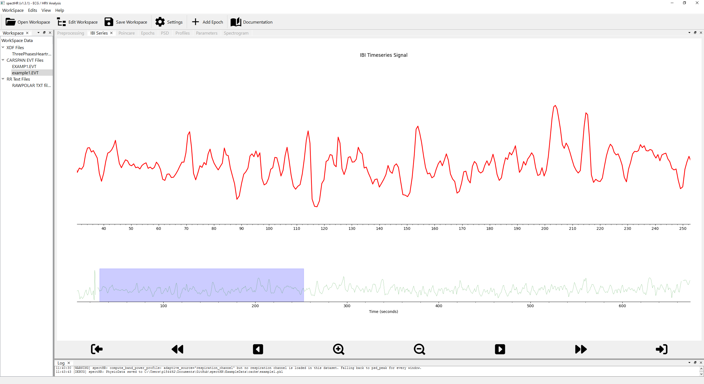
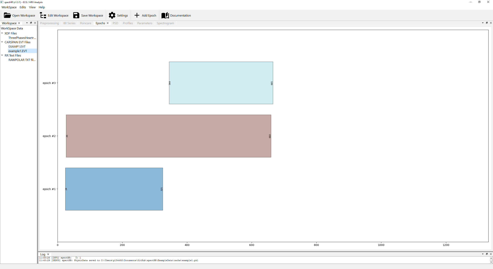
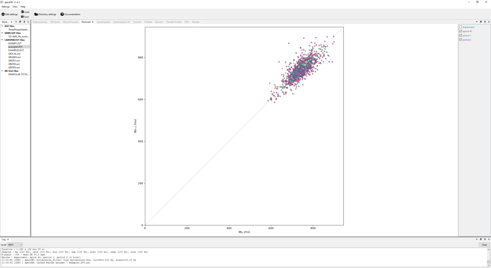
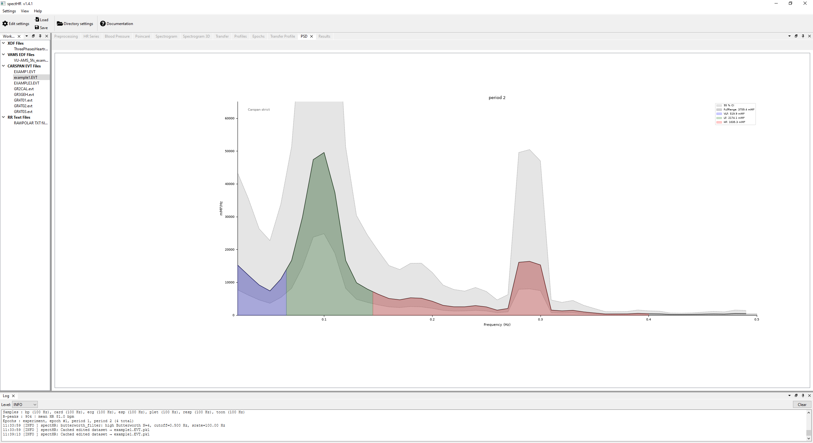

  

⚠️ CAUTION

This project is a work in progress. Blood pressure analysis is not yet implemented. Breathing signal extraction and visualisation are functional but should be treated as experimental.

---

<a href="#what-is-specthr"><strong>What is spectHR?</strong></a>

<a href="#theoretical-background"><strong>Theoretical background</strong></a>

- [Mental effort, not stress](#mental-effort-not-stress)
- [Frequency bands](#frequency-bands)
- [Practical considerations](#practical-considerations)

<a href="#getting-started"><strong>Getting started</strong></a>

<a href="#the-interface-at-a-glance"><strong>The interface at a glance</strong></a>

- [Step 1, Check and clean the ECG (Preprocessing tab)](#step-1-check-and-clean-the-ecg-preprocessing-tab)
- [Step 2, Inspect the IBI timeseries (IBI Series tab)](#step-2-inspect-the-ibi-timeseries-ibi-series-tab)
- [Step 3, Define your analysis segments (Epochs tab)](#step-3-define-your-analysis-segments-epochs-tab)
- [Step 4, Explore autonomic dynamics (Poincaré tab)](#step-4-explore-autonomic-dynamics-poincaré-tab)
- [Step 5, Examine frequency-domain HRV (PSD tab)](#step-5-examine-frequency-domain-hrv-psd-tab)
- [Step 6, Export your results (Parameters tab)](#step-6-export-your-results-parameters-tab)

<a href="#configuring-the-analysis"><strong>Configuring the analysis</strong></a>

<a href="#data-formats"><strong>Data Formats</strong></a>

- [XDF (LabStreamingLayer)](#xdf-labstreaminglayer)
- [Polar .txt](#polar-txt)
- [CARSPAN .evt / .nff](#carspan-evt--nff)

<a href="#ibi-classification"><strong>IBI Classification</strong></a>

- [Classification algorithm](#classification-algorithm)
- [Comparison with CARSPAN](#comparison-with-carspan)

<a href="#breathing-signal-extraction"><strong>Breathing Signal Extraction</strong></a>

<a href="#poincaré-metrics"><strong>Poincaré Metrics</strong></a>

<a href="#power-spectral-density-method-details"><strong>Power Spectral Density, method details</strong></a>

- [Welch's method](#welchs-method)
- [CARSPAN method](#carspan-method)
- [Confidence intervals](#confidence-intervals)
- [Frequency bands](#frequency-bands-1)
- [Units and normalisation](#units-and-normalisation)

<a href="#installation"><strong>Installation</strong></a>

- [Windows](#windows)
- [Linux](#linux)
- [macOS](#macos)

<a href="#contributing"><strong>Contributing</strong></a>

<a href="#license"><strong>License</strong></a>

<a href="#references"><strong>References</strong></a>

---

# spectHR: An Interactive HRV Analysis Tool

## What is spectHR?

**spectHR** is a free, open-source desktop application for Heart Rate Variability (HRV) analysis. It is built for researchers and students who want to move from a raw electrocardiogram (ECG) to interpretable HRV metrics without writing any code, and without trusting a black box.

Heart rate variability reflects the fluctuations inter-beat intervals (IBI). These fluctuations are regulated by the autonomic nervous system: higher HRV generally indicates flexible, healthy regulation; lower HRV is associated with stress, disease, or fatigue. By analysing the power in different frequency bands of the IBI series, spectHR lets you separate the parasympathetic (HF) and sympathetic/parasympathetic (LF) contributions to heart rate control in each named epoch of your recording.

The key principle behind spectHR is that **you have to check data quality**. Every step that could go wrong, R-peak detection, noisy intervals, epoch boundaries, is shown to you visually and can be corrected before any metrics are computed.

---

## Theoretical background

Generally, heart rate variability (HRV) reflects the continuous interplay between the two branches of the autonomic nervous system (ANS). The **parasympathetic** branch, acting via the vagus nerve, produces rapid beat-to-beat fluctuations — including respiratory sinus arrhythmia (RSA). The **sympathetic** branch exerts slower influences, mainly through vasomotor tone and blood pressure regulation. Because the two branches operate at different speeds, spectral analysis separates their contributions by frequency. ([Mulder, 1989](#ref-mulder1989); [Task Force of the European Society of Cardiology, 1996](#ref-taskforce1996)).

A note on the two-branch picture: both branches can be simultaneously active or withdrawn. HRV does not directly reveal what the sympathetic branch is doing. Broader conclusions about autonomic balance require additional signals such as blood pressure, breathing patterns or pre-ejection period.

### Mental effort, not stress

The CARSPAN tradition, which spectHR inherits, utilizes the constructs *mental effort* and *mental workload* rather than *stress*. Mental effort is defined as the resources invested in response to task demands - a construct that can be experimentally manipulated and whose physiological cost can be measured independently of the subjective experience of strain.

Mulder [(1980)](#ref-mulder1980) showed that task performance suppresses HRV, particularly in the mid-frequency band (~0.10 Hz) that reflects baroreceptor-driven blood pressure oscillations. Mulder [(1989)](#ref-mulder1989) formalised the framework: the suppression reflects invested effort, not task difficulty. A person who disengages from a hard task shows little HRV change; one working hard at an easy task shows a marked decrease ([Mulder, 1992](#ref-mulder1992)). The pattern generalises across driving ([de Waard, 1996](#ref-dewaard1996); [Mulder et al., 2004](#ref-mulder2004)), aviation ([De Rivecourt et al., 2008](#ref-derivecourt2008)), clinical work ([Peabody et al., 2023](#ref-peabody2023)), and driving simulation studies ([Arutyunova et al., 2024](#ref-arutyunova2024)).

HRV does not measure perceived stress. It measures a physiological state: the cost of effort investment that may or may not correspond to what a person calls "feeling stressed." The gap between the two is where individual differences and coping strategies operate. Treating HRV as a direct readout of stress conflates distinct levels of analysis.

### Frequency bands

spectHR computes power in three bands ([Mulder, 1989](#ref-mulder1989); [Mulder, 1988](#ref-mulder1988)), following the CARSPAN convention. Band boundaries are **user-configurable** to accommodate different research traditions.

### Practical considerations

**Recording length.** Frequency resolution is $\Delta f = 1/T$. A 5-minute epoch gives $\Delta f \approx 0.003$ Hz, enough to resolve MF and HF cleanly. Shorter epochs give coarser resolution and wider confidence intervals — visible in spectHR's shaded CI band. Note that this applies to spectral measures only: [Tegegne et al. (2019)](#ref-tegegne2018) showed that a 10-second ECG yields a valid RMSSD estimate in large samples.

**Artefacts are critical.** A single missed or spurious R-peak introduces broadband spectral energy that can swamp the genuine HRV signal ([Mulder, 1988](#ref-mulder1988)). This is why spectHR requires the user to inspect and verify the IBI series before computing any metrics.

**Normalisation.** Absolute spectral power in ms² scales with mean IBI squared, increasing at lower heart rates. The CARSPAN mMI² normalisation corrects for this automatically. For the Welch method the output unit is configurable: the default is **mMI²** (normalised, heart-rate-independent) but can be switched to **ms²** (raw IBI power, not normalised) via the `"units"` key in *Edit Parameters*. Whether to normalise HRV for mean heart rate is genuinely unresolved ([de Geus et al., 2019](#ref-degeus2019)), and no single recommendation fits all research questions.

The two choices show the same frequencies (the rhythms of heart rate variability), but measured differently.
ms²/Hz is the direct view. You take the sequence of beat-to-beat intervals in milliseconds, and ask how its variance is spread across frequencies. At any given frequency, this value tells you how much millisecond-squared variability sits there, per unit of frequency bandwidth. Integrate the curve over a band (for example HF, 0.15 to 0.40 Hz) and the result is band power in ms². That number is intuitive in absolute terms: an HF power of 1000 ms² means the HF rhythm contributes about √1000 ≈ 32 ms of variation to the IBI signal.
The catch is that ms²/Hz depends strongly on mean heart rate. Someone with a slow resting heart (mean IBI 1200 ms) has more absolute room to fluctuate in milliseconds than someone with a fast heart (mean IBI 600 ms), even when both modulate their heart rate by the same proportion. So comparing absolute ms² between subjects, or between rest and exercise within one subject, is muddied by baseline differences in heart rate.
mMI²/Hz removes that dependence. CARSPAN works from the R-peak event series and divides the spectrum by the squared mean heart rate. What comes out is dimensionless: it no longer asks "how many ms of fluctuation," but "what fraction of the mean does the rhythm modulate?" Because that fraction is small, the result is multiplied by 10⁶ so values land in a readable range. The unit name reflects this scaling: milli-Modulation-Index squared, mMI².
The y-axis of an mMI²/Hz plot is therefore a relative modulation strength per Hz. Integrating over a band gives band power in mMI², with a clean interpretation tied directly to the coefficient of variation of heart rate: a 1% CoV contributes 100 mMI² of total power (since 0.01² × 10⁶ = 100), and a 10% CoV contributes 10 000 mMI². Read backwards, an HF band power of 250 mMI² means the high-frequency rhythm modulates heart rate by roughly √(250 × 10⁻⁶) ≈ 1.6%.
In short: use ms²/Hz when you care about the absolute size of the millisecond fluctuations themselves. Use mMI²/Hz when you want to compare HRV rhythms across people, sessions, or conditions where mean heart rate differs, because it expresses the rhythms as a percentage of the heartbeat being modulated rather than as an absolute amplitude.

**spectHR operates on IBI time series.** The core analyses - time-domain HRV, spectral band power, Poincaré geometry - require only inter-beat intervals. Simultaneous blood pressure or respiration recordings are not needed. That said, the most reliable conclusions about mental effort come from converging evidence across heart rate, HRV, and when available, blood pressure and baroreflex sensitivity. Stuiver and Mulder [(2014)](#ref-stuiver2014) showed that the full cardiovascular pattern was more diagnostically informative than any single measure in isolation.

---

## Getting started

1. Launch the application. On first run it creates a default workspace pointing to your Documents folder.
2. Open **WorkSpace → Edit Workspace** to point spectHR at the folder where your data files live.
3. Your files appear in the tree on the left. Click one to load it.
4. Work through the tabs from left to right: clean the ECG, define your epochs, then read the results.

---

## The interface at a glance

The window is divided into two areas. On the left is a narrow **file tree** listing all datasets in your configured data folder. On the right is the main **analysis area**, organised into six tabs:

| Tab | What you do there |
|-----|------------------|
| **Preprocessing** | Verify and correct R-peak detection |
| **IBI Series** | Review the IBI timeseries |
| **Poincaré** | Explore beat-to-beat dynamics visually |
| **Epochs** | Draw and adjust your analysis segments |
| **PSD** | Read the frequency-domain power spectrum per epoch |
| **Parameters** | See all HRV metrics in a table and export to CSV |

---

### Step 1, Check and clean the ECG (Preprocessing tab)

This is the most important step. The quality of every metric downstream depends entirely on whether the R-peaks have been detected correctly.

When you select a file, spectHR loads the ECG, finds R-peaks automatically, and displays everything in the Preprocessing tab. The **main plot** shows the raw ECG signal in red. Every detected R-peak is marked with a vertical coloured line, and the IBI (in milliseconds) is printed as an arrow between consecutive peaks. A **colour code** immediately tells you which beats look suspicious, see [IBI Classification](#ibi-classification) for the full scheme.

If a breathing signal is available from the device's accelerometer, it appears as a **green curve** overlaid on the ECG. Light-blue shading marks inhalation phases. Below the main ECG is a **thumbnail strip** showing the entire recording. The **navigation bar** at the bottom lets you jump to the next or previous abnormal beat, pan, and zoom.

When you spot a problem, use the **mode selector**:
- **Drag**, shift a peak line to its correct position.
- **Add**, click anywhere on the ECG to insert a missing peak.
- **Remove**, click a peak line to delete a spurious detection.

All changes are saved automatically to the cache file when you leave the tab.

Tip

Right-clicking a file gives you **Reload Raw**, **Invert ECG Polarity**, and **Retrigger ECG**.

---

### Step 2, Inspect the IBI timeseries (IBI Series tab)

Once the peaks look correct, switch to the **IBI Series tab** to see heart rate over time in beats per minute. If a breathing signal is available it is shown as a faint green overlay.

---

### Step 3, Define your analysis segments (Epochs tab)

HRV metrics are always computed within named segments. The **Epochs tab** shows a Gantt-style chart. If your recording contains marker events, epochs are built automatically. You can also add epochs manually via **Actions → Add Epoch** and trim them by dragging their edges. Any change here immediately updates the Poincaré plot, the PSD plots, and the metrics table.

---

### Step 4, Explore autonomic dynamics (Poincaré tab)

The **Poincaré tab** shows a scatter plot where each point represents one heartbeat: its IBI on the x-axis and the following IBI on the y-axis. A healthy autonomic system produces a characteristic elliptical cloud elongated along the diagonal. The short axis (SD1) reflects rapid, beat-to-beat variability; the long axis (SD2) reflects slower variability. Each active epoch is drawn in a different colour with its own ellipse overlaid.

A note on SD1 and SD2

SD1 and SD2 carry no statistical information beyond RMSSD and SDNN respectively. Van Roon et al. (2025) demonstrate this rigorously: SD1 $= \text{RMSSD}/\sqrt{2}$ by definition, and SD2 follows algebraically from SDNN and RMSSD. spectHR reports them because they are widely expected in the literature and because the Poincaré plot is a useful visual summary, but users should not treat SD1 and SD2 as independent metrics alongside RMSSD and SDNN in statistical analyses.

*van Roon, A.M., Span, M.M., Lefrandt, J.D., & Riese, H. (2025). Overview of mathematical relations between Poincaré plot measures and time and frequency domain measures of heart rate variability. Entropy, 27(8), 861.* https://doi.org/10.3390/e27080861

---

### Step 5, Examine frequency-domain HRV (PSD tab)

The **PSD tab** shows one power spectrum per active epoch. Four frequency bands are shaded (usefull defaults in brackets):

- **FullRange (0.02–0.65 Hz)**, the total HRV spectrum.
- **VLF (0.02–0.06 Hz)**, slow regulatory processes.
- **LF (0.07–0.14 Hz)**, baroreflex, mixed sympathetic/parasympathetic.
- **HF (0.15–0.40 Hz)**, respiratory sinus arrhythmia, parasympathetic tone.

Ranges are configurable. The shaded grey band is the **confidence interval**. Three PSD methods are available — `carspan`, `carspan_strict`, `welch` — selected in **WorkSpace → Edit Parameters**. The method takes effect immediately without restarting.

---

### Step 6, Export your results (Parameters tab)

The **Parameters tab** shows a table with one row per epoch:

- **Time-domain:** count, mean, median, min, max, std, RMSSD, SDNN, SDSD
- **Poincaré:** SD1, SD2, SD2/SD1, ellipse area
- **Frequency-domain:** FullRange, VLF, LF, HF power and LF/HF ratio — in **mMI²** by default; Welch can be switched to **ms²** via *Edit Parameters*

Click **Save** to export to CSV.

---

## Configuring the analysis

All parameters are stored in a JSON workspace file, editable through the application menus.

**WorkSpace → Edit Workspace** changes the three folder paths (data, cache, export).

**WorkSpace → Edit Parameters** covers:
- *Frequency Analysis*, PSD method, band edges and colours, method-specific parameters, CI level.
- *IBI Classification*, window length, threshold multiplier, TL ceiling.
- *ECG Preprocessing*, high-pass filter settings.

Changes take effect immediately and are saved to disk.

---

## Data Formats

### XDF (LabStreamingLayer)

spectHR reads `.xdf` files from [LabStreamingLayer](https://github.com/sccn/labstreaminglayer), designed for use with the [Polar H10](https://www.polar.com/en/sensors/h10-heart-rate-sensor) via [PolarBLE](https://github.com/markspan/PolarBLE). Streams are identified automatically. Epochs are derived in one of two ways:

- **Explicit markers** — if any marker stream contains labels beginning with `start <label>` / `stop <label>` (or `end <label>`), those are used to build named epochs in the usual way.
- **Keyboard stream fallback** — if no explicit start/stop markers are present but a stream named `Keyboard` exists, spectHR builds consecutive, non-overlapping epochs from every marker that ends with `" pressed"`. Each such marker starts a new epoch named by the key that was pressed (the marker text with `" pressed"` stripped). The epoch ends when the next key is pressed, or at the end of the recording for the final epoch. If the same key is pressed more than once its epochs are numbered (`a #1`, `a #2`, …).

### Polar .txt

The plain-text RR-interval export format from the Polar app. See `ExampleData/`.

### CARSPAN .evt / .nff

CARSPAN event files. If an `.nff` file with the same base name is present, spectHR loads the ECG channel from it. In that case the R-peak timestamps from the `.evt` file are authoritative: the ECG is filtered for display but R-peaks are **not** re-detected from it (the loader sets `rtops_locked` on the resulting `CardioSeries`).

---

## IBI Classification

After R-peak detection, each inter-beat interval is classified before any metrics are computed. The beat colour in the ECG plot reflects its label:

| Label | Meaning | Colour |
|-------|---------|--------|
| N | Normal, within the expected range | Blue |
| S | Short, below the lower threshold | Magenta |
| L | Long, above the upper threshold | Cyan |
| TL | Too Long, exceeds the absolute ceiling; excluded from all metrics | Orange |
| SL | Short followed immediately by Long | Turquoise |
| SNS | Short-Normal-Short triplet | Light sea green |
| T | Degenerate (NaN or zero duration); excluded from all metrics | — |

Terminology

**Terminology:** The CARSPAN documentation occasionally uses the term *Energy* where *Power* is the correct term. spectHR uses *Power* consistently throughout.

---

Classification algorithm

### Classification algorithm

Let $\text{IBI}_i$ denote the $i$-th inter-beat interval and let $\bar{\text{IBI}}$ and $\sigma$ denote the **local** mean and standard deviation over a centred rolling window of $W$ beats. Classification proceeds as follows:

| Condition | Label |
|-----------|-------|
| $`\text{IBI}_i > T_{\max}`$ | **TL** *(excluded from all statistics)* |
| $`\text{IBI}_i \leq 0`$ or NaN | **T** *(excluded from all statistics)* |
| $`\text{IBI}_i > \bar{\text{IBI}} + N \cdot \sigma`$ | **L** |
| $`\text{IBI}_i < \bar{\text{IBI}} - N \cdot \sigma`$ | **S** |
| beat $`i`$ is S and beat $`i+1`$ is L | **SL** |
| beat $`i`$ is S, beat $`i+1`$ is N, beat $`i+2`$ is S | **SNS** |
| otherwise | **N** |

**Default parameters** (all configurable in *Edit Parameters*):

| Parameter | Default | JSON key |
|-----------|---------|----------|
| Window length $`W`$ | 51 beats | `window_length` |
| Threshold $`N`$ | 4.0 std | `n_std` |
| TL ceiling $`T_{\max}`$ | 2.0 s | `max_ibi_sec` |

---

### Comparison with CARSPAN

Users familiar with CARSPAN will notice several differences in the classification approach. Each is a deliberate design choice.

#### 1. Refractory period, implemented at detection, not classification

CARSPAN enforces a hardware refractory period $T_\text{refr} = 300~\text{ms}$ at the classification stage, rejecting any detected interval shorter than this. spectHR implements the equivalent constraint earlier in the pipeline as the `min_peak_distance_ms` parameter passed to `scipy.signal.find_peaks`. Any two candidate peaks closer than 300 ms simply cannot both be detected. This approach prevents the false detection from entering the data in the first place. The effect on the classified IBI series is identical.

#### 2. Window type, centred rather than causal

CARSPAN computes its running statistics over a **causal** (backward-looking) window of $T_w = 60~\text{s}$. spectHR uses a **centred** window of $W$ beats, incorporating beats both before and after the current interval. A centred window produces more stable thresholds at condition boundaries, precisely where accurate classification is most important in psychophysiological research. A causal window adapts its threshold only *after* a heart rate change has occurred, which can flag the first beats of a new condition incorrectly.

#### 3. Window unit, beats rather than seconds

CARSPAN's window is defined in seconds; spectHR's in beats. For a resting heart rate of ~70 bpm, 51 beats ≈ 44 seconds, close to CARSPAN's default of 60 seconds. A beat-based window always contains the same number of statistical observations regardless of heart rate.

#### 4. Successive difference criterion, not implemented

CARSPAN also flags a beat if the *difference* between consecutive intervals ($`\text{IBI}_i - \text{IBI}_{i-1}`$) exceeds $`N_\text{SuD}`$ standard deviations of the successive difference series. spectHR does not implement this. The SL and SNS sequence labels already capture the most physiologically relevant abrupt patterns. Adding a separate threshold would introduce a second set of parameters that could conflict with the sequence labels in ambiguous cases.

#### 5. Min/Max SD clipping, not implemented

CARSPAN clips the standard deviation used for thresholding to a minimum of 5 % and a maximum of 15 % of the local mean IBI. spectHR relies instead on the user's choice of `n_std` and `max_ibi_sec`. The absolute ceiling guards the upper extreme; the 300 ms minimum peak distance guards the lower extreme.

#### 6. Automatic interpolation, not implemented

CARSPAN automatically corrects detected artefacts by linear interpolation, inserting estimated beats and adding normally-distributed noise to prevent variance reduction. spectHR does not perform automatic correction. Every flagged beat is shown in the Preprocessing tab and can be corrected manually. Intervals left uncorrected and labelled TL or T are excluded from all metric calculations. This reflects spectHR's core principle: **you**, not the algorithm, decide what to do with each artefact.

---

## Breathing Signal Extraction

When a Polar H10 accelerometer stream is present, spectHR derives a respiration surrogate from the 3-axis chest-belt movement data by removing the gravity component, bandpassing to 0.10–0.70 Hz, and applying PCA to extract the dominant axis of motion as a single 1-D signal. The result is z-score normalised and overlaid in green on the ECG and heart rate plots. Inhalation phases are shaded in light blue.

---

## Poincaré Metrics

**SD1**, beat-to-beat variability, equal to $\text{RMSSD}/\sqrt{2}$:

$$\text{SD1} = \sqrt{\tfrac{1}{2} \cdot \mathrm{Var}(\text{IBI}_{i+1} - \text{IBI}_i)}$$

**SD2**, longer-term variability, algebraically related to SDNN and RMSSD:

$$\text{SD2} = \sqrt{2 \cdot \mathrm{Var}(\text{IBI}_i) - \tfrac{1}{2} \mathrm{Var}(\text{IBI}_{i+1} - \text{IBI}_i)}$$

**SD1/SD2**, autonomic balance index.

**Ellipse area** $= \pi \cdot \text{SD1} \cdot \text{SD2}$, total HRV.

**Important:** SD1 and SD2 are fully determined by RMSSD and SDNN and therefore carry no additional statistical information ([van Roon et al., 2025](#ref-vanroon2025)). Including all four in a statistical model introduces redundancy.

---

## Power Spectral Density, method details

### Welch's method

The IBI series (in ms) is resampled onto a uniform time grid with cubic interpolation, divided into overlapping segments, windowed, Fourier-transformed, and averaged. Averaging across segments reduces variance at the cost of frequency resolution. Default output: **mMI²/Hz**; configurable to **ms²/Hz** via the `"units"` workspace key.

Welch, algorithm detail

### Welch, algorithm detail

Let $`x(t)`$ denote the IBI series (in ms), resampled at $`f_s`$ Hz. `scipy.signal.welch` is invoked with `scaling='density'` and returns a one-sided PSD in ms²/Hz.

Band power $B$ in $`[f_l, f_h]`$ is obtained by trapezoidal integration with endpoint interpolation:

$$B = \int_{f_l}^{f_h} \hat{S}(f) df \approx \sum_k \hat{S}(f_k) \Delta f$$

Because consecutive segments overlap, they are not statistically independent. The effective degrees of freedom are reduced accordingly (Percival & Walden, 1993):

$$\nu = \frac{2K}{1 + 2\!\left(1 - \tfrac{1}{K}\right)\rho^2}$$

$$CI(f) = \left[ \frac{\nu \cdot \hat{S}(f)}{\chi^2_{\nu, 1-\alpha/2}}, \quad \frac{\nu \cdot \hat{S}(f)}{\chi^2_{\nu, \alpha/2}} \right]$$

where:
- $K$ — number of segments
- $\rho$ — normalised window autocorrelation at lag equal to the segment step, computed numerically from the actual window samples: $\rho = \sum_n w[n]\, w[n + \text{step}] \;/\; \sum_n w[n]^2$
- $\chi^2_{\nu, p}$ — chi-square quantile at probability $p$ with $\nu$ degrees of freedom
- $\alpha$ — significance level (e.g. 0.05 for a 95% CI)

For non-overlapping segments $\rho = 0$ and $\nu = 2K$. For a Hann window at 50 % overlap $\rho \approx 1/6$, giving $\nu \approx 1.89\,K$ — close to the value for fully independent segments.

**Default parameters** (configurable in *Edit Parameters*):

| Parameter | Default | JSON key |
|-----------|---------|----------|
| Resampling frequency | 4 Hz | `fs` |
| Segment length | 256 samples | `nperseg` |
| Overlap | 128 samples | `noverlap` |
| FFT length | 1024 | `nfft` |
| Window | Hann | `window` |
| Output units | mMI² | `units` |

**Note on resampling.** A 4 Hz resampling rate gives a frequency resolution of $f_s / \text{nperseg} = 4/256 = 0.0156~\text{Hz}$, which is adequate for the standard HRV bands. For short epochs where the available IBI samples are fewer than `nperseg`, the segment length is reduced to the available count and the overlap is halved automatically.

---

### CARSPAN method

CARSPAN takes a different approach. Instead of resampling the IBI series onto a uniform time grid, it operates directly on the R-peak times and computes the Fourier transform of those events — the algorithm Mulder [(1988)](#ref-mulder1988) developed for the original CARSPAN software. No resampling, no interpolation in time. The spectrum is computed on a native frequency grid $f_k = k/T$ (resolution $\Delta f = 1/T$), bin-averaged onto a fixed display grid for plotting, and band power is computed by direct summation following the manual's formula 3.28. Output units: **mMI²**.

CARSPAN, algorithm detail

### CARSPAN, algorithm detail

#### The R-peak event series

Following Rompelman (1975) and Mulder [(1988)](#ref-mulder1988), the heartbeat is modelled as a sequence of unit impulses at the R-peak times $t_i$:

$$x(t) = \sum_{i=1}^{N} \delta(t - t_i)$$

This is the *Integral Pulse Frequency Modulation* (IPFM) representation. Its spectrum reflects **heart-rate** variability, not IBI variability directly. The manual's formula 3.20 normalises out the mean heart rate afterwards, which makes the two equivalent for spectral purposes.

#### Power spectral density (formula 3.19)

Treating the signal outside the analysis window $[0, T]$ as a periodic continuation, the PSD at discrete frequencies $f_k = k/T$ is:

$$S_{xx}(f_k) = \frac{2}{T}\left|\sum_{i=1}^{N} w_i e^{-2\pi j f_k t_i}\right|^2$$

The $w_i$ are tapering-window weights (default: `10% cosine bell`, a Tukey window with α = 0.20). The window tapers the signal smoothly to zero at both ends, suppressing spectral leakage at the segment boundaries.

**Two variants are available:**

- **`carspan`** (configurable) — any `scipy.signal.get_window` name (the `"X% cosine bell"` shorthand maps to Tukey α = X/50). Window applied by **event index**; amplitude includes the standard $2N / (T \cdot S_2)$ correction (with $S_2 = \sum_i w_i^2$) so the level remains approximately consistent across window choices. DC removal is off by default; set `dc_removal: true` in the workspace to enable it.
- **`carspan_strict`** — manual-faithful: Tukey 5 % cosine taper (α = 0.10) applied by **event index**, amplitude $2/T$ with no $N/S_2$ correction, and the regular-grid DC removal described below, applied unconditionally. This corresponds to what the reference CARSPAN implementation actually computes.

For a regular sinus rhythm the two variants produce the same spectral shape at LF/HF; the strict variant is noticeably cleaner at VLF because of the DC subtraction. Use `carspan_strict` to reproduce CARSPAN's reported values; use `carspan` for a tunable, variance-correct estimate.

**Why they are not interchangeable.** Several elements of the strict bundle are different code paths rather than parameter values, so `carspan_strict` cannot be reproduced exactly from the configurable `carspan` settings:

| Behaviour | `carspan_strict` | `carspan` (configurable) | Reachable via workspace? |
|---|---|---|---|
| Window function | CARSPAN cosine-bell index taper — sample 0 has a small non-zero weight (scipy's tukey zeros it) | any `scipy.signal.get_window` name | ✗ — no scipy window matches the CARSPAN taper exactly |
| Window length | `N − 1` events | `N` events | ✗ |
| Amplitude pre-factor | `2 / T` | `2N / (T · S₂)` | ✗ |
| First event | skipped (CARSPAN convention) | included | ✗ |
| DC reference grid | regular-rate grid offset by ΔT, length `N − 1` | span-matched grid, length `N` | ✗ |
| **Regular-grid DC removal** | **always on** | **opt-in via** `dc_removal: true` | ✓ |
| 3-MA + bin-average smoothing | on | on by default (`smooth_for_display: true`) | ✓ — already matches |
| mMI² mean convention | arithmetic mean of rate | harmonic mean of rate (`N/T`) | ✗ — hard-coded per method |

The closest the configurable mode can get is `dc_removal: true`, which cleans up the VLF leakage. The window, amplitude, skip-first, DC reference grid, and mean convention still differ. To reproduce CARSPAN exactly, select `method: "carspan_strict"` rather than tuning `carspan`.

#### Regular-grid DC removal (strict mode)

The manual writes Eq. 3.19 as a plain DFT of the windowed impulse train. The reference CARSPAN implementation goes one step further: before squaring, it subtracts the DFT of a perfectly periodic impulse train at the mean rate. The manual does not flag this as a separate step, but it is essential for matching CARSPAN's actual output, particularly at low frequencies.

The mechanism is straightforward. At $f = 0$ both DFTs equal 1, so their difference is exactly zero and the DC component is removed. Beyond DC, the subtraction also cancels the spectral leakage that a mean-rate impulse train would otherwise contribute to the VLF and LF bands. For an approximately regular rhythm the correction is small at LF and HF but dominant at VLF; without it, the low-frequency power is several times too high.

**Available in configurable mode as well.** Setting `FrequencyAnalysis.carspan.dc_removal` to `true` (also editable from *Edit Parameters*) enables the same subtraction in the configurable `carspan` variant. It defaults to `false` to preserve the historical behaviour of that variant; enable it when you need the VLF cleanup while retaining a custom window or the variance-correct $2N / (T \cdot S_2)$ amplitude. Strict mode applies the subtraction unconditionally and ignores this flag.

#### Native frequency grid

The grid runs from $f_1 = 1/T$ to $f_{k_\text{max}} = \lceil f_\text{max} \cdot T \rceil / T$, with spacing $\Delta f = 1/T$. The DC bin ($k = 0$) is excluded; it carries no HRV information.

#### Display grid and smoothing

The *plot* path and the *integration* path operate on separate arrays, so the 3-point moving average can smooth the on-screen curve without affecting the reported band-power values.

**Plot path (`psd()`).** Native spectrum → bin-averaged onto the `freq_resolution` display grid (default 0.01 Hz) → optional 3-point moving average when `smooth_for_display = True` (the default). Following the manual (§3.3):

> *"a moving average window over three frequency points (0.03 Hz bandwidth) is applied before plotting the spectral functions"*

**Integration path (`band_power`, `band_powers`).** spectHR calls the back-end a second time with `smooth=False` and applies only the resample step — same display grid, but no moving average. The manual is equally explicit on this point:

> *"No smoothing of the spectra is carried out on the spectra before computing the spectral band values"*

#### Band power (formula 3.28)

Band power in $[f_l, f_h]$ is computed by rectangular summation on the resampled, unsmoothed display-grid spectrum:

$$B(f_l, f_h) = \sum_{f_k = f_l}^{f_h} S_{xx}(f_k)\, \Delta f_\text{disp}$$

where $\Delta f_\text{disp}$ is the workspace `freq_resolution` setting (default 0.01 Hz).

The manual writes this on the native grid (Δf = 1/T); spectHR uses the resampled grid because that is what the reference CARSPAN implementation integrates. The two values agree to within edge-bin rounding, since the resample step is energy-conservative.

Welch band power uses trapezoidal integration; only the CARSPAN back-end uses this rectangular summation.

**Practical consequences.** Toggling `smooth_for_display` does not affect band power — integration runs on a separately computed unsmoothed copy. Changing `freq_resolution` *does* shift Δf_disp and the bin boundaries, so it has a small effect on band power: energy is preserved overall, but edge-bin rounding shifts slightly. For typical band definitions the difference remains below 1 %. To reproduce CARSPAN's reported values exactly, leave `freq_resolution` at `0.01`.

#### Normalisation to mMI² (formulae 3.20 and 3.29)

The raw spectrum is in units of events²/Hz. To make it dimensionless and independent of mean heart rate, it is divided by the squared mean of the event series. For unit impulses this equals the squared mean heart rate $\bar{x} = 1 / \bar{\text{IBI}}_\text{sec}$. The normalised band power is:

$$B'(f_l, f_h) = \frac{B(f_l, f_h)}{\bar{x}^2} \times 10^6 = B(f_l, f_h) \times \bar{\text{IBI}}_\text{sec}^2 \times 10^6 \quad [\text{mMI}^2]$$

The factor $10^6$ scales the result into a convenient numeric range — milli-Modulation-Index squared, mMI². A consequence of this normalisation is that mMI² values are largely independent of mean heart rate, allowing direct comparison across subjects or sessions with different resting heart rates.

**Note on the mean.** CARSPAN defines the mean rate as $`\bar{x} = N/T`$ (N events in T seconds), so the mean IBI used in the conversion is $`T/N`$, not the arithmetic mean of the N − 1 individual intervals $`T/(N-1)`$. For typical recordings the difference is well under the width of one IBI.

**Strict mode uses a different mean.** The reference CARSPAN code defines the mean rate slightly differently from its own manual: it uses the *arithmetic mean* of the per-beat instantaneous rates rather than $N/T$. By Jensen's inequality the arithmetic mean is always ≥ $`N/T`$, with equality only for a perfectly regular rhythm. For resting HRV with ~5–8 % RR variability the two differ by ~0.3–0.8 % in the resulting mMI² values. spectHR therefore applies the arithmetic-mean convention only for `carspan_strict`; `carspan` (configurable) and `welch` retain the simpler $`T/N`$ from the manual. This split keeps `carspan_strict` faithful to the reference implementation and the others faithful to the manual.

**Default parameters** (configurable in *Edit Parameters*):

| Parameter | Default | JSON key | Effect |
|-----------|---------|----------|--------|
| Display grid resolution | 0.01 Hz | `freq_resolution` | Smoothness of displayed curve; does not affect band power |
| Tapering window | `10% cosine bell` | `window` | Any `scipy.signal.get_window` name, or `"X% cosine bell"` → Tukey α = X/50 |
| 3-point display smoothing | `true` | `smooth_for_display` | Matches CARSPAN plot convention |
| Regular-grid DC removal (configurable mode) | `false` | `dc_removal` | Subtract the DFT of a mean-rate impulse train before squaring; cleans up VLF. Strict mode applies this unconditionally. |

---

### Confidence intervals

CARSPAN itself does not report confidence intervals; this is a spectHR addition. The CI reflects the variability of the spectral estimate that would be expected if the measurement were repeated under identical conditions. Both methods use a chi-square CI of the form:

$$\frac{\nu \cdot \hat{S}(f)}{\chi^2_{1-\alpha/2, \nu}} \leq S(f) \leq \frac{\nu \cdot \hat{S}(f)}{\chi^2_{\alpha/2, \nu}}$$

The methods differ in how the degrees of freedom $\nu$ are determined.

---

### Frequency bands

All methods share the same configurable band definitions:

| Band | Default range | Reflects |
|------|--------------|---------| 
| FullRange | 0.02–0.50 Hz | Total spectral power across the HRV range |
| VLF | 0.02–0.06 Hz | Slow regulatory processes; requires long recordings |
| LF | 0.07–0.14 Hz | Baroreceptor reflex, mixed sympathetic/parasympathetic |
| HF | 0.15–0.40 Hz | Respiratory sinus arrhythmia, parasympathetic tone |

Band edges are configurable in *Edit Parameters*. If your participants breathe slowly, you may need to extend the HF band to lower frequencies.

---

### Units and normalisation

| Method | PSD unit (default) | Band power unit (default) | Configurable? | Normalised by mean HR? |
|--------|-------------------|--------------------------|---------------|----------------------|
| Welch | mMI²/Hz | mMI² | Yes (`units`: `"mMI²"` or `"ms²"`) | Yes (default) |
| CARSPAN | mMI²/Hz | mMI² | No | Yes, $`\times \bar{\text{IBI}}_\text{sec}^{-2} \times 10^{-6}`$ |

Both methods output mMI² by default, which is dimensionless and largely heart-rate independent, enabling valid comparisons across groups or conditions that differ in resting heart rate. Output of the Welch method can be switched to raw ms² output via the `units` workspace key; CARSPAN always outputs mMI².

---

## Installation

Realeases are compiled using *Nuitka*. They are fully self-contained.
### Windows

Download `spectHR-Windows-vX.Y.Z.zip` from the [Releases](https://github.com/markspan/spectHR/releases) page, extract, and run `spectHR.exe`. No Python installation is required.

### Linux

Download `spectHR-Linux-vX.Y.Z.zip` from the [Releases](https://github.com/markspan/spectHR/releases) page, extract, and run `spectHR`. No Python installation is required.

### macOS

Download `spectHR-macOS-vX.Y.Z.zip` from the [Releases](https://github.com/markspan/spectHR/releases) page and extract `spectHR.app`. Drag it to `/Applications`. Because the app is not signed by Apple, macOS will block it the first time. Right-click `spectHR.app` in Finder, choose **Open**, and click **Open** in the dialog. Alternatively run `xattr -dr com.apple.quarantine /Applications/spectHR.app` in a Terminal.

---

## Contributing

spectHR is written in pure Python. The analysis library (`src/spectHR/`) and the GUI (`src/spectUI/`) are kept separate so the library can be used independently in scripts.

New HRV metrics can be added by decorating a method with `@hrv_metric` in `CardioSeries`, it will appear in the Parameters table and CSV automatically.

New file formats can be added by registering a loader function with `@register_loader(".ext")` in `src/spectHR/DataSet/loaders/`.

Fork the repository and open a pull request with a clear description of the change.

---

## License

spectHR is released under the GNU LGPL-2.1 license. See the [LICENSE](LICENSE) file for details.

---

## References

Arutyunova, K.R., Bakhchina, A.V., Konovalov, D.I., Margaryan, M., Filimonov, A.V., & Shishalov, I.S. (2024). Heart rate dynamics for cognitive load estimation in a driving simulation task. *Scientific Reports*, 14, 31656. https://doi.org/10.1038/s41598-024-79728-x

Billman, G.E. (2013). The LF/HF ratio does not accurately measure cardiac sympatho-vagal balance. *Frontiers in Physiology*, 4, 26. https://doi.org/10.3389/fphys.2013.00026

de Geus, E.J.C., Gianaros, P.J., Brindle, R.C., Jennings, J.R., & Berntson, G.G. (2019). Should heart rate variability be "corrected" for heart rate? Biological, quantitative, and interpretive considerations. *Psychophysiology*, 56(2), e13287. https://doi.org/10.1111/psyp.13287

Mulder, G. (1980). *The heart of mental effort*. Ph.D. Thesis, University of Groningen.

Mulder, L.J.M. (1985). Mental load, mental effort and attention. In A.W.K. Gaillard & W. Ritter (Eds.), *Tutorials in Event Related Potential Research: Endogenous Components*. Amsterdam: North Holland.

Mulder, L.J.M. (1988). *Assessment of cardiovascular reactivity by means of spectral analysis*. Ph.D. Thesis, University of Groningen.

Mulder, L.J.M. (1992). Measurement and analysis methods of heart rate and respiration for use in applied environments. *Biological Psychology*, 34, 205–236. https://doi.org/10.1016/0301-0511(92)90016-N

Mulder, L.J.M. (1989). Cardiovascular reactivity and mental workload. *International Journal of Psychophysiology*, 7, 321.

Mulder, L.J.M., de Waard, D., & Brookhuis, K.A. (2004). Estimating mental effort using heart rate and heart rate variability. In N.A. Stanton, A. Hedge, K. Brookhuis, E. Salas, & H. Hendrick (Eds.), *Handbook of Human Factors and Ergonomics Methods* (pp. 20.1–20.8). Boca Raton: CRC Press.

Peabody, J.E., Ryznar, R., Ziesmann, M.T., & Gillman, L. (2023). A systematic review of heart rate variability as a measure of stress in medical professionals. *Cureus*, 15(1), e34345. https://doi.org/10.7759/cureus.34345

De Rivecourt, M., Kuperus, M.N., Post, W.J., & Mulder, L.J.M. (2008). Cardiovascular and eye activity measures as indices for momentary changes in mental effort during simulated flight. *Ergonomics*, 51, 1295–1319. https://doi.org/10.1080/00140130802120267

Rompelman, O. (1980). Heart rate variability and the assessment of mental workload. In B.K.P. Horn (Ed.), *Methods of Information in Medicine*. Stuttgart: Schattauer.

Rompelman, O., Coenen, A.J.R.M., & Kitney, R.I. (1977). Measurement of heart-rate variability: Part 1 — Comparative study of heart-rate variability analysis methods. *Medical and Biological Engineering and Computing*, 15, 233–239. https://doi.org/10.1007/BF02441043

Stuiver, A., & Mulder, L.J.M. (2014). Cardiovascular state changes in simulated work environments. *Frontiers in Neuroscience*, 8, 399. https://doi.org/10.3389/fnins.2014.00399

Task Force of the European Society of Cardiology and the North American Society of Pacing and Electrophysiology (1996). Heart rate variability: standards of measurement, physiological interpretation and clinical use. *Circulation*, 93(5), 1043–1065. https://doi.org/10.1161/01.CIR.93.5.1043

Tegegne, B., Man, T., van Roon, A., Riese, H., & Snieder, H. (2019). To the Editor: 10-second ECG-based RMSSD as valid measure of HRV. *Heart Rhythm*, 16(3), e35. https://doi.org/10.1016/j.hrthm.2018.10.038

van Roon, A.M., Span, M.M., Lefrandt, J.D., & Riese, H. (2025). Overview of mathematical relations between Poincaré plot measures and time and frequency domain measures of heart rate variability. *Entropy*, 27(8), 861. https://doi.org/10.3390/e27080861

de Waard, D. (1996). *The measurement of drivers' mental workload*. Ph.D. Thesis, University of Groningen.
