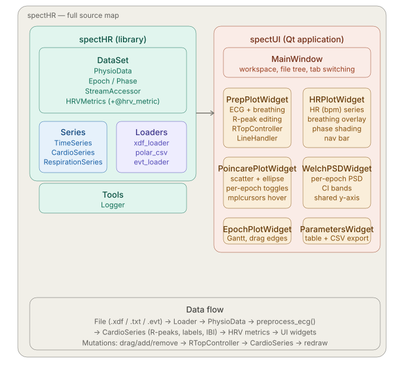

> **⚠️ CAUTION:**
> This project is a work in progress. Blood pressure analysis is not yet implemented. Breathing signal extraction and visualization are functional but should be treated as experimental.

---

- [spectHR: An Interactive HRV Analysis Tool](#specthr-an-interactive-hrv-analysis-tool)
  - [Overview](#overview)
  - [Features](#features)
  - [How It Works](#how-it-works)
    - [Inputs](#inputs)
    - [Workflow](#workflow)
    - [Outputs](#outputs)
  - [The Application Tabs in Detail](#the-application-tabs-in-detail)
    - [PreProcessing Tab](#preprocessing-tab)
    - [IBI Series Tab](#ibi-series-tab)
    - [Poincaré Tab](#poincaré-tab)
    - [Epochs Tab](#epochs-tab)
    - [PSD Tab](#psd-tab)
    - [Parameters Tab](#parameters-tab)
  - [Data Formats](#data-formats)
  - [IBI Classification](#ibi-classification)
    - [Labels](#labels)
    - [Classification Parameters](#classification-parameters)
  - [Breathing Signal Extraction](#breathing-signal-extraction)
  - [Poincaré Plots](#poincaré-plots)
  - [Power Spectral Density (PSD)](#power-spectral-density-psd)
  - [Installation and Running](#installation-and-running)
    - [Windows](#windows)
    - [macOS](#macos)
  - [Workspace Configuration](#workspace-configuration)
  - [Contributing](#contributing)
  - [License](#license)

---

# spectHR: An Interactive HRV Analysis Tool

## Overview


**spectHR** is an fully open-source interactive desktop application for Heart Rate Variability (HRV) analysis. It provides a graphical interface built with Qt and Matplotlib for exploring, preprocessing, and analyzing ECG-derived HRV data. The application is designed for researchers and students who need a hands-on, visual workflow — no programming required to use it.

The project consists of two layers:

- **spectHR** — the analysis library (`src/spectHR/`). Handles data loading, signal processing, R-peak detection, IBI classification, and HRV metric computation.
- **spectUI** — the Qt application (`src/spectUI/`). Provides the interactive GUI built on top of the library.



## Features

- **Multiple file formats** — reads LabStreamingLayer `.xdf` files, Polar `.txt` exports, and CARSPAN `.evt`/`.nff` files.
- **Automatic ECG polarity detection** — the app detects whether the ECG signal is inverted and corrects it automatically on load.
- **Interactive R-peak editing** — drag, add, or remove individual R-peaks (R-tops) directly on the ECG plot.
- **Breathing signal extraction** — a respiration surrogate is derived from the Polar H10's 3-axis accelerometer via PCA and overlaid on the ECG and heart rate plots.
- **Epoch-based analysis** — all analyses are segmented by named time epochs. Epochs are built automatically from event markers, or can be added, renamed, and adjusted manually.
- **Full HRV metric suite** — time-domain (RMSSD, SDNN, SD1, SD2, …) and frequency-domain (VLF, LF, HF power) metrics per epoch.
- **Dual PSD methods** — power spectral density can be estimated using either **Welch's method** (uniform resampling + FFT) or the **Lomb-Scargle periodogram** (works directly on the irregular IBI timestamps without resampling). The method is selected in the workspace and can be changed at runtime via the Parameters dialog without restarting.
- **Configurable confidence intervals** — chi-square confidence intervals are shown as shaded bands on every PSD plot. The significance level α is configurable; the plot legend always reflects the actual level used (e.g. "95 % CI" for α = 0.05).
- **Multiple simultaneous devices** — supports recordings from more than one Polar H10 at the same time. Each device's ECG and respiration data are indexed as separate "bands."
- **Caching** — processed datasets are saved as `.pkl` files so reopening a file is instant.

## How It Works

### Inputs

A dataset is loaded from a supported file format. It must contain at least an ECG time series. Marker/event streams are optional but enable automatic epoch construction.

### Workflow

1. **Configure a workspace** — a JSON file that points to your data directory, cache directory, and sets all analysis parameters. The app opens with a default workspace; you can open or edit your own via the File menu.
2. **Select a file** from the file tree on the left. The app loads (or retrieves from cache), preprocesses the ECG, detects R-peaks, extracts the breathing signal if accelerometer data is available, and displays the results.
3. **Inspect and correct R-peaks** in the PreProcessing tab. Use Drag / Add / Remove mode to fix any mis-detections.
4. **Review the heart rate series** in the IBI Series tab.
5. **Explore HRV dynamics** in the Poincaré, PSD, and Parameters tabs.
6. **Adjust epoch boundaries** in the Epochs tab by dragging the edges of epoch bars.
7. **Edit analysis parameters** via File → Edit Parameters to change PSD method, frequency bands, IBI classification settings, and more — all changes take effect immediately and are saved to the workspace file.
8. **Export results** — click Save in the Parameters tab to write a CSV file to the configured output directory.

All edits are saved automatically to the cache file when you switch tabs or select a new file.

### Outputs

- Interactive visualizations across all tabs.
- HRV metric tables per epoch, exportable as CSV.
- The `.pkl` cache file (can be reloaded later for further analysis).

---

# The Application Tabs in Detail

## PreProcessing Tab

The central workspace for ECG quality control. The tab shows two stacked plots:

- **Main ECG plot** (upper, larger) — the raw ECG signal in red, with detected R-peaks shown as colour-coded vertical lines. Lines are coloured by their IBI classification label (see [IBI Classification](#ibi-classification) below). IBI durations in milliseconds are annotated as arrows between adjacent R-peaks. If a breathing signal is available, it is overlaid as a green trace on a secondary y-axis. Time epochs are shown as horizontal arrows above the plot.
- **Overview strip** (lower, smaller) — a thumbnail of the full ECG recording with a blue rectangle indicating the current zoom window. Drag the rectangle to navigate.

**Navigation bar** buttons (left to right): go to start · pan left · jump to previous abnormal R-peak · zoom in · zoom out · jump to next abnormal R-peak · pan right · go to end.

**Editing modes** — select from the dropdown at the top of the tab:

| Mode | What it does |
|------|-------------|
| Drag | Click and drag a vertical R-peak line to adjust its time position. |
| Remove | Click a line to delete that R-peak. |
| Add | Click anywhere on the ECG to insert a new R-peak at that time. |

**Right-click menu on a file** in the tree panel provides three additional actions:

| Action | Effect |
|--------|--------|
| Reload Raw | Discards the cache and reprocesses the raw file from scratch. |
| Invert ECG Polarity | Flips the ECG signal vertically and reruns peak detection. Useful if automatic polarity detection was incorrect. |
| Retrigger ECG | Reruns automatic R-peak detection on the current ECG without reloading the raw file. |

## IBI Series Tab

Displays the heart rate over time in beats per minute (bpm), derived from the R-peak times. Heart rate is computed as 60 / IBI at each R-peak, plotted at the midpoint of each inter-beat interval. The same navigation bar as in the PreProcessing tab is available for zooming and panning. If breathing data is present, it is overlaid as a semi-transparent green trace.

## Poincaré Tab

Displays a Poincaré (return map) scatter plot: each point represents a pair of consecutive IBIs — IBI(n) on the x-axis and IBI(n+1) on the y-axis. Each epoch is plotted in a distinct colour, with an SD1/SD2 confidence ellipse overlaid. Epoch visibility is controlled by checkboxes on the right side of the tab. Hovering over a point (click to pin the tooltip) shows the two IBI values and the timestamp of that R-peak. See [Poincaré Plots](#poincaré-plots) for metric definitions.

## Epochs Tab

A Gantt-style chart showing all active epochs as horizontal bars.

- **Drag the left or right edge** of an epoch bar to adjust its start or end time.
- **Click a y-axis label** (epoch name) to rename it. Enter an empty name to delete the epoch.
- **Add a new epoch** via the menu: Actions → Add Epoch. You will be prompted for a name; the new epoch spans the full recording and can be trimmed by dragging its edges.

Epoch changes immediately affect all other tabs and all metric calculations.

## PSD Tab

Shows one Power Spectral Density plot per active epoch, stacked vertically in a scrollable panel. All epoch plots share the same y-axis scale so epochs can be compared at a glance.

The PSD method — **Welch** or **Lomb-Scargle** — is selected in the workspace and shown in each plot's title. Confidence intervals are rendered as a shaded grey band with dashed boundary lines; the legend label (e.g. "95 % CI") always reflects the configured significance level α.

Frequency bands are coloured fills with the integrated band power shown in the legend. See [Power Spectral Density](#power-spectral-density-psd) for full parameter details.

## Parameters Tab

A spreadsheet showing all HRV metrics for each epoch. Columns include:

- Subject (filename stem) and epoch name
- Time-domain: count, mean, median, min, max, std, RMSSD, SDNN, SDSD, SD1, SD2, SD2/SD1 ratio, ellipse area
- Frequency-domain: VLF power, LF power, HF power, LF/HF ratio

Click **Save** to export the table as a CSV file to the configured output directory.

---

# Data Formats

## XDF (LabStreamingLayer)

spectHR reads `.xdf` files produced by the [LabStreamingLayer](https://github.com/sccn/labstreaminglayer) framework. It identifies streams as follows:

- **ECG stream** — detected by stream type `ECG`. Designed for use with the [Polar H10](https://www.polar.com/en/sensors/h10-heart-rate-sensor) via the [PolarBLE](https://github.com/markspan/PolarBLE) companion application.
- **Accelerometer stream** — detected by stream type `ACCELEROMETER`. The 3-axis data is used to derive the breathing signal. Also produced by [PolarBLE](https://github.com/markspan/PolarBLE).
- **Marker/event streams** — detected by stream type containing `marker` or `event` (camera streams are excluded). Markers trigger automatic epoch construction.

**Marker convention** — markers should follow the pattern `start <label>` to open an epoch and `stop <label>` or `end <label>` to close it. For example, a marker `start baseline` followed later by `stop baseline` creates an epoch called `baseline`. If a `stop` marker is missing, the epoch runs to the end of the recording.

**Multiple devices** — if two Polar H10 units are recorded simultaneously, their streams are indexed as separate bands identified by the last 8 characters of the stream name. In the file tree, the dataset node expands into individual band nodes; selecting one plots that device's data.

## Polar .txt

The plain-text export format from the Polar app. Refer to the example file in `ExampleData/` for the expected column layout.

## CARSPAN .evt / .nff

CARSPAN event files are supported. If an `.nff` file with the same base name exists in the same directory, spectHR loads the channel named `ECG` from it.

---

# IBI Classification

After R-peak detection, each inter-beat interval is classified automatically. The algorithm uses a centered rolling window to compute a local mean and standard deviation of IBIs, then labels each interval relative to those local statistics.

## Labels

| Label | Meaning | Colour in plot |
|-------|---------|----------------|
| N | Normal — within mean ± Nsd × SD | Blue |
| S | Short — below the lower threshold | Magenta |
| L | Long — above the upper threshold | Cyan |
| TL | Too Long — exceeds the absolute maximum (2 s) | Orange |
| SL | Short-Long pattern — an S immediately followed by an L | Turquoise |
| SNS | Short-Normal-Short pattern | Light sea green |
| T | Degenerate interval (NaN or ≤ 0) | — |

## Classification Parameters

These parameters can be adjusted via **File → Edit Parameters** in the application, or by calling `classify_ibi()` programmatically (see [Contributing](#contributing)):

### Window size (`window_length`)

The number of beats in the centered rolling window used to compute the local mean and standard deviation.

- Larger values → smoother thresholds, less sensitive to transient changes.
- Smaller values → thresholds that track short-term rhythm shifts more closely.

Default: **51 beats**

### Number of standard deviations (`n_std`)

Multiplier applied to the local standard deviation when computing the S/L boundaries:

$$(\text{lower}, \text{upper}) = \overline{\text{IBI}} \pm (n\_\text{std} \times \text{SD}(\text{IBI}))$$

Default: **4**

### Maximum IBI (`max_ibi_sec`)

An absolute hard ceiling. Any IBI above this value is labeled `TL` regardless of the rolling thresholds.

Default: **2.0 seconds**

---

# Breathing Signal Extraction

When a Polar H10 accelerometer stream is present, spectHR derives a respiration surrogate signal from the 3-axis chest-belt data. The pipeline is:

1. **Robust pre-cleaning** — NaN values are interpolated per axis; extreme spikes are clipped using a robust MAD-based threshold.
2. **Gravity removal** — a low-pass Butterworth filter (cutoff 0.04 Hz, estimated from timestamps) is applied to estimate the quasi-static gravitational component. This is subtracted from the raw signal to isolate dynamic movement.
3. **Respiration bandpass** — the linear acceleration is bandpassed to the respiration band (0.10–0.70 Hz), retaining the motion frequencies typical of adult breathing.
4. **PCA projection** — Principal Component Analysis is applied to the bandpassed 3-axis signal. The first principal component, which captures the dominant axis of breathing motion, is extracted as a single 1D signal. This approach is robust to variations in device orientation.
5. **Z-score normalisation** — the resulting signal is standardised (mean 0, std 1) for display.

The breathing signal is overlaid in green on the PreProcessing and IBI Series plots. Inhalation phases (trough to peak in the breathing signal) are shaded in light blue.

**Note:** The sampling rate is estimated from the timestamps and is not assumed to be a fixed value. Data shape must be (N, 3) for three axes.

---

# Poincaré Plots

A Poincaré plot maps each IBI against the one that follows it. For a sequence of intervals IBI₁, IBI₂, …, IBIₙ, the plot shows the point cloud (IBIᵢ, IBIᵢ₊₁). The spread of this cloud in two directions yields complementary HRV measures:

### SD1 — short-term variability

SD1 is the standard deviation perpendicular to the line of identity and reflects beat-to-beat variability:

$$\text{SD}_1 = \sqrt{\frac{1}{2}\,\text{Var}(\text{IBI}_{i+1} - \text{IBI}_i)}$$

### SD2 — long-term variability

SD2 is the standard deviation along the line of identity and reflects overall IBI variability:

$$\text{SD}_2 = \sqrt{2\,\text{Var}(\text{IBI}_i) - \frac{1}{2}\,\text{Var}(\text{IBI}_{i+1} - \text{IBI}_i)}$$

### SD2/SD1 ratio

$$\text{SD}_\text{ratio} = \frac{\text{SD}_2}{\text{SD}_1}$$

### Ellipse area

The Poincaré point cloud is approximated by an ellipse centred on the line of identity, with SD1 as the short axis and SD2 as the long axis:

$$\text{Area} = \pi \cdot \text{SD}_1 \cdot \text{SD}_2$$

### Interpretation

- **Tight cluster along the identity line** — low HRV; typical of high sympathetic tone, stress, or pathological states.
- **Broad ellipse with roughly equal SD1 and SD2** — healthy, balanced autonomic regulation.
- **Points far from the main cluster** — may indicate mis-detected R-tops. These are worth inspecting in the PreProcessing tab.

Note: SD1 and SD2 carry overlapping information with RMSSD and SDNN respectively; they do not add independent information but offer a useful visual summary [(van Roon et al., 2025)](https://www.mdpi.com/1099-4300/27/8/861).

---

# Power Spectral Density (PSD)

spectHR supports two PSD estimation methods, selectable via the workspace. Both produce power in **ms²/Hz** over the same configurable frequency bands.

## Welch's Method

The IBI series is resampled to a uniform time grid using linear interpolation, then Welch's method is applied to estimate the power spectral density.

Default parameters:

| Parameter | Value |
|-----------|-------|
| Resampling frequency (`fs`) | 4 Hz |
| Segment length (`nperseg`) | 256 samples |
| Overlap (`noverlap`) | 128 samples |
| Window function | Hamming |
| FFT length (`nfft`) | 1024 |

Confidence intervals use a chi-square approximation with `ν = 2 × n_segments` degrees of freedom, where `n_segments` is the number of Welch averaging segments. For short epochs, segment length and overlap are automatically reduced to fit the available data.

See the [scipy.signal.welch](https://docs.scipy.org/doc/scipy/reference/generated/scipy.signal.welch.html) documentation for full technical details.

## Lomb-Scargle Periodogram

The Lomb-Scargle method evaluates the PSD directly on the **unevenly sampled** IBI timestamps — no resampling or interpolation is needed. This is the primary advantage over Welch for short or irregularly sampled epochs.

The mean IBI is subtracted before estimation to prevent DC leakage. The frequency grid spans all configured HRV bands.

Default parameters:

| Parameter | Value |
|-----------|-------|
| Number of frequency points (`nfreqs`) | 1000 |
| Minimum frequency floor (`fmin_floor`) | 0.0001 Hz |

Confidence intervals use a chi-square approximation with data-driven degrees of freedom. Following Scargle (1982), the effective number of independent frequencies in band `[f_min, f_max]` over an observation of duration `T` seconds is `n_eff ≈ 2 × (f_max − f_min) × T`, giving `ν = 2 × n_eff`. This means CI width scales naturally with recording length — longer recordings give tighter intervals.

## Frequency Bands

Both methods use the same configurable frequency bands:

| Band | Default Range |
|------|--------------|
| VLF (Very Low Frequency) | 0.003–0.04 Hz |
| LF (Low Frequency) | 0.04–0.15 Hz |
| HF (High Frequency) | 0.15–0.40 Hz |

Band edges, colours, and the active PSD method are all configurable in the workspace JSON and in the **Edit Parameters** dialog.

Band power is computed by trapezoidal integration with linear interpolation at the band edges.

## Confidence Intervals

Both methods display a shaded confidence band around the PSD curve. The significance level α (`confidence_interval_alpha`) defaults to 0.05, giving 95 % CIs. The plot legend always shows the actual level, e.g. "90 % CI" if α = 0.10. α can be changed in the workspace or the **Edit Parameters** dialog.

---

# Installation and Running

## Windows

Download `spectHR-Windows-vX.Y.Z.zip` from the [Releases](https://github.com/markspan/spectHR/releases) page, extract, and run `spectHR.exe`. No Python installation is required.

## macOS

### System requirements

- macOS 11 (Big Sur) or newer
- Intel or Apple Silicon (M1/M2/M3)
- No Python installation required

### Step 1 — Download

Go to [Releases](https://github.com/markspan/spectHR/releases) and download `spectHR-macOS-vX.Y.Z.zip`. Double-click the `.zip` file to extract `spectHR.app`.

### Step 2 — Move to Applications

Drag `spectHR.app` to `/Applications`. This avoids permission issues with running apps from the Downloads folder.

### Step 3 — First launch

Because the app is not signed by Apple, macOS will block it the first time. Choose one of the following:

**Option A — Finder (recommended)**
1. Open `/Applications`
2. Right-click `spectHR.app` → choose **Open**
3. Click **Open** in the dialog

The app will run normally from this point on.

**Option B — System Settings**
1. Try opening `spectHR.app` once (so macOS registers the block)
2. Open **System Settings → Privacy & Security**
3. Near the bottom you will see: *"spectHR was blocked…"* — click **Open Anyway**

**Option C — Terminal (always works)**
```bash
xattr -dr com.apple.quarantine /Applications/spectHR.app
```
Then open `spectHR.app` normally.

### Updating

Download the new `.zip`, replace `spectHR.app` in `/Applications`. No reinstallation needed.

---

# Workspace Configuration

spectHR uses a JSON workspace file to configure file locations and all analysis parameters. The default workspace is loaded on startup from `~/Documents/DefaultWorkSpace.json`. You can open, edit, or save workspaces via the **File** menu. Parameters can also be edited interactively via **File → Edit Parameters**, which saves changes back to the current workspace file immediately.

The workspace has three top-level sections:

```json
{
    "Directories": {
        "DataDirectory":  "/path/to/your/raw/data",
        "CacheDirectory": "/path/to/cache",
        "OutputDirectory": "/path/to/csv/output"
    },
    "FrequencyAnalysis": {
        "method": "welch",
        "bands": {
            "VLF": { "low": 0.003, "high": 0.04,  "color": "blue" },
            "LF":  { "low": 0.04,  "high": 0.15,  "color": "darkgreen" },
            "HF":  { "low": 0.15,  "high": 0.40,  "color": "red" }
        },
        "welch": {
            "fs": 4.0,
            "nperseg": 256,
            "noverlap": 128,
            "nfft": null,
            "window": "hamming"
        },
        "lombscargle": {
            "nfreqs": 1000,
            "fmin_floor": 0.0001
        },
        "confidence_interval_alpha": 0.05
    },
    "CardioParameters": {
        "IbiClassification": {
            "window_length": 51,
            "n_std": 4.0,
            "max_ibi_sec": 2.0,
            "min_peak_distance_ms": 300.0
        },
        "EcgPreprocessing": {
            "filter_type": "highpass",
            "filter_cutoff": 1.0
        }
    }
}
```

**Directories**
- `DataDirectory` — where spectHR looks for `.xdf`, `.txt`, and `.evt` files.
- `CacheDirectory` — where processed datasets are saved as `.pkl` files for fast reloading.
- `OutputDirectory` — where CSV exports from the Parameters tab are written.

**FrequencyAnalysis**
- `method` — PSD estimation method: `"welch"` or `"lombscargle"`.
- `bands` — frequency band definitions; add, remove, or rename bands freely.
- `welch` — parameters passed to `scipy.signal.welch` (used when `method` is `"welch"`).
- `lombscargle` — parameters for the Lomb-Scargle periodogram (used when `method` is `"lombscargle"`).
- `confidence_interval_alpha` — significance level α for the chi-square CI shading (0.05 = 95 % CI).

**CardioParameters**
- `IbiClassification` — window length, standard-deviation multiplier, and maximum IBI threshold for automatic beat classification.
- `EcgPreprocessing` — filter type and cutoff used during ECG pre-processing.

---

# Contributing

spectHR is written in pure Python. The library layer (`src/spectHR/`) and the UI layer (`src/spectUI/`) are kept deliberately separate so the analysis code can be used independently of the GUI.

### Key classes for contributors

| Class | File | Role |
|-------|------|------|
| `PhysioData` | `DataSet/PhysioData.py` | Central data container; owns all time series, epochs, and derived data |
| `CardioSeries` | `DataSet/Series/CardioSeries.py` | R-peak times, IBI classification, all HRV metric methods |
| `CardioMetricsMixin` | `DataSet/Series/CardioMetricsMixin.py` | All frequency-domain PSD computation (Welch + Lomb-Scargle), CI estimation, band-power metrics |
| `TimeSeries` | `DataSet/Series/TimeSeries.py` | Raw 1-D time series with filtering and polarity detection |
| `RespirationSeries` | `DataSet/Series/RespirationSeries.py` | Detected inhalation/exhalation phase intervals |
| `Epoch` | `DataSet/Epoch.py` | Single named time interval with helper methods |
| `HRVMetric` | `DataSet/HRVMetrics.py` | Base class; the `@hrv_metric` decorator auto-registers metrics |
| Loaders | `DataSet/loaders/` | File-format readers registered by extension via `@register_loader` |

### Adding a new HRV metric

Decorate a method with `@hrv_metric` in `CardioSeries` and it will automatically appear in the Parameters table and CSV export:

```python
from spectHR.DataSet.HRVMetrics import hrv_metric

@hrv_metric
def my_metric(self) -> float:
    ibi_ms = self._ibi_clean_ms()
    return float(np.something(ibi_ms))
```

### Adding a new file format

Create a new loader module in `src/spectHR/DataSet/loaders/` and decorate the loader function:

```python
from spectHR.DataSet.loaders.registry import register_loader

@register_loader(".myext")
def load_myext(physiodata, filename: str, **kwargs) -> None:
    # populate physiodata.timeseries, physiodata.events, etc.
    ...
```

Please ensure contributions follow the existing code style and include appropriate tests. Fork the repository and open a pull request with a clear description of the change.

---

## License

spectHR is released under the GNU LGPL-2.1 license. See the [LICENSE](LICENSE) file for details.
