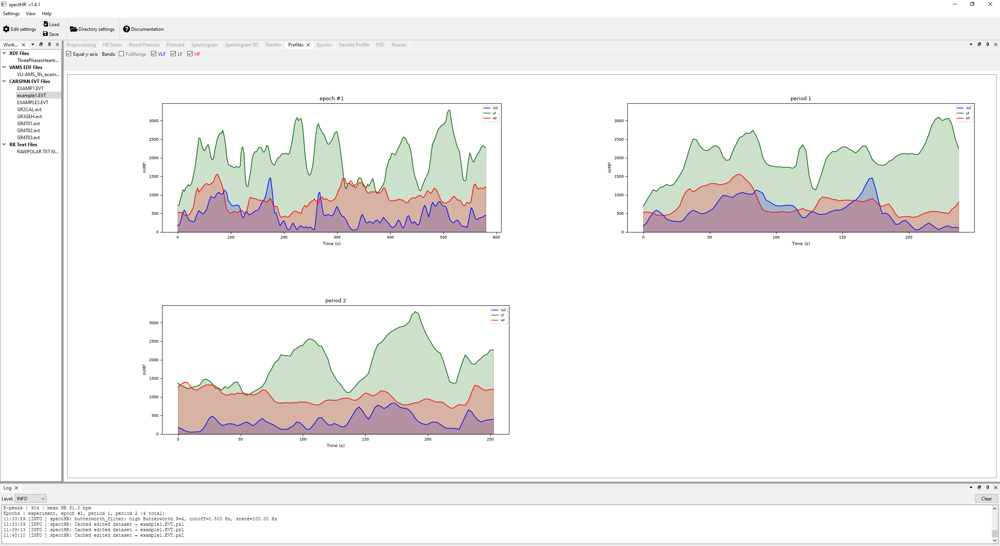
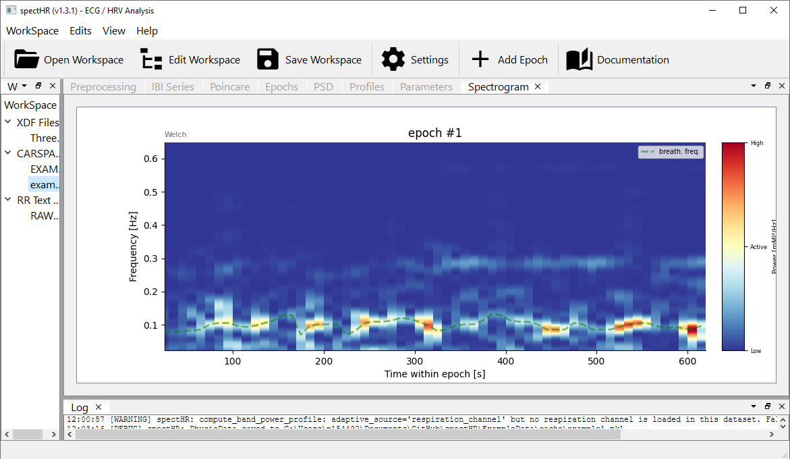
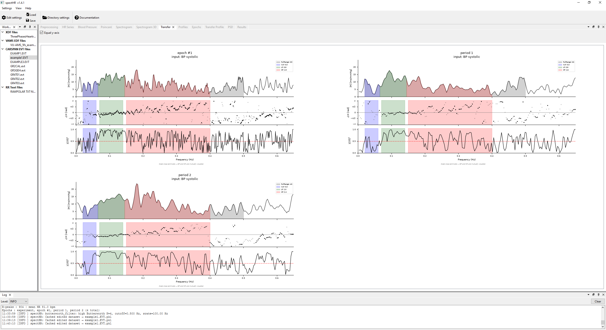
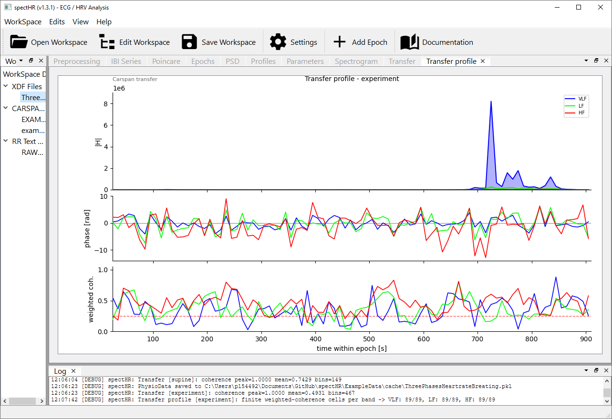

<details open>
<summary>⚠️ CAUTION</summary>
This project is a work in progress. Blood-pressure support (calibration, beat-by-beat SBP/DBP/MAP/PP, and BP→HR baroreflex transfer) and breathing signal extraction are functional but should be treated as experimental.
</details>

---

<details open>
<summary><a href="#what-is-specthr"><strong>What is spectHR?</strong></a></summary>
</details>

<details>
<summary><a href="#theoretical-background"><strong>Theoretical background</strong></a></summary>

- [Mental effort, not stress](#mental-effort-not-stress)
- [Frequency bands](#frequency-bands)
- [Practical considerations](#practical-considerations)

</details>

<details open>
<summary><a href="#getting-started"><strong>Getting started</strong></a></summary>
</details>

<details>
<summary><a href="#the-interface-at-a-glance"><strong>The interface at a glance</strong></a></summary>

- [Step 1, Check and clean the ECG (Preprocessing tab)](#step-1-check-and-clean-the-ecg-preprocessing-tab)
- [Step 2, Inspect the IBI timeseries (IBI Series tab)](#step-2-inspect-the-ibi-timeseries-ibi-series-tab)
- [Blood pressure (Blood Pressure tab)](#blood-pressure-blood-pressure-tab)
- [Step 3, Define your analysis segments (Epochs tab)](#step-3-define-your-analysis-segments-epochs-tab)
- [Step 4, Explore autonomic dynamics (Poincaré tab)](#step-4-explore-autonomic-dynamics-poincaré-tab)
- [Step 5, Examine frequency-domain HRV (PSD tab)](#step-5-examine-frequency-domain-hrv-psd-tab)
- [Step 6, Track band power over time (Profiles tab)](#step-6-track-band-power-over-time-profiles-tab)
- [Step 7, Examine input → HR coupling: RSA and baroreflex (Transfer tab)](#step-7-examine-input--hr-coupling-rsa-and-baroreflex-transfer-tab)
- [Step 8, Export your results (Parameters tab)](#step-8-export-your-results-parameters-tab)

</details>

<details open>
<summary><a href="#configuring-the-analysis"><strong>Configuring the analysis</strong></a></summary>
</details>

<details>
<summary><a href="#data-formats"><strong>Data Formats</strong></a></summary>

- [XDF (LabStreamingLayer)](#xdf-labstreaminglayer)
- [Polar .txt](#polar-txt)
- [CARSPAN .evt / .nff](#carspan-evt--nff)

</details>

<details>
<summary><a href="#ibi-classification"><strong>IBI Classification</strong></a></summary>

- [Classification algorithm](#classification-algorithm)
- [Comparison with CARSPAN](#comparison-with-carspan)

</details>

<details open>
<summary><a href="#breathing-signal-extraction"><strong>Breathing Signal Extraction</strong></a></summary>
</details>

<details open>
<summary><a href="#respiration-context-hf"><strong>Respiration-context HF</strong></a></summary>
</details>

<details open>
<summary><a href="#blood-pressure"><strong>Blood Pressure</strong></a></summary>
</details>

<details open>
<summary><a href="#pre-ejection-period-pep"><strong>Pre-ejection period (PEP)</strong></a></summary>
</details>

<details open>
<summary><a href="#poincaré-metrics"><strong>Poincaré Metrics</strong></a></summary>
</details>

<details open>
<summary><a href="#non-linear-and-stationarity-metrics"><strong>Non-linear and stationarity metrics</strong></a></summary>
</details>

<details>
<summary><a href="#power-spectral-density-method-details"><strong>Power Spectral Density, method details</strong></a></summary>

- [Welch's method](#welchs-method)
- [CARSPAN method](#carspan-method)
- [Spectral profiles](#spectral-profiles)
- [Adaptive bands](#adaptive-bands)
- [Transfer functions](#transfer-functions)
- [Confidence intervals](#confidence-intervals)
- [Frequency bands](#frequency-bands-1)
- [Units and normalisation](#units-and-normalisation)

</details>

<details>
<summary><a href="#installation"><strong>Installation</strong></a></summary>

- [Windows](#windows)
- [Linux](#linux)
- [macOS](#macos)

</details>

<details open>
<summary><a href="#contributing"><strong>Contributing</strong></a></summary>
</details>

<details open>
<summary><a href="#license"><strong>License</strong></a></summary>
</details>

<details open>
<summary><a href="#references"><strong>References</strong></a></summary>
</details>

---

# spectHR: An Interactive HRV Analysis Tool

## What is spectHR?


**spectHR** is a free, open-source desktop application for Heart Rate Variability (HRV) analysis. It is built for researchers and students who want to move from a raw electrocardiogram (ECG) to interpretable HRV metrics without writing any code, and without trusting a black box.

Heart rate variability reflects the fluctuations inter-beat intervals (IBI). These fluctuations are regulated by the autonomic nervous system: higher HRV generally indicates flexible, healthy regulation; lower HRV is associated with stress, disease, or fatigue. By analysing the power in different frequency bands of the IBI series, spectHR lets you separate the parasympathetic (HF) and sympathetic/parasympathetic (LF) contributions to heart rate control in each named epoch of your recording.

When the recording also carries a continuous **blood-pressure** waveform (e.g. a Finapres/Finometer channel in a CARSPAN file), spectHR calibrates it to mmHg, derives beat-by-beat systolic, diastolic, mean and pulse pressure, and can estimate **spectral baroreflex sensitivity** as a blood-pressure → heart-rate transfer function. A respiration channel similarly unlocks the respiration → heart-rate (respiratory sinus arrhythmia) transfer view.

The key principle behind spectHR is that **you have to check data quality**. Every step that could go wrong, R-peak detection, noisy intervals, epoch boundaries, is shown to you visually and can be corrected before any metrics are computed.

---

## Theoretical background

Generally, heart rate variability (HRV) reflects the continuous interplay between the two branches of the autonomic nervous system (ANS). The **parasympathetic** branch, acting via the vagus nerve, produces rapid beat-to-beat fluctuations, including respiratory sinus arrhythmia (RSA). The **sympathetic** branch exerts slower influences, mainly through vasomotor tone and blood pressure regulation. Because the two branches operate at different speeds, spectral analysis separates their contributions by frequency. ([Mulder, 1989](#ref-mulder1989); [Task Force of the European Society of Cardiology, 1996](#ref-taskforce1996)).

A note on the two-branch picture: both branches can be simultaneously active or withdrawn. HRV does not directly reveal what the sympathetic branch is doing. Broader conclusions about autonomic balance require additional signals such as blood pressure, breathing patterns or pre-ejection period.

### Mental effort, not stress

The CARSPAN tradition, which spectHR inherits, uses the constructs *mental effort* and *mental workload* rather than *stress*. Mental effort is defined as the resources invested in response to task demands - a construct that can be experimentally manipulated and whose physiological cost can be measured independently of the subjective experience of strain.

Mulder [(1980)](#ref-mulder1980) showed that task performance suppresses HRV, particularly in the mid-frequency band (~0.10 Hz) that reflects baroreceptor-driven blood pressure oscillations. Mulder [(1989)](#ref-mulder1989) formalised the framework: the suppression reflects invested effort, not task difficulty. A person who disengages from a hard task shows little HRV change; one working hard at an easy task shows a marked decrease ([Mulder, 1992](#ref-mulder1992)). The pattern generalises across driving ([de Waard, 1996](#ref-dewaard1996); [Mulder et al., 2004](#ref-mulder2004)), aviation ([De Rivecourt et al., 2008](#ref-derivecourt2008)), clinical work ([Peabody et al., 2023](#ref-peabody2023)), and driving simulation studies ([Arutyunova et al., 2024](#ref-arutyunova2024)).

HRV does not measure perceived stress. It measures a physiological state: the cost of effort investment that may or may not correspond to what a person calls "feeling stressed." The gap between the two is where individual differences and coping strategies operate. Treating HRV as a direct readout of stress conflates distinct levels of analysis.

### Frequency bands

spectHR defaults to the **CARSPAN (Groningen)** band convention, the one used throughout the mental-effort literature this tool serves. Band boundaries are **user-configurable**.

| Band | Default range | Also labelled | Reflects |
|------|--------------|------|------|
| VLF | 0.02–0.06 Hz | "low" | Slow regulatory processes |
| LF | 0.07–0.14 Hz | "mid" / "middle" | ~0.10 Hz baroreceptor (Mayer) wave, mixed sympathetic/parasympathetic |
| HF | 0.15–0.40 Hz | "high" | Respiratory sinus arrhythmia, parasympathetic tone |

The CARSPAN bands are sometimes written with the names **low / middle (mid) / high** rather than VLF / LF / HF — they refer to the same three components. The middle band is deliberately centred on the ~0.10 Hz oscillation that [Mulder (1980](#ref-mulder1980), [1989)](#ref-mulder1989) identified as the component most sensitive to invested mental effort. See also [Mulder (1988)](#ref-mulder1988) for background.

**Alternative: Task Force (1996) bands.** Many clinical and general HRV studies use the [Task Force (1996)](#ref-taskforce1996) convention instead. You can switch to it by editing the band edges under **WorkSpace → Edit Parameters → Frequency Analysis**:

| Band | Task Force range |
|------|--------------|
| VLF | ≤ 0.04 Hz (typically 0.003–0.04 Hz) |
| LF | 0.04–0.15 Hz |
| HF | 0.15–0.40 Hz |

> **The two conventions are not interchangeable.** CARSPAN LF (0.07–0.14 Hz) is **narrower and shifted** relative to Task Force LF (0.04–0.15 Hz), and the VLF edges differ too. Numeric LF or VLF values from spectHR's default bands cannot be compared directly with published Task Force values unless you reconfigure the band edges to match. HF (0.15–0.40 Hz) is identical in both conventions.

**VU-DAMS preset.** If you are comparing spectHR output against VU-DAMS 5.0 (VU Ambulatory Monitoring System software), load the ready-made workspace preset `presets/vuams_welch.json` via **WorkSpace → Open Workspace**. It sets bands and Welch parameters to match what VU-DAMS computes by default:

| Parameter | VU-DAMS (DAMS 5.0 manual §5.3.1) | preset value |
|-----------|----------------------------------|--------------|
| Method | Welch (averaged periodograms) | `method: "welch"` |
| Resampling | Cubic spline → 4 Hz | `fs: 4.0` |
| Segment length | 256 s = 1024 samples at 4 Hz | `nperseg: 1024` |
| Overlap | 128 s = 512 samples (50 %) | `noverlap: 512` |
| Window | Quadratic (Welch/parabolic) | `window: "quadratic"` |
| Detrending | Tarvainen smoothness-prior (λ) | `detrend_lambda: 500` |
| Output units | ms² | `units: "ms²"` |
| TP band | 0.0001 – 0.40 Hz | TP: 0.0001–0.40 |
| LF band | 0.04 – 0.15 Hz | LF: 0.04–0.15 |
| HF band | 0.15 – 0.40 Hz | HF: 0.15–0.40 |

Two minor differences remain. VU-DAMS applies the smoothness-prior detrending **per 256-second segment**, whereas spectHR applies it once to the full tachogram before segmentation — a common implementation choice (used by Kubios) that is mathematically nearly identical for recordings longer than a few minutes. VU-DAMS also discards segments that contain a gap of more than 5 seconds with no R-peaks and zero-pads the final segment; spectHR's cubic interpolation fills such gaps implicitly. Neither difference has a meaningful effect on band power for clean recordings.

### Practical considerations

**Recording length.** Frequency resolution is $\Delta f = 1/T$. A 5-minute epoch gives $\Delta f \approx 0.003$ Hz, enough to resolve MF and HF cleanly. Shorter epochs give coarser resolution and wider confidence intervals (visible in spectHR's shaded CI band). Note that this applies to spectral measures only: [Tegegne et al. (2019)](#ref-tegegne2019) showed that a 10-second ECG can yield a valid RMSSD estimate in large samples.

**Artefacts are critical.** A single missed or spurious R-peak introduces broadband spectral energy that can swamp the genuine HRV signal ([Mulder, 1988](#ref-mulder1988)). This is why spectHR requires the user to inspect and verify the IBI series before computing any metrics.

**Detrending (optional).** Slow, non-stationary trends in the IBI series — warm-up, fatigue, posture shifts — leak into the VLF and LF bands and can bias exactly the mid-frequency band that mental-effort research cares about. spectHR offers the smoothness-priors detrending method of [Tarvainen et al. (2002)](#ref-tarvainen2002), which removes such trends without the band-edge distortion of a plain high-pass filter. It is **off by default**; set `detrend_lambda` (the regularisation strength λ; a typical value is ~500) under **WorkSpace → Edit Parameters → Frequency Analysis** to enable it. Detrending conditions the tachogram-based PSD methods (**Welch**, **Lomb-Scargle**) only; the faithful CARSPAN spectral paths are never altered.

**Normalisation.** Absolute spectral power in ms² scales with mean IBI squared, increasing at lower heart rates. The CARSPAN mMI² normalisation corrects for this automatically. For the Welch method the output unit is configurable: the default is **mMI²** (normalised, heart-rate-independent) but can be switched to **ms²** (raw IBI power, not normalised) via the `"units"` key in *Edit Parameters*. Whether to normalise HRV for mean heart rate is genuinely unresolved ([de Geus et al., 2019](#ref-degeus2019)), and no single recommendation fits all research questions.

<details>
<summary>mMI²/Hz vs ms²/Hz: which unit to use?</summary>

The two choices show the same frequencies (the rhythms of heart rate variability), but measured differently.
ms²/Hz is the direct view. You take the sequence of beat-to-beat intervals in milliseconds, and ask how its variance is spread across frequencies. At any given frequency, this value tells you how much millisecond-squared variability sits there, per unit of frequency bandwidth. Integrate the curve over a band (for example HF, 0.15 to 0.40 Hz) and the result is band power in ms². That number is intuitive in absolute terms: an HF power of 1000 ms² means the HF rhythm contributes about √1000 ≈ 32 ms of variation to the IBI signal.
The catch is that ms²/Hz depends strongly on mean heart rate. Someone with a slow resting heart (mean IBI 1200 ms) has more absolute room to fluctuate in milliseconds than someone with a fast heart (mean IBI 600 ms), even when both modulate their heart rate by the same proportion. So comparing absolute ms² between subjects, or between rest and exercise within one subject, is muddied by baseline differences in heart rate.
mMI²/Hz removes that dependence. CARSPAN works from the R-peak event series and divides the spectrum by the squared mean heart rate. What comes out is dimensionless: it no longer asks "how many ms of fluctuation," but "what fraction of the mean does the rhythm modulate?" Because that fraction is small, the result is multiplied by 10⁶ so values land in a readable range. The unit name reflects this scaling: milli-Modulation-Index squared, mMI².
The y-axis of an mMI²/Hz plot is therefore a relative modulation strength per Hz. Integrating over a band gives band power in mMI², with a clean interpretation tied directly to the coefficient of variation of heart rate: a 1% CoV contributes 100 mMI² of total power (since 0.01² × 10⁶ = 100), and a 10% CoV contributes 10 000 mMI². Read backwards, an HF band power of 250 mMI² means the high-frequency rhythm modulates heart rate by roughly √(250 × 10⁻⁶) ≈ 1.6%.
In short: use ms²/Hz when you care about the absolute size of the millisecond fluctuations themselves. Use mMI²/Hz when you want to compare HRV rhythms across people, sessions, or conditions where mean heart rate differs, because it expresses the rhythms as a percentage of the heartbeat being modulated rather than as an absolute amplitude.
</details>

**spectHR operates on IBI time series.** The core analyses - time-domain HRV, spectral band power, Poincaré geometry - require only inter-beat intervals. Simultaneous blood pressure or respiration recordings are not needed. That said, the most reliable conclusions about mental effort come from converging evidence across heart rate, HRV, and when available, blood pressure and baroreflex sensitivity. Stuiver and Mulder [(2014)](#ref-stuiver2014) showed that the full cardiovascular pattern was more diagnostically informative than any single measure in isolation.

---

## Getting started

1. Launch the application. On first run it creates a default workspace pointing to your Documents folder.
2. Open **WorkSpace → Edit Workspace** to point spectHR at the folder where your data files live.
3. Your files appear in the tree on the left. Click one to load it.
4. Work through the tabs from left to right: clean the ECG, define your epochs, then read the results.

---

## The interface at a glance

The window is divided into two areas. On the left is a narrow **file tree** listing all datasets in your configured data folder. On the right is the main **analysis area**, organised into tabs (those that need a channel the recording lacks — Blood Pressure, Transfer — stay disabled):

| Tab | What you do there |
|-----|------------------|
| **Preprocessing** | Verify and correct R-peak detection |
| **IBI Series** | Review the IBI timeseries |
| **Blood Pressure** | Review the calibrated blood-pressure waveform (shown only when the recording has a BP channel) |
| **Poincaré** | Explore beat-to-beat dynamics visually |
| **Epochs** | Draw and adjust your analysis segments |
| **PSD** | Read the frequency-domain power spectrum per epoch |
| **Profiles** | Track each band's power as it evolves over time within an epoch |
| **Transfer** | Bode plot of how an input signal — blood pressure (baroreflex, the default) or respiration (RSA) — drives HRV: modulus, phase, and coherence over frequency for each epoch |
| **Transfer profile** | Sliding-window time course of the same modulus / phase / coherence summaries per band |
| **Parameters** | See all HRV metrics in a table and export two files: a scalar CSV (all summaries, opens in JASP / SPSS) and an HDF5 file (full spectra, profile and transfer time series) |

---

### Step 1, Check and clean the ECG (Preprocessing tab)

This is the most important step. The quality of every metric downstream depends entirely on whether the R-peaks have been detected correctly.

When you select a file, spectHR loads the ECG, finds R-peaks automatically, and displays everything in the Preprocessing tab. The **main plot** shows the raw ECG signal in red. Every detected R-peak is marked with a vertical coloured line, and the IBI (in milliseconds) is printed as an arrow between consecutive peaks. A **colour code** immediately tells you which beats look suspicious, see [IBI Classification](#ibi-classification) for the full scheme.

If a breathing signal is available from the device's accelerometer, it appears as a **green curve** overlaid on the ECG. Light-blue shading marks inhalation phases. Below the main ECG is a **thumbnail strip** showing the entire recording. The **navigation bar** at the bottom lets you jump to the next or previous abnormal beat, pan, and zoom.

When you spot a problem, use the **mode selector**:
- **Drag**, shift a peak line to its correct position.
- **Add**, click anywhere on the ECG to insert a missing peak.
- **Remove**, click a peak line to delete a spurious detection.

All changes are saved automatically to the cache file when you leave the tab.

<details>
<summary>Tip</summary>

Right-clicking a file gives you **Reload Raw**, **Invert ECG Polarity**, and **Retrigger ECG**.

</details>

---

### Step 2, Inspect the IBI timeseries (IBI Series tab)

Once the peaks look correct, switch to the **IBI Series tab** to see heart rate over time in beats per minute. If a breathing signal is available it is shown as a faint green overlay.


---

### Blood pressure (Blood Pressure tab)

If the recording carries a continuous blood-pressure waveform (for example the BP channel of a CARSPAN `.nff` file), the **Blood Pressure tab** appears and shows that waveform on the same scrollable, zoomable timeline as the ECG and IBI views — pan/zoom is linked, so framing one view re-frames the others. When the BP channel arrives uncalibrated, spectHR converts it from raw A/D counts to **mmHg** using a linear calibration `mmHg = scale · raw + zero`, configurable under **WorkSpace → Edit Parameters → General Settings → Calibration** (`bp_scale`, `bp_zero`; defaults 0.125 / 0 match the worked example in the CARCAL manual for a Finapres/Finometer through a 12-bit converter). If the file's header already carries a per-channel calibration, that is kept and the manual values are ignored.

From the calibrated waveform spectHR derives, per cardiac interval, four beat-by-beat parameters following the CARSPAN algorithm: **SBP** (systolic, the maximum in the interval), **DBP** (diastolic, the minimum preceding the systolic peak), **PP** (pulse pressure, SBP − DBP) and **MAP** (mean arterial pressure, the true integral mean between successive diastolic minima). Beats failing a flat-line / artefact check are dropped. Their per-epoch means are exported in the Parameters tab (`bp_sbp`, `bp_dbp`, `bp_pp`, `bp_map`), and the systolic / diastolic series can drive the baroreflex transfer (see [Step 7](#step-7-examine-input--hr-coupling-rsa-and-baroreflex-transfer-tab)).

---

### Step 3, Define your analysis segments (Epochs tab)

HRV metrics are always computed within named segments. The **Epochs tab** shows a Gantt-style chart. If your recording contains marker events, epochs are built automatically. You can also add epochs manually via **Actions → Add Epoch** and trim them by dragging their edges. Any change here immediately updates the Poincaré plot, the PSD plots, and the metrics table.


---

### Step 4, Explore autonomic dynamics (Poincaré tab)

The **Poincaré tab** shows a scatter plot where each point represents one heartbeat: its IBI on the x-axis and the following IBI on the y-axis. A healthy autonomic system produces a characteristic elliptical cloud elongated along the diagonal. The short axis (SD1) reflects rapid, beat-to-beat variability; the long axis (SD2) reflects slower variability. Each active epoch is drawn in a different colour with its own ellipse overlaid.


<details>
<summary>A note on SD1 and SD2</summary>

SD1 and SD2 carry no statistical information beyond RMSSD and SDNN respectively. Van Roon et al. (2025) demonstrate this rigorously: SD1 $= \text{RMSSD}/\sqrt{2}$ by definition, and SD2 follows algebraically from SDNN and RMSSD. spectHR reports them because they are widely expected in the literature and because the Poincaré plot is a useful visual summary, but users should not treat SD1 and SD2 as independent metrics alongside RMSSD and SDNN in statistical analyses.

*van Roon, A.M., Span, M.M., Lefrandt, J.D., & Riese, H. (2025). Overview of mathematical relations between Poincaré plot measures and time and frequency domain measures of heart rate variability. Entropy, 27(8), 861.* https://doi.org/10.3390/e27080861

</details>

---

### Step 5, Examine frequency-domain HRV (PSD tab)


The **PSD tab** shows one power spectrum per active epoch. Four frequency bands are shaded (default ranges in brackets):

- **FullRange (0.02–0.50 Hz)**, the total HRV spectrum.
- **VLF (0.02–0.06 Hz)**, slow regulatory processes.
- **LF (0.07–0.14 Hz)**, baroreflex, mixed sympathetic/parasympathetic.
- **HF (0.15–0.40 Hz)**, respiratory sinus arrhythmia, parasympathetic tone.

Ranges are configurable. The shaded grey band is the **confidence interval**. Three PSD methods are available (`carspan`, `carspan_strict`, `welch`), selected in **WorkSpace → Edit Parameters**. The method takes effect immediately without restarting.

---

### Step 6, Track band power over time (Profiles tab)



The **Profiles tab** shows how each chosen frequency band's power *changes over the course of each epoch*. Where the PSD tab gives you one spectrum per epoch (collapsing time), the Profiles tab gives you one curve per band per epoch (collapsing frequency *within* the band, but resolving time).

Each subplot is one epoch; each filled, semi-transparent trace is one band. The x-axis is time within the epoch (seconds, with `t = 0` at the epoch's first R-peak); the y-axis is band power in mMI² (or ms², if you switched the Welch units). The y-axis is shared across epoch subplots so band-power magnitudes are directly comparable between epochs. Up / Down arrows zoom the shared axis; Shift+Ctrl+P exports every subplot to the configured output folder.

How the curve is computed: a fixed window of length `window_s` slides along the epoch in steps of `step_s`, and the active PSD method (CARSPAN-strict by default) is recomputed on the R-peaks inside each window. The band-power integration that produces one dot of the trace is the **same `band_powers()` call** used in the PSD tab, just applied per-window; flipping the PSD method in *Edit Parameters* therefore affects the Profiles tab the same way it affects the PSD tab.

Configure it under **WorkSpace → Edit Parameters → Profile Settings** (see [Spectral profiles](#spectral-profiles) for the full parameter table).

Each profile dot is plotted at the **centre of the window that produced it**, not at the window's left edge. So the first dot for a 30 s window lands at `t = 15 s` within the epoch; the apparent "gap" at the left of each plot is the half-window that the first window's centre is offset from `t = 0`.


#### Alternative: Spectrogram

An alternative to the profiles plot is the 'spectrogram', where the x-axis is time in the epoch, the y-axis is the frequency, and the z-axis (color) depicts the power in that frequency, at that timepoint.


---

### Step 7, Examine input → HR coupling: RSA and baroreflex (Transfer tab)



The **Transfer tab** answers a different question from the PSD and Profiles tabs: not *"how much power is there in band X"*, but *"how much of the heart-rate fluctuation at frequency f can be predicted from an input signal at that frequency, and with what gain and phase delay"*. The output channel is always the IBI (HR) series; the **input channel is selectable** (Transfer Settings → `input_signal`), which makes this one tab serve two distinct, equally-important analyses:

- **Blood pressure → HR** (`bp_sys` / `bp_dia`) — spectral **baroreflex sensitivity (BRS)**: how beat-by-beat systolic or diastolic pressure drives heart rate, the cardiovascular-control quantity at the heart of mental-effort research. **This is the default**, with **systolic** pressure as the input (the [Robbe et al. (1987)](#ref-robbe1987) BRS convention). Needs a blood-pressure channel. The modulus is a genuine gain in **ms/mmHg** and the legend names the pairing it computed (e.g. `IBI ↔ BP systolic`).
- **Respiration → HR** (`rsp`) — respiratory sinus arrhythmia (RSA): how the breathing rhythm drives heart-rate variability. Needs a respiration channel. Because respiration has no standard engineering unit, the modulus axis reads simply $|H(f)|$.

Switch between them with `input_signal` in Transfer Settings; everything downstream (Bode tiles, band summaries, exports) works identically for both.

> **Note on spectral BRS.** Blood pressure and heart rate drive each other in a closed loop, so the transfer function $H = \text{IBI} / \text{BP}$ is technically an open-loop approximation of a closed-loop system. This is inherent to the cross-spectral method and is shared by all single-channel spectral BRS estimators. [Robbe et al. (1987)](#ref-robbe1987) validated this approximation together with the 0.5 coherence gate used here. Interpret BRS values as estimates of spontaneous baroreflex gain, not as a direct open-loop measurement.

The tab is enabled when the recording carries a **blood-pressure or respiration** channel; with neither, the View-menu entry is greyed out and trying to open it pops a message explaining why. The default input is `bp_sys`, so on a recording that has respiration but no blood pressure, switch `input_signal` to `rsp` in Transfer Settings to populate the view.

Each active epoch gets one **Bode tile** with three stacked panels sharing the frequency x-axis:

- **Modulus** $|H(f)|$, how strongly breathing drives heart-rate variability at frequency $f$. Plotted as a black line with PSD-style under-curve fills coloured by band, and a legend showing the coherence-gated mean $|H|$ per band (the same number the export carries as `<band>_modulus`).
- **Phase** $\angle H(f)$ in radians, the delay between breathing and the HRV response. Drawn as a dot scatter where bins with coherence $\ge$ `min_coherence` are solid and bins below the gate fade to `coherence_mask_alpha` (default 0.20), so the eye can tell at a glance which dots the band-mean phase actually used. Toggle wrapped / unwrapped in Settings.
- **Coherence** $|C(f)|^2 \in [0, 1]$, the linear predictability of HRV from breathing at each frequency. A red dashed line at `min_coherence` marks the integrator's cutoff so the visual reference always tracks the statistical gate. When the recording's peak coherence is below 0.2 the y-axis auto-rescales so a weak curve stays visible.



A sibling **Transfer profile tab** shows the same modulus / phase / coherence summaries as time series. Inside each epoch a fixed window slides at a fixed step (same parameters used by the Profiles tab) and the per-band BandTransfer summary (mean modulus, mean phase, weighted coherence) is collected per window. One coloured line per band on a time axis. Tile y-axes are linked to the same modulus scale on first draw; Up / Down arrows then act per tile (the one your mouse hovers over) so you can zoom into a quiet epoch without disturbing the rest.

Both views share Settings, configurable under **WorkSpace -> Edit Parameters -> Transfer Settings**:

| Setting | Default | What it does |
|---|---|---|
| `input_signal` | `bp_sys` | Which signal drives the transfer input: `bp_sys` (default) or `bp_dia` (blood pressure → HR, baroreflex sensitivity), or `rsp` (respiration → HR, RSA). The output is always the IBI/HR series. |
| `window (sec)` / `step (sec)` | 30 / 5 | Sliding-window length and step used by the Transfer-profile view. Same sizing rules as the Profiles tab. |
| `min_coherence` | 0.5 | Squared-coherence gate. In compute, only bins clearing this threshold contribute to band-mean modulus / phase. In the per-epoch plot, the red dashed reference line sits at this value and the phase mask fades bins below it. |
| `f_min` / `f_max` | 0 / 0.5 Hz | Frequency-axis range for the per-epoch Bode plot. `f_max` also caps the native DFT grid. |
| `smooth` | `true` | Apply a 3-point triangular smoother to the auto- and cross-spectra before computing $H$ and coherence. Required for meaningful per-epoch coherence; the manual-faithful CARSPAN single-block path used `smooth=false`, which collapses coherence to $1$ at every bin and is left here as an opt-out. |
| `phase_view` | `wrapped` | Switch between wrapped (in $[-\pi, \pi]$) and unwrapped phase in the middle panel. |
| `show_coherence_threshold` | `true` | Draw the red reference line at `min_coherence` on the coherence panel. |
| `coherence_mask_alpha` | 0.20 | Opacity (0..1) applied to phase points where coherence is below `min_coherence`. Set to 0 to hide them entirely. |

#### Reading the plots

Both transfer views render as **three-row tiles per epoch**, all sharing the same x-axis. The Bode tile (per-epoch view) plots against frequency; the Transfer-profile tile plots against time within the epoch.

| Row | Bode tile (per epoch) | Transfer-profile tile (sliding window) |
|---|---|---|
| **Top: modulus** | $\|H(f)\|$, a black line with PSD-style under-curve fills coloured by band. A peak at the breathing frequency means heart rate tracks breathing strongly there. The legend reports the coherence-gated mean $\|H\|$ per band (the same number that lands in `<band>_modulus`). Up / Down arrows shrink / grow the y-axis. | One coloured line per band: how the band-mean modulus changes window by window. Tiles start linked (same y-top across epochs) so cross-epoch reading works; Up / Down on a hovered tile unlinks just that one for a closer look. |
| **Middle: phase** | $\angle H(f)$ as a dot scatter (radians on the y-axis). Solid dots are bins whose coherence cleared `min_coherence`; faded dots (opacity = `coherence_mask_alpha`) are bins below the gate, shown so you can see where phase becomes noisy. Toggle wrapped (default, $[-\pi, \pi]$) or unwrapped in Settings. A near-zero phase at the breathing frequency means heart rate follows breathing without delay; a non-zero phase reflects a respiratory-sinus-arrhythmia time lag. | One coloured line per band over time. Same wrapped / unwrapped toggle. Watch for sustained drifts away from the band's resting-state phase; those flag breathing-pattern changes that are reshaping the coupling. |
| **Bottom: coherence** | $\|C(f)\|^2 \in [0, 1]$, the linear predictability of heart rate from breathing per bin. A red dashed line sits at `min_coherence` so the visual gate always matches the integrator's gate. If the recording's peak coherence falls below 0.2 the y-axis auto-rescales (with the peak value annotated on the y-label) so a faint trace stays visible instead of hugging the bottom spine. | Weighted-coherence per band as a time series, one coloured line per band. Same auto-rescale rule. Drops here mark windows where breathing stopped driving HRV cleanly. |

Vertical band-coloured shading on the phase and coherence panels marks the configured frequency bands so a peak at, say, 0.25 Hz reads immediately as "inside HF". The modulus panel uses PSD-style **under-curve** fills instead of vertical bars so the area visually scales with $\|H\|$ in that band. FullRange is intentionally not drawn on either view: a 0.02 -- 0.5 Hz overlay would blanket the secondary panels, and the integrated $|H|$ over that whole range is rarely meaningful.

Shift+Ctrl+P exports every Transfer (and Transfer-profile) tile as PNG + PDF to the configured Output folder, alongside the existing PSD and Profile exports.

---

### Step 8, Export your results (Parameters tab)

The **Parameters tab** shows a table with one row per epoch:

- **Time-domain:** count, mean, median, min, max, RMSSD, SDNN, SDSD
- **Poincaré:** SD1, SD2, SD2/SD1, ellipse area
- **Non-linear / stationarity:** DFA short-term scaling exponent (`dfa_a1`) and the reverse-arrangements stationarity z-score (`stationarity_z`) — see [Non-linear and stationarity metrics](#non-linear-and-stationarity-metrics) below.
- **Frequency-domain:** FullRange, VLF, LF, HF power and LF/HF ratio (mMI² by default). *The LF/HF ratio is reported because the literature expects it, but it should be read descriptively: it is **not** a clean index of sympatho-vagal balance ([Billman, 2013](#ref-billman2013)).*
- **Blood pressure & respiration:** mean SBP, DBP, PP, MAP (`bp_sbp`, `bp_dbp`, `bp_pp`, `bp_map`), mean / sample respiratory volume (`resp_mvo`, `resp_svo`), Grossman peak-to-valley respiratory sinus arrhythmia (`rsa`, `rsa0`) ([Grossman et al., 1990](#ref-grossman1990); [Buron & Menuet, 2026](#ref-buron2026)), the mean breathing frequency (`resp_rate`, Hz) and an HF-validity flag (`hf_resp_in_band`) — see [Respiration-context HF](#respiration-context-hf) below. These columns are always present; the values are blank when the corresponding channel is absent.
- **Sympathetic (ICG):** pre-ejection period (`pep`, ms) when the recording carries an ICG `dZ/dt` channel — see [Pre-ejection period (PEP)](#pre-ejection-period-pep) below.
- **Transfer** (when the input channel is present): per-band modulus, phase and weighted coherence

#### RSA lag

The Grossman peak-to-valley algorithm finds, per breath cycle, the shortest IBI during inhalation and the longest IBI during exhalation, and returns their difference. Because vagal neural conduction takes ~0.5–1.5 s, the cardiac response to a phase transition does not arrive instantaneously: the IBI that "belongs" to inhalation may fall just after the inhalation window closes. `rsa_lag_s` extends each search window beyond the phase boundary by this amount.

The default of **1.0 s** is the value used in [Grossman et al. (1990)](#ref-grossman1990) and matches the VU-DAMS implementation.

 **For children** (typical rate 20–30 bpm) the 1.0 s default could be too large; values of 0.3–0.5 s are more appropriate. Configure `rsa_lag_s` under **Settings → Edit Parameters → General Settings → Respiration Analysis**.

#### `rsa` vs `rsa0`

For each breath cycle the algorithm may either (a) find a valid positive RSA, (b) obtain a *negative* difference (the longest IBI came out shorter than the shortest — a sign of measurement error or weak coupling), or (c) fail to locate a qualifying shortest- or longest-IBI altogether. Following the VU-DAMS definition (manual §5.4.1, *Respiratory sinus arrhythmia*), spectHR reports two epoch means:

- **`rsa`** — the mean over breaths with a **valid positive** RSA only. Discarding near-zero breaths that happen to dip negative biases this estimate *upward*.
- **`rsa0`** — the recommended measure: **every invalid breath** — whether it produced a *negative* RSA or had an *undetectable* IBI — is **included in the mean with value zero**. The denominator is therefore the **total number of breath cycles** in the epoch, so a label dominated by weak or undetectable breaths is correctly pulled toward zero.

The distinction matters: `rsa0` is always ≤ `rsa`, and the two diverge precisely when an epoch contains invalid breaths. When respiratory coupling is strong and clean (e.g. supine rest) almost every breath is valid and positive, so `rsa0 ≈ rsa`; the gap widens under conditions that suppress or distort RSA (e.g. standing). This zero-inclusion is what reproduces VU-DAMS `RSA0` (e.g. standing `rsa` ≈ 16 ms but `rsa0` ≈ 10 ms, matching VU-AMS).

Click **Save** to export **two files** to the configured Output folder:

| File | What it contains |
| --- | --- |
| `{basename}.csv` | One row per epoch, every cell a plain scalar. Opens directly in JASP, SPSS, R, or any spreadsheet. Contains time-domain + Poincaré + integrated band powers + beat-by-beat blood-pressure / respiration means + spectral-profile summary statistics + transfer-function band summaries (the last written only when a respiration channel is available). |
| `{basename}.h5` | HDF5 file with one group per epoch holding the full array data: complete PSD spectra, per-window profile time series, full Bode curves, and sliding-window transfer-function profiles. |

#### Why two files?

JASP and SPSS are statistical tools built around flat tables: one row per observation, one column per variable, every cell a plain number. They have no concept of a variable-length array inside a cell — a 50-point frequency spectrum simply cannot be represented. The CSV covers everything those tools need.

R and Python users who want the full spectral arrays load the HDF5 file. The two files are designed to complement each other, not to overlap: join them on `epoch` (or just use the HDF5 for everything in R).

#### Contents of `{basename}.csv`

| Column group | Columns |
| --- | --- |
| **Identity** | `Subject`, `epoch` |
| **Time-domain HRV** | `count`, `mean`, `median`, `min`, `max`, `rmssd`, `sdnn`, `sdsd`, `stationarity`, … |
| **Poincaré** | `sd1`, `sd2`, `sd_ratio`, `ellipse_area` |
| **Non-linear / stationarity** | `dfa_a1`, `stationarity_z` |
| **Band powers (PSD)** | `{band}_power` per configured band (mMI² by default), `lf_hf_ratio` |
| **Blood pressure / respiration** | `bp_sbp`, `bp_dbp`, `bp_pp`, `bp_map`, `resp_mvo`, `resp_svo`, `resp_rate`, `hf_resp_in_band`, `rsa`, `rsa0` (always present; blank when the corresponding channel is absent) |
| **Sympathetic (ICG)** | the scored landmarks `pep_q_ms` (Q-onset), `pep_b_ms` (B-point), `pep_c_ms` (C-point; all latencies in ms relative to the R-peak) and `pep_n_beats` (ensemble size), followed by `pep` itself. All present; blank when no ICG `dZ/dt` channel |
| **Profile summaries** | `{band}_prof_mean/std/min/max/t_max` per band; `prof_method`, `prof_unit`, `prof_window_s`, `prof_step_s`, `prof_n_windows` |
| **Transfer summaries** | `{band}_tf_modulus`, `_tf_phase_w`, `_tf_phase_u`, `_tf_coherence`, `_tf_n_points`, `_tf_n_coherent` per band; `tf_method`, `tf_freq_resolution`, `tf_smooth`, `tf_min_coherence`; written only when a respiration channel is present |

`t_max` is the epoch-relative time of the band-power peak in seconds, matching the x-axis of the Profiles plot.

#### Contents of `{basename}.h5`

The HDF5 file uses one top-level group per epoch. Inside each epoch group, **every scalar from the CSV is stored as an HDF5 attribute on the epoch group itself**, and four sub-groups hold the full array data. This means the scalar CSV is entirely derived from it, and any new `@epoch_metric` that is added automatically appears as an epoch-group attribute.

```
/{epoch}/
  attrs: subject,
         rmssd, sdnn, sdsd, mean, median, count, min, max,   ← time-domain
         stationarity, stationarity_z, dfa_a1,                ← stationarity / non-linear
         sd1, sd2, sd_ratio, ellipse_area,                    ← Poincaré
         {band}_power, lf_hf_ratio,                           ← band powers
         bp_sbp/bp_dbp/bp_pp/bp_map, resp_mvo/resp_svo,        ← BP / respiration
         resp_rate, hf_resp_in_band,                           ← respiration-context HF
         pep, pep_b_ms, pep_c_ms, pep_q_ms, pep_n_beats,       ← pre-ejection period (ICG)
         rsa, rsa0,                                             ← Grossman RSA (epoch means)
         {band}_prof_mean/std/min/max/t_max,                  ← profile summaries
         prof_method, prof_unit, prof_window_s, prof_step_s,
         prof_n_windows [, prof_adaptive_band, prof_adaptive_source],
         {band}_tf_modulus/_tf_phase_w/_tf_phase_u/           ← transfer summaries
           _tf_coherence/_tf_n_points/_tf_n_coherent,         (present only when
         tf_method, tf_freq_resolution, tf_smooth,             respiration channel
         tf_min_coherence                                      available)
         … plus any future @epoch_metric columns automatically

  /psd/
    attrs: method, unit, psd_unit, freq_resolution
    datasets: freqs [N_f], power [N_f]
    /{band}/
      attrs: low, high, integrated_power, unit
      datasets: freqs [N_b], power [N_b]

  /profile/
    attrs: method, unit, window_s, step_s, n_windows,
           adaptive_band, adaptive_source
    datasets: timestamps [N_w], t_rel [N_w]
    /resp_freqs [N_w]          (present only when breathing freq was estimated)
    /{band}/
      attrs: mean, std, min, max, t_max
      datasets: power [N_w]

  /transfer/                   (present only when recording has a respiration channel)
    attrs: method, freq_resolution, smooth, min_coherence, f_max
    datasets: freqs [N_f], modulus [N_f], phase_wrapped [N_f],
              phase_unwrapped [N_f], coherence [N_f]
    /{band}/
      attrs: low, high, modulus, phase_wrapped, phase_unwrapped,
             weighted_coherence, n_points, n_coherent
      datasets: freqs [N_b], modulus_raw [N_b], phase_wrapped_raw [N_b],
                phase_unwrapped_raw [N_b], coherence_raw [N_b]

  /transfer_profile/           (present only when recording has a respiration channel)
    attrs: method, window_s, step_s, smooth, min_coherence, f_max, n_windows
    datasets: timestamps [N_w]
    /{band}/
      datasets: modulus [N_w], phase [N_w], phase_unwrapped [N_w],
                weighted_coherence [N_w], n_coherent [N_w]

  /respiration/                (present only when INH/EXH phases were detected)
    attrs: lag_s, n_breaths, n_valid
    datasets: rsa [N_br], rsa0 [N_br], breath_times [N_br]

  /icg/                        (present only when an ICG dZ/dt channel is loaded)
    attrs: pep_ms, q_onset_ms, b_point_ms, c_point_ms, n_beats, polarity
    datasets: rel_ms [N_e], dzdt_ens [N_e]
              [, ecg_ens [N_e]]   (present only when an ECG channel is loaded)
```

`N_br` = number of complete INH→EXH breath cycles in the epoch. `rsa` contains `NaN` for invalid cycles (negative peak-to-valley difference or missing IBI); `rsa0` has those replaced with 0. `breath_times` is the midpoint timestamp (seconds) of each cycle. `lag_s` is the configured search-window extension (default 1.0 s).

`N_e` = samples on the R-locked ensemble grid (`rel_ms` runs from −200 ms to +400 ms relative to the R-peak). `dzdt_ens` is the polarity-corrected ensemble-averaged `dZ/dt` complex used to score the B- and C-points, and `ecg_ens` the matching ensemble ECG used for the Q-onset; the `*_ms` attributes are the scored landmark latencies (relative to the R-peak) that produce `pep`. Plotting `dzdt_ens` against `rel_ms` and marking `b_point_ms` / `c_point_ms` reproduces exactly what the PEP detector saw — the intended way to spot-check the automated B-point (see [Pre-ejection period](#pre-ejection-period-pep)).

All datasets are `float64` (gzip-compressed, level 4); `n_coherent` is `int32`. Array lengths: `N_f` = full frequency grid; `N_b` = frequency bins inside the band's `[low, high]` range; `N_w` = number of sliding windows.

Per-epoch failures (epoch too short for a window, no PSD method set, etc.) are logged and that epoch's sub-groups are left empty rather than crashing the export.

<details>

#### Reading into R

`hdf5r` is on CRAN — no Bioconductor needed.

```r
install.packages("hdf5r")   # once
library(hdf5r)
```

**Explore the file**

```r
h5 <- H5File$new("P01.h5", mode = "r")
h5$ls(recursive = TRUE)   # print full tree: groups, datasets, attributes
```

**Read all scalar metrics into a data frame**

`h5attributes()` pulls every attribute of a group as a named list in one call.
All per-epoch scalars — time-domain, Poincaré, band powers, profile summaries,
transfer summaries, and any future `@epoch_metric` additions — sit on the epoch
group, so one loop covers everything:

```r
library(hdf5r); library(dplyr); library(purrr)

specthr_read_scalars <- function(h5path) {
  h5      <- H5File$new(h5path, mode = "r")
  epochs  <- names(h5)
  subject <- h5$attr_open("subject")$read()

  df <- map_dfr(epochs, function(ep) {
    attrs <- h5attributes(h5[[ep]])   # named list of ALL scalars at once
    as_tibble(c(Subject = subject, epoch = ep, attrs))
  })

  h5$close_all()
  df
}

T <- specthr_read_scalars("P01.h5")
T$rmssd           # RMSSD per epoch
T$lf_power        # LF band power
T$LF_prof_mean    # LF profile mean
T$LF_tf_modulus   # LF transfer modulus (when respiration channel present)
```

**Multi-subject collector**

```r
h5_files   <- list.files("~/export", pattern = "\\.h5$", full.names = TRUE)
all_epochs <- map_dfr(h5_files, specthr_read_scalars)
# Flat table across all subjects — pass straight to lme4, afex, write.csv, …
```

**Read a full PSD spectrum**

```r
library(ggplot2)

h5     <- H5File$new("P01.h5", mode = "r")
epoch  <- "sitting"
band_colours <- c(FullRange = "gray40", VLF = "blue", LF = "darkgreen", HF = "red")

freqs  <- h5[[paste0(epoch, "/psd/freqs")]][]
power  <- h5[[paste0(epoch, "/psd/power")]][]
method <- h5[[paste0(epoch, "/psd")]]$attr_open("method")$read()
unit   <- h5[[paste0(epoch, "/psd")]]$attr_open("unit")$read()

plot(freqs, power, type = "l",
     xlab = "Frequency [Hz]", ylab = paste0("PSD [", unit, "/Hz]"),
     main = paste(epoch, "—", method))
```

**Read a band-power profile**

```r
t_rel   <- h5[[paste0(epoch, "/profile/t_rel")]][]
lf_prof <- h5[[paste0(epoch, "/profile/LF/power")]][]
lf_mean <- h5[[paste0(epoch, "/profile/LF")]]$attr_open("mean")$read()
lf_tmax <- h5[[paste0(epoch, "/profile/LF")]]$attr_open("t_max")$read()

plot(t_rel, lf_prof, type = "l", col = "darkgreen",
     xlab = "Time within epoch [s]", ylab = "LF power [mMI²]")
abline(v = lf_tmax, lty = 2, col = "red")
```

**Read the transfer function (Bode plot)**

```r
tg      <- h5[[paste0(epoch, "/transfer")]]
tf_f    <- tg[["freqs"]][]
tf_mod  <- tg[["modulus"]][]
tf_ph   <- tg[["phase_wrapped"]][]
tf_coh  <- tg[["coherence"]][]
min_coh <- tg$attr_open("min_coherence")$read()

par(mfrow = c(3, 1), mar = c(3, 4, 1, 1))
plot(tf_f, tf_mod, type = "l", ylab = "|H(f)|")
plot(tf_f, tf_ph, type = "n", ylab = "Phase [rad]")
  points(tf_f[tf_coh >= min_coh], tf_ph[tf_coh >= min_coh], pch = 16, cex = 0.6)
  points(tf_f[tf_coh <  min_coh], tf_ph[tf_coh <  min_coh], pch = 16, cex = 0.6,
         col = adjustcolor("black", alpha.f = 0.2))
  abline(h = 0, lty = 2, col = "grey60")
plot(tf_f, tf_coh, type = "l", ylab = "|C(f)|²", ylim = c(0, 1))
  abline(h = min_coh, lty = 2, col = "red")
```

**Read a sliding-window transfer profile**

```r
tpg   <- h5[[paste0(epoch, "/transfer_profile")]]
ts    <- tpg[["timestamps"]][]
bands <- setdiff(names(tpg), "timestamps")

tp_long <- map_dfr(bands, \(b) tibble(
  band      = b,
  time_s    = ts,
  modulus   = tpg[[b]][["modulus"]][],
  coherence = tpg[[b]][["weighted_coherence"]][]
))

ggplot(tp_long, aes(x = time_s, y = modulus, colour = band)) +
  geom_line(linewidth = 0.6) +
  scale_colour_manual(values = band_colours, drop = FALSE) +
  labs(x = "Time within epoch [s]", y = "Band-mean |H|",
       title = paste(epoch, "— transfer profile"))

h5$close_all()
```

**Notes**

- `h5[[path]][]` — the trailing `[]` loads the data into R; without it you hold a dataset reference.
- `h5attributes(grp)` returns a named list; `as_tibble()` converts it to a one-row tibble. NaN attributes survive as `NaN`.
- Guard against recordings without a respiration channel: `"transfer" %in% names(h5[[epoch]])`.
- Always call `h5$close_all()` when finished; not closing causes a warning on script exit.

**Reading with Python / h5py**

```python
import h5py, numpy as np

with h5py.File("P01.h5", "r") as f:
    for epoch in f:
        psd = f[epoch]["psd"]
        freqs = psd["freqs"][:]
        power = psd["power"][:]
        method = psd.attrs["method"]

        prof = f[epoch]["profile"]
        t_rel = prof["t_rel"][:]
        lf_power = prof["LF"]["power"][:]

        if "transfer" in f[epoch]:
            tf = f[epoch]["transfer"]
            tf_freqs = tf["freqs"][:]
            tf_mod   = tf["modulus"][:]
            lf_tf_mod_mean = tf["LF"].attrs["modulus"]   # scalar
```

---
</details>

## Configuring the analysis

All parameters are stored in a JSON workspace file, editable through the application menus.

**WorkSpace → Edit Workspace** changes the three folder paths (data, cache, export).

**WorkSpace → Edit Parameters** is a tabbed dialog:

- **General Settings**: *IBI Classification* (window length, threshold multiplier, TL ceiling), *ECG Preprocessing* (high-pass filter), *Respiration Analysis* (per-epoch flag; RSA lag; RSA overlay; `rsp_source` — `icg` vs `accelerometer`, see [Supported channels](#supported-channels)), *Calibration* (blood-pressure `bp_scale` / `bp_zero`), *ICG Analysis* (PEP B-point guard `b_point_guard_ms`, see [Pre-ejection period](#pre-ejection-period-pep)), *Logging* (minimum log level shown in the Log dock / console).
- **PSD Settings**: PSD method, band edges and colours, method-specific parameters, CI level (everything under `FrequencyAnalysis` in the workspace JSON).
- **Profile Settings**: which bands to plot in the Profiles tab (`bands` tick-box list), the sliding-window parameters (`window (sec)`, `step (sec)`), and the optional `smooth_for_display` time-axis smoother.

Changes take effect immediately and are saved to disk.

---

## Data Formats

### XDF (LabStreamingLayer)

spectHR reads `.xdf` files from [LabStreamingLayer](https://github.com/sccn/labstreaminglayer), designed for use with the [Polar H10](https://www.polar.com/en/sensors/h10-heart-rate-sensor) via [PolarBLE](https://github.com/markspan/PolarBLE). Streams are identified automatically. Epochs are derived in one of two ways:

- **Explicit markers**: if any marker stream contains labels beginning with `start <label>` / `stop <label>` (or `end <label>`), those are used to build named epochs in the usual way.
- **Keyboard stream fallback**: if no explicit start/stop markers are present but a stream named `Keyboard` exists, spectHR builds consecutive, non-overlapping epochs from every marker that ends with `" pressed"`. Each such marker starts a new epoch named by the key that was pressed (the marker text with `" pressed"` stripped). The epoch ends when the next key is pressed, or at the end of the recording for the final epoch. If the same key is pressed more than once its epochs are numbered (`a #1`, `a #2`, …).

### Polar .txt

The plain-text RR-interval export format from the Polar app. See `ExampleData/`.

### CARSPAN .evt / .nff

CARSPAN event files. If an `.nff` file with the same base name is present, spectHR loads **every channel** it contains — ECG, respiration, and blood pressure — keyed by the channel labels in the file header. In that case the R-peak timestamps from the `.evt` file are authoritative: the ECG is filtered for display but R-peaks are **not** re-detected from it (the loader sets `rtops_locked` on the resulting `CardioSeries`). An uncalibrated blood-pressure channel is converted to mmHg using the workspace [Calibration](#configuring-the-analysis) setting (see [Blood Pressure](#blood-pressure)).

### VU-AMS EDF / EDF+C

spectHR reads `.edf` files exported from [VU-AMS](https://vu-ams.nl) (Amsterdam Medical Supplies), an ambulatory monitor that records physiological signals during daily activity. The export is in **EDF+C** format (European Data Format with Continuous annotations).

#### Exporting from VU-AMS

In the VU-AMS data-management software, select a recording and use **File → Export → Export to EDF**. Export the signals you need; at minimum ECG is required for HRV analysis. The software can export all channels in a single file.

To export the condition labels, use **File → Export → Export configuration file (.cfg)**. This produces a plain-text file that maps the numeric condition codes stored inside the EDF to the human-readable names you defined in your protocol (e.g. `10  Lying_supine`, `11  Standing`).

#### Why both files are needed

The EDF file records condition boundaries as timestamped annotations using internal numeric codes (`10_`, `11_`, …). These codes correspond to the condition numbers in your experimental protocol, but the EDF format itself carries no names — only numbers. Without the `.cfg` file, spectHR can still build epochs from the timing information, but they will be labelled `10_`, `11_`, etc. rather than `Lying_supine`, `Standing`.

Place the `.cfg` file in the **same directory** as the `.edf` file before opening it in spectHR. The loader matches them by file name stem; if the names differ (which can happen when VU-AMS uses a project-level cfg) it falls back to any single `.cfg` present in that directory. With the cfg loaded, all 39 (or however many) conditions appear in spectHR with their full protocol names.

#### Supported channels

| VU-AMS channel | Unit | Rate | spectHR role |
|---|---|---|---|
| ECG | mV | 1000 Hz | Primary ECG for R-peak detection and HRV |
| DZ | Ω | 1000 Hz | Respiration from the **ICG** signal (thoracic impedance) — the channel VU-AMS itself scores; **default** |
| MXR + MYR + MZR | g | 1000 Hz | Respiration surrogate via 3-axis accelerometer PCA — selectable alternative |
| DZDT | Ω/s | 1000 Hz | ICG-respiration fallback when DZ is absent |
| Z0 | Ω | 250 Hz | Stored as auxiliary time series |
| SCL | µS | 10 Hz | Stored as auxiliary time series |
| BAT | V | 1 Hz | Stored as auxiliary time series |
| MYA | g | 1 Hz | Stored as auxiliary time series |

The loader builds **both** respiration candidates when the channels are present and stores them as `rsp_icg-[vuams]` (the ICG / thoracic-impedance signal — DZ, or dZ/dt as a fallback) and `rsp_acc-[vuams]` (the accelerometer surrogate: gravity removed with a low-pass filter, then the first principal component of the 0.1–0.7 Hz band). The **active** respiration channel `rsp-[vuams]` — linked to the ECG band for RSA, transfer-function and `resp_rate` analysis — is selected by the workspace setting **`RespirationAnalysis.rsp_source`**:

| `rsp_source` | Active channel | Use when |
|---|---|---|
| `icg` (default) | ICG / thoracic impedance | Stationary / lab protocols; matches VU-AMS RSA scoring |
| `accelerometer` | 3-axis accelerometer PCA surrogate | Ambulatory / movement recordings, or devices with no ICG channel |

Switching `rsp_source` re-points `rsp-[vuams]` and takes effect on the next reprocess — no re-import needed.

> **Why ICG is the default.** The accelerometer-PCA surrogate captures *chest-wall motion*, whose relationship to breathing depends on posture: the gravity vector and the axis along which the chest expands change between supine, standing and sitting, and the surrogate can lock onto a non-respiratory body-motion component at the wrong rate. When that happens it detects breaths at roughly twice the true rate, so each inhalation/exhalation search window spans only half a real respiratory cycle and the peak-to-valley RSA comes out roughly halved relative to VU-AMS. Using the ICG signal avoids this and matches VU-AMS scoring (e.g. supine RSA0 ≈ 120 ms vs VU-AMS ≈ 115 ms; standing ≈ 10 ms vs ≈ 10 ms). The accelerometer remains available for ambulatory recordings where impedance electrodes are motion-contaminated.

---

## IBI Classification

After R-peak detection, each inter-beat interval is classified before any metrics are computed. The beat colour in the ECG plot reflects its label:

| Label | Meaning | Colour |
|-------|---------|--------|
| N | Normal, within the expected range | Blue |
| S | Short, below the lower threshold | Magenta |
| L | Long, above the upper threshold | Cyan |
| TL | Too Long, exceeds the absolute ceiling; excluded from all metrics | Orange |
| SL | Short followed immediately by Long | Turquoise |
| SNS | Short-Normal-Short triplet | Light sea green |
| T | Degenerate (NaN or zero duration); excluded from all metrics | – |

---

<details>
<summary>Classification algorithm</summary>

### Classification algorithm

Let $\text{IBI}_i$ denote the $i$-th inter-beat interval and let $\bar{\text{IBI}}$ and $\sigma$ denote the **local** mean and standard deviation over a centred rolling window of $W$ beats. Classification proceeds as follows:

| Condition | Label |
|-----------|-------|
| $`\text{IBI}_i > T_{\max}`$ | **TL** *(excluded from all statistics)* |
| $`\text{IBI}_i \leq 0`$ or NaN | **T** *(excluded from all statistics)* |
| $`\text{IBI}_i > \bar{\text{IBI}} + N \cdot \sigma`$ | **L** |
| $`\text{IBI}_i < \bar{\text{IBI}} - N \cdot \sigma`$ | **S** |
| beat $`i`$ is S and beat $`i+1`$ is L | **SL** |
| beat $`i`$ is S, beat $`i+1`$ is N, beat $`i+2`$ is S | **SNS** |
| otherwise | **N** |

**Default parameters** (all configurable in *Edit Parameters*):

| Parameter | Default | JSON key |
|-----------|---------|----------|
| Window length $`W`$ | 51 beats | `window_length` |
| Threshold $`N`$ | 4.0 std | `n_std` |
| TL ceiling $`T_{\max}`$ | 2.0 s | `max_ibi_sec` |

---
<details>

### Comparison with CARSPAN

Users familiar with CARSPAN will notice several differences in the classification approach. Each is a deliberate design choice.

#### 1. Refractory period, implemented at detection, not classification

CARSPAN enforces a hardware refractory period $T_\text{refr} = 300~\text{ms}$ at the classification stage, rejecting any detected interval shorter than this. spectHR implements the equivalent constraint earlier in the pipeline as the `min_peak_distance_ms` parameter passed to `scipy.signal.find_peaks`. Any two candidate peaks closer than 300 ms simply cannot both be detected. This approach prevents the false detection from entering the data in the first place. The effect on the classified IBI series is identical.

#### 2. Window type, centred rather than causal

CARSPAN computes its running statistics over a **causal** (backward-looking) window of $T_w = 60~\text{s}$. spectHR uses a **centred** window of $W$ beats, incorporating beats both before and after the current interval. A centred window produces more stable thresholds at condition boundaries, precisely where accurate classification is most important in psychophysiological research. A causal window adapts its threshold only *after* a heart rate change has occurred, which can flag the first beats of a new condition incorrectly.

#### 3. Window unit, beats rather than seconds

CARSPAN's window is defined in seconds; spectHR's in beats. For a resting heart rate of ~70 bpm, 51 beats ≈ 44 seconds, close to CARSPAN's default of 60 seconds. A beat-based window always contains the same number of statistical observations regardless of heart rate.

#### 4. Successive difference criterion, not implemented

CARSPAN also flags a beat if the *difference* between consecutive intervals ($`\text{IBI}_i - \text{IBI}_{i-1}`$) exceeds $`N_\text{SuD}`$ standard deviations of the successive difference series. spectHR does not implement this. The SL and SNS sequence labels already capture the most physiologically relevant abrupt patterns. Adding a separate threshold would introduce a second set of parameters that could conflict with the sequence labels in ambiguous cases.

#### 5. Min/Max SD clipping, not implemented

CARSPAN clips the standard deviation used for thresholding to a minimum of 5 % and a maximum of 15 % of the local mean IBI. spectHR relies instead on the user's choice of `n_std` and `max_ibi_sec`. The absolute ceiling guards the upper extreme; the 300 ms minimum peak distance guards the lower extreme.

#### 6. Automatic interpolation, not implemented

CARSPAN automatically corrects detected artefacts by linear interpolation, inserting estimated beats and adding normally-distributed noise to prevent variance reduction. spectHR does not perform automatic correction. Every flagged beat is shown in the Preprocessing tab and can be corrected manually. Intervals left uncorrected and labelled TL or T are excluded from all metric calculations. This reflects spectHR's core principle: **you**, not the algorithm, decide what to do with each artefact.

</details>
</details>

---

## Breathing Signal Extraction

When available, respiration data will be used. When a Polar H10 accelerometer stream is present, spectHR derives a respiration surrogate from the 3-axis chest-belt movement data by removing the gravity component, bandpassing to 0.10–0.70 Hz, and applying PCA to extract the dominant axis of motion as a single 1-D signal. The result is z-score normalised and overlaid in green on the ECG and heart rate plots. If the posture of a subject changed between epochs, it makes sense to set the 'per epoch' respiration analysis setting in the parameter editor. This allows for different 'dominant' axis between epochs. Inhalation phases are shaded in light blue.

---

## Respiration-context HF

HF-HRV amplitude depends not only on vagal tone but also on the **rate and depth of breathing** ([Grossman & Taylor, 2007](#ref-grossman2007)): the same vagal drive produces a smaller HF peak when breathing is fast or shallow, and a breathing frequency that drifts *out of* the HF band breaks the assumption that HF power indexes respiratory sinus arrhythmia at all. spectHR therefore exports, per epoch, the two quantities needed to judge — or statistically correct — whether an HF change is genuinely vagal.

**`resp_rate`** — mean breathing frequency in Hz (multiply by 60 for breaths/min). The phase-segmented respiration signal gives an alternating sequence of $N$ phase boundaries at times $t_1 < t_2 < \dots < t_N$ (each inhalation→exhalation or exhalation→inhalation transition). Pairing successive boundaries into $N-1$ breath cycles, the rate is the mean of the per-cycle instantaneous frequencies:

$$f_\text{resp} = \frac{1}{N-1} \sum_{k=1}^{N-1} \frac{1}{t_{k+1} - t_k}$$

This matches CARSPAN's $1/\overline{\text{MeanIn}}$ for the `RespPeriod` profile. Blank when fewer than two phases fall inside the epoch.

**`hf_resp_in_band`** — a validity flag: `1.0` when the mean breathing frequency lies inside the configured HF band $[f_\text{HF}^\text{low}, f_\text{HF}^\text{high}]$ (default 0.15–0.40 Hz, i.e. 9–24 breaths/min), `0.0` when it falls outside, blank when undeterminable. It is the band-membership indicator

$$\mathbb{1}\!\left[\, f_\text{HF}^\text{low} \le f_\text{resp} \le f_\text{HF}^\text{high} \,\right]$$

A `0.0` is a red flag that the epoch's HF power may not reflect RSA at all. The actual statistical correction (e.g. regressing HF on `resp_rate` across epochs or subjects) is deliberately left to your statistics package (R / JASP) — these two columns are the inputs that make it possible.

---

## Blood Pressure

When a recording carries a continuous blood-pressure waveform (for example the BP channel of a CARSPAN `.nff` file), spectHR calibrates it, derives beat-by-beat pressures, and makes the systolic / diastolic series available as a baroreflex transfer input.

**Calibration.** A blood-pressure transducer is digitised to dimensionless A/D counts; analysis needs physical units. spectHR applies a linear map `mmHg = bp_scale · raw + bp_zero` (workspace **Calibration** section). The defaults `bp_scale = 0.125`, `bp_zero = 0` reproduce the worked example in the CARCAL manual: a Finapres/Finometer (1.0 V ≙ 100 mmHg) through a 12-bit converter at 1.25 mV/count gives `100 mmHg/V × 0.00125 V/count = 0.125 mmHg/count`, with no offset. If the file header already carries a per-channel calibration, it is honoured and the manual values are skipped (mirroring CARSPAN's "when not already included in the header" rule). A different device (e.g. a 2.0 V Portapres → 200 mmHg), converter resolution, or an inline amplifier would change these numbers; CARSPAN's separate **CARCAL** tool computes them from a recorded square-wave calibration signal.

**Beat-by-beat parameters.** Each cardiac interval `[R_i, R_{i+1}]` yields one value of each, ported from CARSPAN's `T_EventFile` data-column algorithms:

| Parameter | Definition |
|---|---|
| **SBP** (systolic) | maximum sample in the interval |
| **DBP** (diastolic) | minimum sample *before* the systolic peak (the foot of the wave) |
| **PP** (pulse pressure) | SBP − DBP |
| **MAP** (mean arterial pressure) | true integral mean of the waveform between two successive diastolic minima (not the `(SBP + 2·DBP)/3` approximation) |

A CARSPAN-faithful flat-line guard (a 300 ms / 10 ms-step sliding window flags beats whose coefficient of variation collapses, i.e. a disconnected or clamped transducer) marks suspect beats `NaN` so per-epoch `nanmean` aggregation ignores them. The per-epoch means are exported as `bp_sbp`, `bp_dbp`, `bp_pp`, `bp_map`.

**Baroreflex sensitivity.** The systolic or diastolic beat series can be fed to the Transfer view as the input channel (`input_signal = bp_sys` / `bp_dia`), turning the respiration → HR transfer into a blood-pressure → HR estimate — the spectral baroreflex-sensitivity gain in ms/mmHg. See [Transfer functions](#transfer-functions).

---

## Pre-ejection period (PEP)

When the recording carries an impedance-cardiography (ICG) `dZ/dt` channel — VU-AMS EDF exports store it as `DZDT` — spectHR computes the **pre-ejection period** (`pep`, ms), the cleanest non-invasive index of *sympathetic* (beta-adrenergic) drive to the heart, the branch HRV alone cannot isolate ([Sherwood et al., 1990](#ref-sherwood1990); [Berntson et al., 2004](#ref-berntson2004)). PEP is the interval from the onset of left-ventricular depolarization (the ECG **Q-onset**) to the opening of the aortic valves (the **B-point** on the ICG `dZ/dt`):

$$\text{PEP} = (\tau_B - \tau_Q)\times 1000 \;\text{ms}$$

with $\tau_B$ and $\tau_Q$ both measured relative to the R-peak ($\tau = 0$). Single-beat `dZ/dt` is far too noisy for reliable inflection-point detection, so spectHR follows the VU-DAMS scoring recipe (manual §5.5) and **ensemble-averages** the waveform across the epoch before scoring.

Alongside `pep`, the three scored landmark latencies are exported per epoch — `pep_b_ms` (B-point), `pep_c_ms` (C-point) and `pep_q_ms` (Q-onset), all in ms relative to the R-peak — together with `pep_n_beats` (the number of beats in the ensemble). These let you audit *which* landmark drives a given `pep` without re-running the detector, and the full ensemble complexes themselves are written to the HDF5 export (the [`/icg/` group](#contents-of-basenameh5)) for visual spot-checking.

<details>
<summary>PEP, scoring detail</summary>

### PEP, scoring detail

**1. Ensemble averaging.** For the $M$ R-peaks $r_1, \dots, r_M$ in the epoch, both the ICG and the ECG are averaged on a common time grid $\tau$ locked to the R-peak — the large-scale ensemble average that is standard VU practice ([Riese et al., 2004](#ref-riese2004)):

<div align="center">

$$\bar d(\tau) = \frac{1}{M}\sum_{m=1}^{M} d\!\left(r_m + \tau\right), \qquad \tau \in [-200, +400]\ \text{ms}$$

</div>

where $d(\cdot)$ is the `dZ/dt` waveform (and analogously $\bar e(\tau)$ for the ECG).

**2. Filtering & polarity.** The averaged ICG complex is **low-pass filtered at 60 Hz** (the VU-DAMS default, *"necessary to overcome the noise confound and assure reliable detection of the inflection points"*). The polarity is auto-detected: the raw VU-AMS `dZ/dt` carries the C-point as a *minimum* (*"the dZ/dt minimum is shown as a maximum by the program"*), so the sign is corrected so the C-point reads as a maximum.

**3. C- and B-points.** Within the early-systole window the **C-point** (peak ejection velocity) is the maximum and the **B-point** (aortic-valve opening) is the point of maximum upstroke acceleration before it — the maximum of the second derivative of `dZ/dt` ([Lozano et al., 2007](#ref-lozano2007)), searched up to a **30 ms guard** before the C-point:

<div align="center">

$$\tau_C = \arg\max_{\tau}\ \bar d(\tau), \qquad \tau_B = \arg\max_{\tau \le\, \tau_C - 30\,\text{ms}}\ \frac{d^2\bar d}{d\tau^2}$$

</div>

The guard matters: the B-point is anatomically never within a few dozen ms of peak ejection velocity, and on distorted morphologies (e.g. standing) the *global* 2nd-derivative maximum can otherwise latch onto a secondary acceleration bump adjacent to C, placing B too late. Excluding the 30 ms zone keeps detection on the true B inflection. The guard is dropped automatically when the upstroke is shorter than the zone.

The guard width is the workspace setting **`IcgAnalysis.b_point_guard_ms`** (default `30.0`, edited under *General Settings → ICG Analysis*). Raise it if your B-points still read late on a given recording; lower it toward `0` (which disables the guard entirely) if a short upstroke is being clipped and B comes out too early. The default sits at the physiological floor of the C−B interval, so it is a safe starting point across postures.

**4. Q-onset.** On the averaged ECG, $\tau_Q$ is the isoelectric-to-Q transition just before the R-peak (the last baseline sample preceding the Q trough). When no Q wave is resolvable, the VU-DAMS fallback of $\tau_Q = \tau_\text{Q-point} - 12\,\text{ms}$ is used (manual TIP17). With no ECG channel the R-peak is the reference ($\tau_Q = 0$), giving the slightly shorter R-to-B interval.

Implausible values (outside 40–180 ms) are blanked.

</details>

<details>
<summary>Validation against VU-DAMS</summary>

### Validation against VU-DAMS

On the VU-AMS 5fs example recording (39 conditions), spectHR's per-epoch `pep` was compared against the values VU-DAMS produces from the same data:

| landmark | mean Δ (spectHR − VU-DAMS) | MAE |
|---|---|---|
| **Q-onset** (`pep_q_ms`) | −1.1 ms | 1.1 ms |
| **C-point** (`pep_c_ms`) | −0.3 ms | 0.9 ms |
| **B-point** (`pep_b_ms`) | +2.0 ms | ~5 ms |
| **PEP** | +2.0 ms | 5.2 ms (r = 0.90) |

The Q-onset and C-point match VU-DAMS to ~1 ms; essentially all of the residual sits in the **B-point**, which is exactly the landmark the manual flags as needing visual correction. The 30 ms B-point guard (above) was tuned on this comparison — it halves the bias and pulls the worst (standing) deviation from 17 ms down to 13 ms — but was deliberately kept conservative (the physiological floor of the C−B interval) rather than over-fitted to a single subject.

</details>

> **Note.** The VU-DAMS manual is explicit that automated B-point detection *"simply will not work for all signals"* — every ensemble complex is normally visually inspected and manually corrected. spectHR's automated `pep` should likewise be spot-checked against the `dZ/dt` waveform in demanding applications; posture-dependent morphology changes (e.g. supine vs standing) are where it most often needs a manual nudge. The HDF5 [`/icg/` group](#contents-of-basenameh5) stores the ensemble `dzdt_ens` complex and the scored `b_point_ms` / `c_point_ms` for each epoch, so this spot-check is a single plot per epoch.

---

## Poincaré Metrics

**SD1**, beat-to-beat variability, equal to $\text{RMSSD}/\sqrt{2}$:

$$\text{SD1} = \sqrt{\tfrac{1}{2} \cdot \mathrm{Var}(\text{IBI}_{i+1} - \text{IBI}_i)}$$

**SD2**, longer-term variability, algebraically related to SDNN and RMSSD:

$$\text{SD2} = \sqrt{2 \cdot \mathrm{Var}(\text{IBI}_i) - \tfrac{1}{2} \mathrm{Var}(\text{IBI}_{i+1} - \text{IBI}_i)}$$

**SD1/SD2**, autonomic balance index.

**Ellipse area** $= \pi \cdot \text{SD1} \cdot \text{SD2}$, total HRV.

See the note in Step 4 above: SD1 and SD2 add no statistical information beyond RMSSD and SDNN ([van Roon et al., 2025](#ref-vanroon2025)).

---

## Non-linear and stationarity metrics

Two columns probe structure in the IBI series that the time-domain, Poincaré and spectral measures miss: the *fractal scaling* of the fluctuations and whether the epoch is *statistically stationary* in the first place (a precondition the whole-epoch spectral estimates quietly assume).

**`dfa_a1`** — the short-term **detrended-fluctuation-analysis** scaling exponent $\alpha_1$ ([Peng et al., 1995](#ref-peng1995)), computed over box sizes of 4–16 beats. It captures the long-range correlation structure of the IBI series: $\alpha_1 \approx 1.0$ indicates healthy "1/f" correlation, $\alpha_1 \to 0.5$ uncorrelated (white-noise-like) variability, and $\alpha_1 \to 1.5$ a Brownian/random-walk regime. Needs at least $2 \cdot \text{scale}_\max = 32$ beats, otherwise blank.

<details>
<summary>DFA-α1, algorithm detail</summary>

### DFA-α1, algorithm detail

For an IBI series $x_1, \dots, x_N$ (ms), first form the integrated, mean-removed profile:

<div align="center">

$$y(k) = \sum_{i=1}^{k}\big(x_i - \bar{x}\big), \qquad k = 1, \dots, N$$

</div>

For each box size $n$, split $y$ into $\lfloor N/n \rfloor$ non-overlapping windows, fit a local linear trend $\hat y_n$ in each window, and take the root-mean-square residual across the whole profile:

<div align="center">

$$F(n) = \sqrt{\frac{1}{N}\sum_{k=1}^{N}\big(y(k) - \hat y_n(k)\big)^2}$$

</div>

A self-similar series obeys $F(n) \propto n^{\alpha}$, so $\alpha_1$ is the slope of a least-squares line through $\log F(n)$ versus $\log n$ over the short-term scales $n \in [4, 16]$ beats.

</details>

**`stationarity_z`** — the **reverse-arrangements** test statistic ([Bendat & Piersol, 2010](#ref-bendat2010)). Whereas the plain `stationarity` column is just a linear IBI-vs-time correlation (it catches monotone drift only), `stationarity_z` is a distribution-free z-score sensitive to *any* trend. Under stationarity it is $\sim \mathcal{N}(0, 1)$, so **$|z| > 1.96$ flags a non-stationary epoch** at the 5 % level — a warning that the whole-epoch spectral estimates should be read with care. It pairs naturally with the optional [detrending](#practical-considerations) setting. Blank for epochs shorter than 10 valid intervals.

<details>
<summary>Reverse-arrangements z-score, detail</summary>

### Reverse-arrangements z-score, detail

Count the *reverse arrangements* $A$ — the number of ordered pairs in which a later interval exceeds an earlier one:

<div align="center">

$$A = \bigl|\{(i, j) : i < j,\ x_j > x_i\}\bigr|$$

</div>

Under the null hypothesis of a stationary (exchangeable) series, $A$ has known moments:

<div align="center">

$$\mu_A = \frac{N(N-1)}{4}, \qquad \sigma_A^2 = \frac{2N^3 + 3N^2 - 5N}{72}$$

</div>

and the standardised statistic is asymptotically normal:

<div align="center">

$$z = \frac{A - \mu_A}{\sigma_A} \;\sim\; \mathcal{N}(0, 1)$$

</div>

</details>

---

## Power Spectral Density, method details

### Welch's method

The IBI series (in ms) is resampled onto a uniform time grid with cubic interpolation, divided into overlapping segments, windowed, Fourier-transformed, and averaged. Averaging across segments reduces variance at the cost of frequency resolution. Default output: **mMI²/Hz**; configurable to **ms²/Hz** via the `"units"` workspace key.

<details>
<summary>Welch, algorithm detail</summary>

### Welch, algorithm detail

Let $`x(t)`$ denote the IBI series (in ms), resampled at $`f_s`$ Hz. `scipy.signal.welch` is invoked with `scaling='density'` and returns a one-sided PSD in ms²/Hz.

Band power $B$ in $`[f_l, f_h]`$ is obtained by trapezoidal integration with endpoint interpolation:

<div align="center">

$$B = \int_{f_l}^{f_h} \hat{S}(f) df \approx \sum_k \hat{S}(f_k) \Delta f$$

</div>

Because consecutive segments overlap, they are not statistically independent. The effective degrees of freedom are reduced accordingly (Percival & Walden, 1993):

<div align="center">

$$\nu = \frac{2K}{1 + 2\!\left(1 - \tfrac{1}{K}\right)\rho^2}$$

</div>

<div align="center">

$$CI(f) = \left[ \frac{\nu \cdot \hat{S}(f)}{\chi^2_{\nu, 1-\alpha/2}}, \quad \frac{\nu \cdot \hat{S}(f)}{\chi^2_{\nu, \alpha/2}} \right]$$

</div>

where:
- $K$: number of segments
- $\rho$: normalised window autocorrelation at lag equal to the segment step, computed numerically from the actual window samples: $\rho = \sum_n w[n]\, w[n + \text{step}] \;/\; \sum_n w[n]^2$
- $\chi^2_{\nu, p}$: chi-square quantile at probability $p$ with $\nu$ degrees of freedom
- $\alpha$: significance level (e.g. 0.05 for a 95% CI)

For non-overlapping segments $\rho = 0$ and $\nu = 2K$. For a Hann window at 50 % overlap $\rho \approx 1/6$, giving $\nu \approx 1.89\,K$, close to the value for fully independent segments.

**Default parameters** (configurable in *Edit Parameters*):

| Parameter | Default | JSON key |
|-----------|---------|----------|
| Resampling frequency | 4 Hz | `fs` |
| Segment length | 256 samples (64 s at 4 Hz) | `nperseg` |
| Overlap | 128 samples (32 s, 50 %) | `noverlap` |
| FFT length | 1024 | `nfft` |
| Window | Hann | `window` |
| Output units | mMI² | `units` |

**Note on resampling.** A 4 Hz resampling rate gives a frequency resolution of $f_s / \text{nperseg} = 4/256 = 0.0156~\text{Hz}$, which is adequate for the standard HRV bands. For short epochs where the available IBI samples are fewer than `nperseg`, the segment length is reduced to the available count and the overlap is halved automatically.

**VU-DAMS Welch preset.** The `presets/vuams_welch.json` file ships with spectHR and reproduces the Welch pipeline that VU-DAMS 5.0 applies to each label (DAMS manual §5.3.1):

| Parameter | VU-DAMS value | Rationale |
|-----------|--------------|-----------|
| `nperseg` | 1024 (= 256 s × 4 Hz) | VU-DAMS uses 256-second segments |
| `noverlap` | 512 (50 %) | VU-DAMS uses 128-second overlap |
| `window` | `"quadratic"` | VU-DAMS convolves each segment with a quadratic (parabolic) window before the DFT — the window $w[k] = 1-(2k/(N-1)-1)^2$ that P.D. Welch (1967) originally proposed. scipy does not expose it by name; spectHR builds it as a NumPy array. |
| `detrend_lambda` | 500 | VU-DAMS applies the Tarvainen et al. (2002) smoothness-prior detrending matrix to each segment. spectHR applies the same λ=500 detrending to the whole tachogram before segmentation, which is the standard Kubios-style implementation. |
| `units` | `"ms²"` | VU-DAMS reports band power in ms². |
| Bands | TP 0.0001–0.40, LF 0.04–0.15, HF 0.15–0.40 | DAMS manual §5.3.1 |

Load it with **WorkSpace → Open Workspace** and point to `presets/vuams_welch.json`. The file is a partial workspace (only the changed keys), so your directory settings and other preferences are preserved by the deep-merge.

</details>

---

### CARSPAN method

CARSPAN takes a different approach. Instead of resampling the IBI series onto a uniform time grid, it operates directly on the R-peak times and computes the Fourier transform of those events. That is the algorithm Mulder [(1988)](#ref-mulder1988) developed for the original CARSPAN software. No resampling, no interpolation in time. The spectrum is computed on a native frequency grid $f_k = k/T$ (resolution $\Delta f = 1/T$), bin-averaged onto a fixed display grid for plotting, and band power is computed by direct summation following the manual's formula 3.28. Output units: **mMI²**.

spectHR has **one CARSPAN compute function** (`compute_carspan_psd`) with **two presets** of its `CarspanOptions` dataclass, exposed in the workspace as `method: "carspan"` (configurable) and `method: "carspan_strict"` (manual-faithful):

- **`carspan_strict`** is the preset bundle returned by `carspan_strict_options()`. Locks every setting the [CARSPAN manual](#ref-carspan-manual) leaves implicit, including `signal: "ibi_amplitude"` which switches the DFT to the IBI-amplitude formula of Eq. 3.21 of the [CARSPAN manual](#ref-carspan-manual). Reproduces the manual's reference epoch within ~2 % on every band. Use this when you want to compare against published CARSPAN values.
- **`carspan`** is the configurable variant. By default it's the unit-impulse SOC of Eq. 3.19, with the window, amplitude correction, reference-grid DC subtraction, and skip-first-event all exposed as separate workspace fields. Use this when you want to explore the effect of any of those settings.

Because both come from the same function, *every* setting `carspan_strict` uses is reachable from the configurable side too. The strict preset is exactly:

| `CarspanOptions` field | Strict value | Notes |
|---|---|---|
| `signal` | `"ibi_amplitude"` | flips the DFT from Eq. 3.19 → Eq. 3.21 |
| `taper` | `"carspan_index"` | Index taper (sample 0 has a small non-zero weight; scipy's tukey zeros it) |
| `alpha_taper` | `0.10` | 5 % cosine bell per side (`TaperPercent := 5`) |
| `freq_resolution` | `0.01` | display grid spacing (`NewRes`) |
| `amplitude_correction` | `false` | use the manual's flat `2/T` (no `N/S₂` variance-correction); *ignored on the `ibi_amplitude` branch* |
| `dc_removal` | `true` | reference-grid DC subtraction; *ignored on the `ibi_amplitude` branch* (mean subtraction handles DC) |
| `dc_grid` | `"carspan_strict"` | asymmetric reference grid; *ignored on the `ibi_amplitude` branch* |
| `smooth_for_display`, `f_max`, `plot_units` | caller's choice | not locked by the preset; defaults are `true`, `0.5`, `"mMI²/Hz"` |

The four "*ignored on the `ibi_amplitude` branch*" rows are kept on the preset only so a curious caller flipping `signal` back to `"events"` gets the CARSPAN-faithful unit-impulse SOC settings for comparison. In practice on the strict path only the top three rows do any work.


<details>
<summary>CARSPAN, algorithm detail</summary>

### CARSPAN, algorithm detail

#### Two views of the same signal

Mulder's manual gives two algebraically equivalent ways to write the CARSPAN spectrum, depending on what you treat as the "data" entering the DFT.

**Unit-impulse view (Eq. 3.19; used by `carspan`).** Following Rompelman [(1985)](#ref-rompelman1985) and Mulder [(1988)](#ref-mulder1988), the heartbeat is modelled as a sequence of unit impulses at the R-peak times $t_i$:

<div align="center">

$$x(t) = \sum_{i=1}^{N} \delta(t - t_i)$$

</div>

This is the *Integral Pulse Frequency Modulation* (IPFM) representation. Treating the signal outside the analysis window $[0, T]$ as a periodic continuation, the PSD at discrete frequencies $f_k = k/T$ is:

<div align="center">

$$S_{xx}(f_k) = \frac{2}{T}\left|\sum_{i=1}^{N} w_i\, e^{-2\pi j f_k t_i}\right|^2$$

</div>

The $w_i$ are tapering-window weights. The output is in events²/Hz; conversion to mMI²/Hz is done by the mixin layer.

**IBI-amplitude view (Eq. 3.21; used by `carspan_strict`).** The same recording, expressed as a sum over IBI amplitudes weighted by their local interval $t_i$:

<div align="center">

$$\tilde S_{xx}(f_k) = \frac{2}{T}\left|\sum_{i=1}^{N} t_i\, x_i\, e^{-2\pi j f_k T_i}\right|^2$$

</div>

where $x_i$ is the arithmetic-mean-subtracted IBI in ms, $t_i$ the local IBI duration in seconds, and $T_i = \sum_{j \le i} t_j$ the cumulative time of the $i$-th beat. The output is in ms²/Hz directly (variance per Hz), and the mixin layer normalises to mMI²/Hz by multiplying by $`10^6 / \overline{\text{IBI}}_{\text{ms}}^2`$, the milli-squared form of manual Eq. 3.20.

The two views describe the *same physical signal* and would integrate to the same total energy under continuous-signal idealisations. In the discrete sampled implementation they produce different magnitudes (per-bin scaling differs by ~ $\overline{\text{IBI}}^2$ ). The strict path is the one whose discrete output matches the manual's tabulated reference values.

**Which one matches the manual?** The strict path: verified against the manual's reference epoch to within ~2 % on every band, ~0.03 % on LF.

Internally, both variants run through the same `compute_carspan_psd` function in `CarspanPSD.py`; the `signal` field of `CarspanOptions` (`"events"` vs `"ibi_amplitude"`) selects the algorithm. The `carspan_strict_options()` helper builds the preset that locks in the manual-faithful choices for the IBI-amplitude path.

#### Differences between the two paths

| Behaviour | `carspan_strict` (Eq. 3.21) | `carspan` (Eq. 3.19, configurable) |
|---|---|---|
| `signal` field of `CarspanOptions` | `"ibi_amplitude"` | `"events"` (default) |
| What the DFT sees | IBI amplitude $(x_i - \bar x) \cdot t_i$ per beat | unit impulses, windowed |
| DC removal | mean-subtraction of the IBI amplitudes (built-in) | optional reference-grid subtraction (`dc_removal: true`) |
| Window function (default) | Index taper, `TaperPercent=5` (set by `carspan_strict_options()`) | any `scipy.signal.get_window` name (default `10% cosine bell` → Tukey α = 0.20) |
| Amplitude pre-factor | $2/T$ (fixed by Eq. 3.21) | $2N / (T \cdot S_2)$ by default (variance-correct); $2/T$ when `amplitude_correction: false` |
| First event | included (all $N$ IBIs participate; `skip_first_event` ignored on this branch) | included by default; `skip_first_event: true` drops the first R-peak |
| Native grid | $f_k = k/T$ for $k = 1..\lfloor f_\text{max}\,T\rfloor$ | same |
| Display resample | `Resample_R` (fractional-coverage weighted mean) | same |
| 3-MA display smoothing | on by default (`smooth_for_display: true`) | on by default |
| mMI² mean convention | arithmetic mean of rate (= harmonic mean of IBI) | harmonic mean of rate (= $T/N$) |
| Workspace key | `method: "carspan_strict"` | `method: "carspan"` |

Two practical consequences:

1. To compare against CARSPAN's manual or any published `(IBI)`-prefixed CARSPAN output, use `carspan_strict`. To explore *what would happen if I had used a different window, or no DC subtraction, or amplitude correction*, use `carspan`.
2. `dc_removal`, `dc_grid`, `amplitude_correction`, and `skip_first_event` are **only meaningful when `signal == "events"`**. With `signal == "ibi_amplitude"` the compute layer ignores them: the manual's Eq. 3.21 fixes the amplitude at $2/T$, mean subtraction does the DC removal at the signal level, and all $N$ IBIs participate.

#### How do I make `carspan` perform like `carspan_strict`?

`carspan_strict` is, by design, the same code as `carspan` with the `carspan_strict_options()` preset applied. If you want to keep `method: "carspan"` in your workspace but flip the algorithm under the hood, **two settings in the Edit Parameters dialog do the job**:

| Setting | From-strict-equivalent value |
|---|---|
| `FrequencyAnalysis.carspan.signal` | **`ibi_amplitude`** |
| `FrequencyAnalysis.carspan.window` | **`5% cosine bell`** |

Or as JSON:

```json
"FrequencyAnalysis": {
  "method": "carspan",
  "carspan": {
    "signal": "ibi_amplitude",
    "window": "5% cosine bell",
    "freq_resolution": 0.01,
    "smooth_for_display": true,
    "plot_units": "mMI²/Hz",
    "dc_removal": false
  }
}
```

Two things to know:

1. **`signal: "ibi_amplitude"`** is the switch that selects the manual-faithful algorithm ([CARSPAN manual](#ref-carspan-manual) Eq. 3.21). On this branch the other strict-bundle fields (`amplitude_correction`, `skip_first_event`, `dc_removal`, `dc_grid`) are **ignored** by the compute layer (the manual fixes their values), so they don't need to appear in the Edit Parameters dialog.
2. **`window: "5% cosine bell"`** matches `TaperPercent := 5` (5 % cosine taper per side). The default of `"10% cosine bell"` is 10 % per side, which leaves ~3–5 % more energy on the table and is the single largest source of disagreement with strict if you only flip `signal`.

Setting `signal: "ibi_amplitude"` + `window: "5% cosine bell"` on the configurable `carspan` path reproduces `carspan_strict` to within ~1 % on every band.

Two small residuals remain between `carspan + signal=ibi_amplitude` and pure `carspan_strict`:

* **Window taper variant.** With `window: "5% cosine bell"` the configurable path uses scipy's Tukey window, which zeros the first/last sample exactly; Index taper gives them a small non-zero weight. The strict preset (`carspan_strict_options()`) hard-codes `taper: "carspan_index"` to get the CARSPAN-faithful version. Difference: ≪ 1 % on band power. Not exposed in the Edit Parameters dialog because it would be a new "carspan_index" choice for the window dropdown that most users wouldn't recognise; if you need it, set it via the Python API.
* **Mean convention.** `psd_method_from_workspace` sets `mean_convention = "arithmetic"` (arithmetic mean of per-beat rate = harmonic mean of IBI) only when `method == "carspan_strict"`. With `method: "carspan"` you get the manual's `T/N` (harmonic mean of rate). For typical 5–8 % RR variability that's a ~0.3–0.8 % difference in the resulting mMI² values. Not exposed in the Edit Parameters dialog for the same reason. If you need full bit-equivalence to strict, just use `method: "carspan_strict"`.

The same answer in summary form:

| Goal | What to set in Edit Parameters |
|---|---|
| Match the manual exactly | `method: "carspan_strict"` (the dropdown choice does it all) |
| Use `method: "carspan"` but get strict-style numbers (within ~1 %) | `method: "carspan"`, `carspan.signal: "ibi_amplitude"`, `carspan.window: "5% cosine bell"` |
| Configurable unit-impulse SOC (default) | `method: "carspan"`, `carspan.signal: "events"` |

<details>
<summary>Note for developers using the Python API directly</summary>

Both variants go through the same `compute_carspan_psd` function. The `signal` field of `CarspanOptions` picks the algorithm:

```python
from spectHR.Tools.PSD.CarspanPSD import (
    CarspanOptions, compute_carspan_psd, carspan_strict_options,
)

# Manual-faithful (IBI-amplitude DFT, Eq. 3.21):
result = compute_carspan_psd(
    rpeak_times,
    options=carspan_strict_options(smooth_for_display=True, f_max=0.5),
)
# result.power is in ms²/Hz on the 0.01 Hz display grid; the mixin
# layer applies the × 10⁶ / mean² conversion for mMI²/Hz.

# Configurable unit-impulse SOC (Eq. 3.19):
result = compute_carspan_psd(
    rpeak_times,
    options=CarspanOptions(
        signal="events",                # default
        taper="carspan_index",
        alpha_taper=0.10,
        amplitude_correction=False,
        skip_first_event=True,
        dc_removal=True,
        dc_grid="carspan_strict",
    ),
)
```

The convenience function `compute_carspan_psd_strict(...)` is a thin wrapper around the first form above (with a rename of the result's `method` field from `"carspan"` to `"carspan_strict"` so downstream code can tell the two apart). `carspan_strict_options()` is the single place that locks in the manual's choices for the IBI-amplitude path (5 % index taper, etc.); if you want a CARSPAN-faithful preset with one setting changed (e.g. no 3-MA smoothing), call `replace(carspan_strict_options(), smooth_for_display=False)`.

The mixin's `PsdMethod.mean_convention` is `"arithmetic"` for `carspan_strict` and `"harmonic"` everywhere else, picked automatically by `psd_method_from_workspace` based on the algorithm name. Library callers can override it by constructing a `PsdMethod` themselves and setting `series.psd_method = …`.

</details>

#### Reference-grid DC removal (configurable mode only)

The configurable unit-impulse branch does one extra trick the manual doesn't flag: before squaring, it subtracts the DFT of a perfectly periodic impulse train at the mean rate. At $f = 0$ both DFTs equal 1, so their difference is exactly zero and DC is removed. Beyond DC, the subtraction also cancels the spectral leakage that a mean-rate impulse train would otherwise contribute to the VLF region. For an approximately regular rhythm the correction is small at LF and HF but dominant at VLF.

In spectHR this is `FrequencyAnalysis.carspan.dc_removal` (also editable in *Edit Parameters*), only applicable to the configurable `carspan` variant. It defaults to `false` to preserve historical behaviour; turn it on when you need the VLF cleanup while retaining a custom window or the variance-correct amplitude. The IBI-amplitude `carspan_strict` path does **not** use this mechanism; its mean-subtraction step does the DC removal at the signal level (manual Eq. 3.21).

#### Native frequency grid

The grid runs from $f_1 = 1/T$ to $f_{k_\text{max}} = \lceil f_\text{max} \cdot T \rceil / T$, with spacing $\Delta f = 1/T$. The DC bin ($k = 0$) is excluded; it carries no HRV information.

#### Display grid and smoothing

The compute layer always returns the **un-smoothed** resampled spectrum; the 3-point moving-average smoother lives in the plot widget (`spectUI.PSDPlotWidget._fetch`), applied only when the active CARSPAN method has `smooth_for_display = True`. This split lets the *same* `series.psd()` call drive both the on-screen curve and the band-power integration, without `smooth=True/False` bookkeeping at the compute level.

**Compute layer (`series.psd()`, `compute_carspan_psd`).** Native spectrum → bin-averaged onto the `freq_resolution` display grid (`Resample`, default 0.01 Hz). That's it: no MA. This mirrors the un-smoothed spectrum the manual integrates for band powers (§3.2):

> *"No smoothing of the spectra is carried out on the spectra before computing the spectral band values"*

**Plot widget (`PSDPlotWidget._fetch`).** Pulls the un-smoothed spectrum from `series.psd()`, then applies a 3-point moving average to `power`, `ci_lower`, and `ci_upper` when the active CARSPAN method requests it. From the manual (§3.3):

> *"a moving average window over three frequency points (0.03 Hz bandwidth) is applied before plotting the spectral functions"*

The MA kernel is mean-preserving (each output bin is the arithmetic mean of three neighbours), so the area under the curve is unchanged; the smoothing only affects visual peak height. Welch and Lomb-Scargle results are never smoothed by the plot widget; the `smooth_for_display` setting lives on `CarspanOptions` and the plot widget consults it only for CARSPAN methods.

**Integration path (`band_power`, `band_powers`).** Runs on the *same* un-smoothed spectrum that `psd()` returns. No second back-end call, no smoothing toggle to remember.

#### Band power (formula 3.28)

Band power in $[f_l, f_h]$ is computed by rectangular summation on the resampled, unsmoothed display-grid spectrum:

<div align="center">

$$B(f_l, f_h) = \sum_{f_k = f_l}^{f_h} S_{xx}(f_k)\, \Delta f_\text{disp}$$

</div>

where $\Delta f_\text{disp}$ is the workspace `freq_resolution` setting (default 0.01 Hz).

The manual writes this on the native grid (Δf = 1/T); spectHR uses the resampled grid because that is what the reference CARSPAN implementation integrates. The two values agree to within edge-bin rounding, since the resample step is energy-conservative.

Welch band power uses trapezoidal integration; only the CARSPAN back-end uses this rectangular summation.

**Practical consequences.** Toggling `smooth_for_display` does not affect band power; integration runs on a separately computed unsmoothed copy. Changing `freq_resolution` *does* shift Δf_disp and the bin boundaries, so it has a small effect on band power: energy is preserved overall, but edge-bin rounding shifts slightly. For typical band definitions the difference remains below 1 %. To reproduce CARSPAN's reported values exactly, leave `freq_resolution` at `0.01`.

#### Normalisation to mMI² (formulae 3.20 and 3.29)

To make spectra independent of mean heart rate, both CARSPAN variants are reported in **milli-Modulation-Index squared** (mMI²/Hz for the spectrum, mMI² for band power), but the conversion from each variant's native unit is different.

**Strict (IBI-amplitude DFT, Eq. 3.21).** The raw spectrum is already in ms²/Hz (variance of the IBI per Hz). Eq. 3.20 normalises by $\bar x^2$ and the milli² convention adds a factor of $10^6$, giving:

<div align="center">

$$B'(f_l, f_h) = \frac{10^6}{\overline{\text{IBI}}_{\text{ms}}^2}\, B(f_l, f_h) \quad [\text{mMI}^2]$$

</div>

The mean IBI here is the **harmonic mean** of IBI (= arithmetic mean of the per-beat instantaneous rate); It differs from $T/N$ by ~0.3–0.8 % at typical resting HRV.

**Configurable (unit-impulse SOC, Eq. 3.19).** The raw spectrum is in events²/Hz. Eq. 3.20 divides by the squared mean rate $`\bar x = 1/\overline{\text{IBI}}_{\text{sec}}`$ to get a dimensionless modulation index, which the implementation re-expresses as a multiply-by-$`\overline{\text{IBI}}_{\text{ms}}^2`$ on the events²/Hz spectrum:

<div align="center">

$$B'(f_l, f_h) = \overline{\text{IBI}}_{\text{ms}}^2 \cdot B(f_l, f_h) \quad [\text{mMI}^2]$$

</div>

Here the mean IBI is the manual's $T/N$ (harmonic mean of rate), not the arithmetic-mean-of-rate flavour.If you need the manual-faithful answer, use `carspan_strict`.

In both cases the factor $10^6$ (explicit above for strict, implicit in the events²/Hz scaling for configurable) is the "milli" prefix squared: it puts typical resting mMI² values into the ~10–10 000 range rather than the ~10⁻⁵–10⁻² range that raw MI² would give. A consequence is that mMI² band powers are largely independent of mean heart rate, allowing direct comparison across subjects with different resting heart rates.

**Bottom line.** The two CARSPAN paths share the same band-power *idea* (variance of IBI in a frequency band, normalised by mean), but get there by different routes and with slightly different mean conventions. For numerical agreement with the CARSPAN manual or any `(IBI)`-prefixed CARSPAN output, use `carspan_strict`. The `PsdMethod.mean_convention` field (`"arithmetic"` vs `"harmonic"`) selects between the two; `psd_method_from_workspace` picks the right one automatically based on the algorithm name.

**Default parameters** (configurable in *Edit Parameters*):

| Parameter | Default | JSON key | Effect |
|-----------|---------|----------|--------|
| Display grid resolution | 0.01 Hz | `freq_resolution` | Smoothness of displayed curve; does not affect band power |
| Tapering window | `10% cosine bell` | `window` | Any `scipy.signal.get_window` name, or `"X% cosine bell"` → Tukey α = X/50 |
| 3-point display smoothing | `true` | `smooth_for_display` | Matches CARSPAN plot convention |
| Regular-grid DC removal (configurable mode) | `false` | `dc_removal` | Subtract the DFT of a mean-rate impulse train before squaring; cleans up VLF. Strict mode applies this unconditionally. |

</details>

---

### Spectral profiles

A **spectral profile** is the time-resolved evolution of band power within one epoch ([CARSPAN manual](#ref-carspan-manual) §3.3.5). Where the PSD tab collapses time and gives one spectrum per epoch, the Profiles tab does the opposite: it collapses *frequency* inside each band and gives one curve per band drawn against time, answering *"how did this band's power rise and fall over the recording?"* rather than *"how is power distributed across frequency?"*

Configure profiles under **WorkSpace → Edit Parameters → Profile Settings**:

| Setting | Default | What it does |
|---|---|---|
| `bands` | `["LF", "HF"]` | Band names to plot. Must match names under PSD Settings; stale names are dropped automatically. Ignored when an adaptive band is active. |
| `window_s` | 30 s | Window length $W$ in seconds. For the LF band (lower edge 0.06 Hz) the [CARSPAN manual](#ref-carspan-manual) recommends $W \ge 50$ s; see algorithm detail for the general criterion. |
| `step_s` | 5 s | Step $S$ in seconds. Must be strictly less than $W$ so that consecutive windows overlap. |
| `smooth_for_display` | `false` | Apply a 3-point moving average along each band's time series for display only.|
| `adaptive_band` | *(none)* | One band whose edges follow the per-window breathing frequency rather than fixed Hz limits. When set, only that band is plotted and a right-hand y-axis shows the breathing frequency trace. |
| `adaptive_source` | `respiration channel` | Where per-window breathing frequency comes from. `respiration channel` uses the accelerometer-derived signal (CARSPAN-faithful). `psd peak` finds the spectral peak inside the band's static search range; no dedicated respiration channel is required. |
| `smooth_breath_freq` | `false` | Apply a 3-point moving average to the per-window breathing-frequency sequence before using it to set adaptive band edges. |

<details>
<summary>Algorithm detail</summary>

The implementation is `CardioMetricsMixin.band_power_profile`.

**spectHR extension: multiple PSD back-ends.** CARSPAN supports profiles only for the SOC spectral path. spectHR runs the same sliding-window scheme for all four methods (Welch, Lomb-Scargle, CARSPAN, and CARSPAN-strict), dispatching through the same `band_powers()` call used by the PSD tab. The active PSD method in *Edit Parameters → PSD Settings* applies immediately to profiles.

#### Step 1: Window enumeration

The [CARSPAN manual](#ref-carspan-manual) (§3.3.5, Eq. 3.34) defines the profile time series as a weighted sum of per-window band values $B_{x,i}(f_l, f_h)$:

<div align="center">

$$x(t) = S \cdot \sum_{i=1}^{N} B_{x,i}(f_l, f_h)\, \delta(t - t_i)$$

</div>

Each sample is attributed to the **centre** of its analysis window:

<div align="center">

$$t_i = t_0 + \tfrac{W}{2} + (i - 1) \cdot S, \qquad i = 1, 2, \dots, N$$

</div>

where $W$ is the window length, $S$ is the step size, and $t_0$ is the epoch's first R-peak time. The first profile sample therefore lands at $W/2$ into the epoch. With $T = t_\text{end} - t_0$ the epoch span, the window count is:

<div align="center">

$$N = \left\lfloor \frac{T - W}{S} \right\rfloor + 1$$

</div>


**Sizing criteria.** For the window: the lowest band frequency $f_l$ must satisfy $f_l > 1/W$; for reliability $W$ should be at least three times that minimum ($W \ge 3/f_{l,\min}$). The number of frequency points in band $[f_l, f_h]$ at window length $W$ is:

<div align="center">

$$n = \lfloor f_h \cdot W \rfloor - \lfloor f_l \cdot W \rfloor$$

</div>

For the step: the temporal resolution must be at least two samples per cycle of the slowest feature of interest. Computation cost scales as $W^2 / S$, so shorter windows and longer steps reduce cost at the expense of spectral and temporal resolution respectively.

A window with fewer than four R-peaks cannot yield a reliable PSD (CARSPAN's minimum-N gate). spectHR stores `NaN` for the entire column rather than CARSPAN's *skip-and-don't-store*, keeping the output matrix rectangular and time-aligned with `timestamps`.

#### Step 2: Per-window PSD (§3.3.4, no 0.01 Hz interpolation)

The manual (§3.3.5) explicitly states that the fixed 0.01 Hz frequency-grid interpolation applied for single-epoch spectral functions is *not* applied for profiles. spectHR follows this: the per-window PSD is computed by `_psd_for_band_power` on the R-peaks inside each window without resampling beyond what the chosen back-end itself performs. For `carspan_strict` this is the standard SOC → auto-spectrum pipeline without display smoothing: *"No smoothing is carried out before computing the spectral band values."* For Welch and Lomb-Scargle the standard IBI-based spectrum is used.

#### Step 3: Band-power integration

For each window and each band $[f_l, f_h]$, the band power is the rectangular sum over in-band frequency bins:

<div align="center">

$$B_{x,i}(f_l, f_h) = \sum_{f_l \le f_k \le f_h} S_{xx}(f_k)\, \Delta f$$

</div>

CARSPAN takes a fixed $\Delta f = 0.01\,\text{Hz}$ and identifies in-band bins by `round(F/FreqRes) − 1`. spectHR instead uses a **centred neighbour-spacing** bin width $\Delta f_k = (f_{k+1} - f_{k-1})/2$ (endpoints fall back to one-sided spacing). This adapts correctly to CARSPAN's resampled grid as well as the non-uniform grids produced by Welch and Lomb-Scargle. The mMI² conversion is applied upstream in `_carspan_display`, so no per-band rescaling is needed here.

#### Adaptive bands

CARSPAN supports one band that tracks the breathing frequency per window. spectHR exposes this through the `adaptive_band` setting and extends it with a configurable frequency source and optional smoothing.

A static band uses its configured $[f_l, f_h]$ unchanged for every window. An **adaptive** band re-centres on the per-window breathing frequency $f_b^{(i)}$; two per-band parameters, `resp_low` ($\Delta f_\text{lo}$) and `resp_high` ($\Delta f_\text{hi}$), define the half-widths around that centre:

<div align="center">

$$f_\text{low}^{(i)} = \max\!\bigl(0.01,\ f_b^{(i)} - \Delta f_\text{lo}\bigr)$$

$$f_\text{high}^{(i)} = \min\!\bigl(f_{\max}^{(i)},\ f_b^{(i)} + \Delta f_\text{hi}\bigr)$$

</div>

where $f_{\max}^{(i)}$ is the top of that window's PSD grid. A 0.01 Hz floor and an $f_{\max}$ cap are applied; if the clamps invert the band ($f_\text{high} \le f_\text{low}$), that window is NaN.

**Breathing-frequency sources** (`adaptive_source`):

*`respiration_channel`* (CARSPAN-faithful default). The accelerometer-derived respiration signal is sliced to the window and `mean_breath_frequency_hz()` is called. With alternating breath phases of starts $s_j$ and ends $e_j$, the breathing frequency is the reciprocal of the mean adjacent-phase cycle duration:

<div align="center">

$$f_b = \frac{1}{\bar{c}}, \qquad \bar{c} = \frac{1}{M}\sum_{j=1}^{M}(e_{j+1} - s_j), \quad c_j > 0$$

</div>

When fewer than two phases fall within the window, or when no respiration channel is loaded, the window falls back to `psd_peak` (a warning is logged once).

*`psd_peak`* (no respiration channel required; also the automatic per-window fallback). The breathing frequency is taken as the largest spectral peak inside the band's static search range:

<div align="center">

$$f_b^{(i)} = \arg\max_{f_l \le f_k \le f_h} S_{xx}^{(i)}(f_k)$$

</div>

read from the same per-window PSD computed in Step 2.

**Optional breathing-frequency smoothing.** When `smooth_breath_freq` is on, the full sequence $\{f_b^{(i)}\}$ is smoothed before any band edge is placed, using the same 3-point kernel as the display smoother:

<div align="center">

$$\tilde{f}_b[i] = \frac{f_b[i-1] + f_b[i] + f_b[i+1]}{3}$$

</div>

with asymmetric boundary weights $\tilde{f}_b[0] = \tfrac{3}{8}f_b[0] + \tfrac{5}{8}f_b[1]$ and $\tilde{f}_b[N-1] = \tfrac{5}{8}f_b[N-2] + \tfrac{3}{8}f_b[N-1]$. Because the complete sequence must be available before edges are placed, smoothing requires **two passes**: pass A collects breathing frequencies and caches per-window PSDs; the sequence is then smoothed; pass B re-integrates band power from the cached PSDs using the smoothed edges. Without smoothing a single pass suffices.

#### Result structure

`band_power_profile` returns a `ProfileResult` containing `timestamps` ($N$ window centres in seconds), `band_names`, a `band_power` matrix of shape $(n_\text{bands} \times N)$ in `unit` (a band-power unit, no `/Hz` suffix), the `method` name, `window_s`, `step_s`, and `resp_freqs` (per-window breathing frequency, shape $(N,)$, NaN where unavailable, or `None` when no band is adaptive).

#### Plot-only smoothing

`smooth_for_display` applies the same 3-point moving average **along each band's time axis**, purely at the display stage; it never affects stored band powers or integration. 

</details>

---

### Transfer functions

The PSD, Profiles and Spectrogram views describe heart-rate variability **on its own**. The Transfer view describes how HRV is **driven by breathing**: a frequency-by-frequency answer to "how much of the heart-rate fluctuation at $f$ is linearly predictable from the breathing signal at $f$, and what is the gain and the phase delay of that prediction?". The implementation is `spectHR.analysis.transfer.compute_transfer` (single-block, one Bode plot per epoch) and `compute_transfer_profile` (sliding-window, one time series per band). Both follow CARSPAN's transfer-function algorithm with one deliberate change documented below.

<details>
<summary>Transfer, algorithm detail</summary>

#### Inputs

Two aligned signals: the IBI series from the heart (always the output) and a selectable input signal (`input_signal`). For `rsp` the input is a continuous respiration trace (chest-belt accelerometer, thermistor, or any other 1-D breathing signal), linearly interpolated at the R-peak times. For `bp_sys` / `bp_dia` the input is the per-beat systolic / diastolic blood pressure extracted from the BP waveform (the same `CalcDataColBPSYS` / `BPDIA` beat values described under [Blood Pressure](#blood-pressure)), already on the beat grid; internal artefact `NaN`s are bridged before the DFT. Both channels are then mean-subtracted, tapered with the CARSPAN 5 % index cosine bell (`TaperPercent := 5`), and IBI-amplitude weighted ($A_i = (x_i - \bar x) \cdot t_i$ in ms $\cdot$ s) so they share the same DFT evaluation grid (the cumulative R-peak times $T_i = \sum_{j \le i} t_j$). With a blood-pressure input the modulus $|H(f)|$ reads as a baroreflex gain in ms/mmHg rather than ms/V.

The native frequency grid is $f_k = k/T$ from $k = 1$ to $\lfloor f_\text{max} \cdot T \rfloor$, with $T$ the epoch span. The grid excludes DC and goes up to `f_max` (default 0.5 Hz).

#### Auto and cross-spectra

Two complex DFTs are computed on the same grid, $X_\text{rsp}(f_k)$ and $X_\text{ibi}(f_k)$. From those:

<div align="center">

$$S_{xx}(f_k) = \tfrac{2 \cdot 10^6}{T} \, |X_\text{rsp}|^2, \qquad S_{yy}(f_k) = \tfrac{2 \cdot 10^6}{T} \, |X_\text{ibi}|^2$$

$$S_{xy}(f_k) = \tfrac{2 \cdot 10^6}{T} \, \overline{X_\text{rsp}} \cdot X_\text{ibi}$$

</div>

The $10^6$ factor is the $milli^2$ scaling that makes the rest of the pipeline read in $mMI^2$, matching the PSD section above.

#### The smoother (single deliberate divergence from CARSPAN)

The transfer formula

<div align="center">

$$|C(f)|^2 = \frac{|S_{xy}(f)|^2}{S_{xx}(f) \cdot S_{yy}(f)}$$

</div>

is algebraically identically $1$ at every frequency when the two spectra come from a single un-averaged periodogram. There is no actual statistical content. To get coherence values that mean anything, the cross- and auto-spectra must be averaged in some way before the ratio is taken. CARSPAN applies a 3-point triangular smoother on the profile branch only; the single-epoch view uses no smoothing and would render a flat `coherence=1` panel that's only useful as a sanity check. spectHR exposes the smoother as a single `smooth` Settings toggle defaulting to **true** on both paths, so the per-epoch Bode plot is informative out of the box. Set `smooth=false` to reproduce the CARSPAN-strict numbers.

#### Transfer function, modulus, phase, coherence

After the optional 3-point smoother:

<div align="center">

$$H(f) = \frac{S_{xy}(f)}{S_{xx}(f)}, \qquad |H(f)| = \sqrt{\Re\{H\}^2 + \Im\{H\}^2}, \qquad \angle H(f) = \arctan_2(\Im H, \Re H)$$

$$|C(f)|^2 = \frac{|S_{xy}(f)|^2}{S_{xx}(f) \cdot S_{yy}(f)}$$

</div>

Phase is kept twice: the wrapped form $\angle H(f) \in (-\pi, \pi]$ for visual structure and a separately unwrapped copy where 2$`\pi`$ jumps are removed via the CARSPAN counter (`UnwrapPhase`, threshold $\pi$, step $2\pi$). The Settings dropdown switches between them in the plot; both go to the CSV.

#### Band integrators

Three band summaries are computed per band $[f_l, f_h]$ on the spectra above, using the manual's $\lfloor f / \Delta f \rceil - 1$ edge-bin rounding. For each band:

<div align="center">

$`\bar M = \frac{1}{N_\text{coh}} \sum_{f_k \in [f_l, f_h],\ |C(f_k)|^2 \ge c_{\min}} |H(f_k)|`$

</div>

<div align="center">

$`\bar \varphi = \frac{1}{N_\text{coh}} \sum_{f_k \in [f_l, f_h],\ |C(f_k)|^2 \ge c_{\min}} \angle H(f_k)`$

</div>

<div align="center">

$`\bar C = \frac{\sum_{f_l \le f_k \le f_h} |C(f_k)|^2 \cdot S_{xx}(f_k)}{\sum_{f_l \le f_k \le f_h} S_{xx}(f_k)}`$

</div>

where $`c_{\min}`$ is the `min_coherence` setting. Modulus and phase are gated by `min_coherence` (only bins whose coherence clears the threshold contribute); weighted coherence is power-weighted by the respiration spectrum and uses every in-band bin. `n_points` is the total number of in-band bins; `n_coherent` is how many of them cleared the gate. All four numbers go to `{basename}_transfer.csv`.

#### Profile path

`compute_transfer_profile` does the same arithmetic in a sliding window: a fixed `window_s` length, fixed `step_s` step, the per-window band summaries collected into a `(n_bands x n_windows)` array. The window-centre times go to the `timestamps` column. Windows with fewer than 4 R-peaks are skipped and their column is NaN, exactly like the Profiles path. The CSV row carries the same band fields as the single-block CSV, but as comma-separated arrays of length `len(timestamps)`.

#### What survives, what changes

All per-bin formulas (taper, DFT, auto / cross spectrum scaling, $|H|$, $\angle H$, $|C|^2$, phase unwrapping), the three band integrators, and the bin-index rounding match CARSPAN's algorithm exactly. Smoothing is the one knob the user can flip: on by default in spectHR (both paths), originally off in CARSPAN on the single-block path. The CSV's `smooth` column records which setting produced each row.

</details>

---

### Confidence intervals

CARSPAN itself does not report confidence intervals; this is a spectHR addition. The CI reflects the variability of the spectral estimate that would be expected if the measurement were repeated under identical conditions. Both methods use a chi-square CI of the form:

$$\frac{\nu \cdot \hat{S}(f)}{\chi^2_{1-\alpha/2, \nu}} \leq S(f) \leq \frac{\nu \cdot \hat{S}(f)}{\chi^2_{\alpha/2, \nu}}$$

The methods differ in how the degrees of freedom $\nu$ are determined.

---

### Frequency bands

All methods share the same configurable band definitions:

| Band | Default range | Reflects |
|------|--------------|---------| 
| FullRange | 0.02–0.50 Hz | Total spectral power across the HRV range |
| VLF | 0.02–0.06 Hz | Slow regulatory processes; requires long recordings |
| LF | 0.07–0.14 Hz | Baroreceptor reflex, mixed sympathetic/parasympathetic |
| HF | 0.15–0.40 Hz | Respiratory sinus arrhythmia, parasympathetic tone |

Band edges are configurable in *Edit Parameters*. If your participants breathe slowly, you may need to extend the HF band to lower frequencies.

---

### Units and normalisation

| Method | PSD unit (default) | Band power unit (default) | Configurable? | Normalised by mean HR? |
|--------|-------------------|--------------------------|---------------|----------------------|
| Welch | mMI²/Hz | mMI² | Yes (`units`: `"mMI²"` or `"ms²"`) | Yes (default) |
| CARSPAN | mMI²/Hz | mMI² | No | Yes, $`\times \bar{\text{IBI}}_{\text{sec}}^{-2} \times 10^{-6}`$ |

Both methods output mMI² by default, which is dimensionless and largely heart-rate independent, enabling valid comparisons across groups or conditions that differ in resting heart rate. Output of the Welch method can be switched to raw ms² output via the `units` workspace key; CARSPAN always outputs mMI².

---

## Installation

Releases are compiled using *Nuitka*. They are fully self-contained.
### Windows

Download `spectHR-Windows-vX.Y.Z.zip` from the [Releases](https://github.com/markspan/spectHR/releases) page, extract, and run `spectHR.exe`. No Python installation is required.

### Linux

Download `spectHR-Linux-vX.Y.Z.zip` from the [Releases](https://github.com/markspan/spectHR/releases) page, extract, and run `spectHR`. No Python installation is required.

### macOS

Download `spectHR-macOS-vX.Y.Z.zip` from the [Releases](https://github.com/markspan/spectHR/releases) page and extract `spectHR.app`. Drag it to `/Applications`. Because the app is not signed by Apple, macOS will block it the first time. Right-click `spectHR.app` in Finder, choose **Open**, and click **Open** in the dialog. Alternatively run `xattr -dr com.apple.quarantine /Applications/spectHR.app` in a Terminal.

---

## Contributing

spectHR is written in pure Python. The analysis library (`src/spectHR/`) and the GUI (`src/spectUI/`) are kept separate so the library can be used independently in scripts.

New metrics can be added by decorating a standalone function with `@epoch_metric` (from `spectHR.analysis.registry`) and placing it in `src/spectHR/analysis/`. The function takes one argument and returns a single `float` (one column — a metric may never emit more than one). For a plain IBI metric that argument is a `CardioSeriesLike`; metrics that need extra data (blood pressure, respiration, the PSD) receive the per-epoch `EpochContext`, which exposes the same series interface plus the cached PSD and BP/RESP beats (this is how `lf_power`, `bp_sbp`, `resp_mvo`, … are built). No other changes are needed: the metric automatically appears in the **Parameters table**, the **scalar CSV** (`{basename}.csv`), and as an **attribute on the epoch group in the HDF5 file** (`{basename}.h5`). The `@epoch_metric` decorator raises `ValueError` at import time if a name collision is detected, so duplicate registrations are caught immediately.

```python
from spectHR.analysis.registry import epoch_metric

@epoch_metric
def sample_entropy(series) -> float:
    """Sample entropy of the cleaned IBI series."""
    import antropy as ant
    ibi = series.ibi[np.isfinite(series.ibi)]
    return float(ant.sample_entropy(ibi)) if ibi.size > 10 else float("nan")
```

After adding this file, `sample_entropy` appears as a column in the table widget, a column in `{basename}.csv`, and as `/{epoch}/.attrs["sample_entropy"]` in the HDF5 file — in all three places without any further code.

New file formats can be added by registering a loader function with `@register_loader(".ext")` in `src/spectHR/DataSet/loaders/`.

Fork the repository and open a pull request with a clear description of the change.

---

## Acknowledgements

The core HRV and spectral analysis algorithms in spectHR are derived from
CARSPAN, a cardiovascular
analysis package developed at the University of Groningen. We are grateful to the
authors of CARSPAN -- Ben Mulder and Arie van Roon -- for their work. Which is actually all the hard work.
The [CARSPAN manual](#ref-carspan-manual) was written by Ben Mulder, Arie van Roon and Hedwig Hofstetter.

LLM's were used in the creation of the documentation and the (re-)structuring of the code. All edits were checked by a human.

---

## License

spectHR is released under the GNU GPL-3.0 license. See the [LICENSE](LICENSE) file for details.

---

## References

<a id="ref-arutyunova2024"></a>
Arutyunova, K.R., Bakhchina, A.V., Konovalov, D.I., Margaryan, M., Filimonov, A.V., & Shishalov, I.S. (2024). Heart rate dynamics for cognitive load estimation in a driving simulation task. *Scientific Reports*, 14, 31656. https://doi.org/10.1038/s41598-024-79728-x

<a id="ref-bendat2010"></a>
Bendat, J.S., & Piersol, A.G. (2010). *Random Data: Analysis and Measurement Procedures* (4th ed.). Hoboken, NJ: Wiley. (Reverse-arrangements test for stationarity.)

<a id="ref-berntson2004"></a>
Berntson, G.G., Norman, G.J., Hawkley, L.C., & Cacioppo, J.T. (2004). Cardiac autonomic balance versus cardiac regulatory capacity. *Psychophysiology*, 45(4), 643–652. https://doi.org/10.1111/j.1469-8986.2008.00652.x

<a id="ref-billman2013"></a>
Billman, G.E. (2013). The LF/HF ratio does not accurately measure cardiac sympatho-vagal balance. *Frontiers in Physiology*, 4, 26. https://doi.org/10.3389/fphys.2013.00026

<a id="ref-buron2026"></a>
Buron, J., & Menuet, C. (2026). Respiratory heart rate variability: Insights into mechanisms, measurements and interpretations. *Biological Psychology*, 208, 109299. https://doi.org/10.1016/j.biopsycho.2026.109299

<a id="ref-degeus2019"></a>
de Geus, E.J.C., Gianaros, P.J., Brindle, R.C., Jennings, J.R., & Berntson, G.G. (2019). Should heart rate variability be "corrected" for heart rate? Biological, quantitative, and interpretive considerations. *Psychophysiology*, 56(2), e13287. https://doi.org/10.1111/psyp.13287

<a id="ref-grossman1990"></a>
Grossman, P., van Beek, J., & Wientjes, C. (1990). A comparison of three quantification methods for estimation of respiratory sinus arrhythmia. *Psychophysiology*, 27(6), 702–714. https://doi.org/10.1111/j.1469-8986.1990.tb03198.x

<a id="ref-grossman2007"></a>
Grossman, P., & Taylor, E.W. (2007). Toward understanding respiratory sinus arrhythmia: Relations to cardiac vagal tone, evolution and biobehavioral functions. *Biological Psychology*, 74(2), 263–285. https://doi.org/10.1016/j.biopsycho.2005.11.014

<a id="ref-lozano2007"></a>
Lozano, D.L., Norman, G., Knox, D., Wood, B.L., Miller, B.D., Emery, C.F., & Berntson, G.G. (2007). Where to B in dZ/dt. *Psychophysiology*, 44(1), 113–119. https://doi.org/10.1111/j.1469-8986.2006.00468.x

<a id="ref-carspan-manual"></a>
Mulder, B., Hofstetter, H., & van Roon, A. (2009). *CARSPAN for Windows: User's manual* (Version 0.0.1.36). University of Groningen. [docs/Carspan_Manual_VERSION_36.pdf](docs/Carspan_Manual_VERSION_36.pdf)

<a id="ref-mulder1980"></a>
Mulder, G. (1980). *The heart of mental effort*. Ph.D. Thesis, University of Groningen. [Ref](https://research.rug.nl/en/publications/the-heart-of-mental-effort/)

<a id="ref-mulder1988"></a>
Mulder, L.J.M. (1988). *Assessment of cardiovascular reactivity by means of spectral analysis*. Ph.D. Thesis, University of Groningen. [Ref](https://research.rug.nl/en/publications/assessment-of-cardiovascular-reactivity-by-means-of-spectral-anal/)

<a id="ref-mulder1989"></a>
Mulder, L.J.M. (1989). Cardiovascular reactivity and mental workload. *International Journal of Psychophysiology*, 7, 321. https://doi.org/10.1016/0167-8760(89)90258-4

<a id="ref-mulder1992"></a>
Mulder, L.J.M. (1992). Measurement and analysis methods of heart rate and respiration for use in applied environments. *Biological Psychology*, 34, 205–236. https://doi.org/10.1016/0301-0511(92)90016-N

<a id="ref-mulder2004"></a>
Mulder, L.J.M., de Waard, D., & Brookhuis, K.A. (2004). Estimating mental effort using heart rate and heart rate variability. In N.A. Stanton, A. Hedge, K. Brookhuis, E. Salas, & H. Hendrick (Eds.), *Handbook of Human Factors and Ergonomics Methods* (pp. 20.1–20.8). Boca Raton: CRC Press. https://doi.org/10.1201/9780203489925.ch20

<a id="ref-peabody2023"></a>
Peabody, J.E., Ryznar, R., Ziesmann, M.T., & Gillman, L. (2023). A systematic review of heart rate variability as a measure of stress in medical professionals. *Cureus*, 15(1), e34345. https://doi.org/10.7759/cureus.34345

<a id="ref-peng1995"></a>
Peng, C.-K., Havlin, S., Stanley, H.E., & Goldberger, A.L. (1995). Quantification of scaling exponents and crossover phenomena in nonstationary heartbeat time series. *Chaos*, 5(1), 82–87. https://doi.org/10.1063/1.166141

<a id="ref-derivecourt2008"></a>
De Rivecourt, M., Kuperus, M.N., Post, W.J., & Mulder, L.J.M. (2008). Cardiovascular and eye activity measures as indices for momentary changes in mental effort during simulated flight. *Ergonomics*, 51, 1295–1319. https://doi.org/10.1080/00140130802120267

<a id="ref-riese2004"></a>
Riese, H., Groot, P.F.C., van den Berg, M., Kupper, N.H.M., Magnee, E.H.B., Rohaan, E.J., Vrijkotte, T.G.M., Willemsen, G., & de Geus, E.J.C. (2004). Large-scale ensemble averaging of ambulatory impedance cardiograms. *Behavior Research Methods, Instruments, & Computers*, 36(3), 467–477. https://doi.org/10.3758/BF03195597

<a id="ref-robbe1987"></a>
Robbe, H.W.J., Mulder, L.J.M., Rüddel, H., Langewitz, W.A., Veldman, J.B.P., & Mulder, G. (1987). Assessment of baroreceptor reflex sensitivity by means of spectral analysis. *Hypertension*, 10(5), 538–543. https://doi.org/10.1161/01.HYP.10.5.538

<a id="ref-rompelman1985"></a>
Rompelman, O. (1985). Spectral analysis of heart-rate variability. In J.F. Orlebeke, G. Mulder, & L.J.P. van Doornen (Eds.), *Psychophysiology of Cardiovascular Control* (pp. 315–331). New York: Plenum Press.

<a id="ref-sherwood1990"></a>
Sherwood, A., Allen, M.T., Fahrenberg, J., Kelsey, R.M., Lovallo, W.R., & van Doornen, L.J.P. (1990). Methodological guidelines for impedance cardiography. *Psychophysiology*, 27(1), 1–23. https://doi.org/10.1111/j.1469-8986.1990.tb02171.x

<a id="ref-vanroon2025"></a>
van Roon, A.M., Span, M.M., Lefrandt, J.D., & Riese, H. (2025). Overview of mathematical relations between Poincaré plot measures and time and frequency domain measures of heart rate variability. *Entropy*, 27(8), 861. https://doi.org/10.3390/e27080861

<a id="ref-stuiver2014"></a>
Stuiver, A., & Mulder, L.J.M. (2014). Cardiovascular state changes in simulated work environments. *Frontiers in Neuroscience*, 8, 399. https://doi.org/10.3389/fnins.2014.00399

<a id="ref-tarvainen2002"></a>
Tarvainen, M.P., Ranta-aho, P.O., & Karjalainen, P.A. (2002). An advanced detrending method with application to HRV analysis. *IEEE Transactions on Biomedical Engineering*, 49(2), 172–175. https://doi.org/10.1109/10.979357

<a id="ref-taskforce1996"></a>
Task Force of the European Society of Cardiology and the North American Society of Pacing and Electrophysiology (1996). Heart rate variability: standards of measurement, physiological interpretation and clinical use. *Circulation*, 93(5), 1043–1065. https://doi.org/10.1161/01.CIR.93.5.1043

<a id="ref-tegegne2019"></a>
Tegegne, B., Man, T., van Roon, A., Riese, H., & Snieder, H. (2019). To the Editor: 10-second ECG-based RMSSD as valid measure of HRV. *Heart Rhythm*, 16(3), e35. https://doi.org/10.1016/j.hrthm.2018.10.038

<a id="ref-dewaard1996"></a>
de Waard, D. (1996). *The measurement of drivers' mental workload*. Ph.D. Thesis, University of Groningen. https://www.researchgate.net/publication/237132452_The_Measurement_of_Drivers'_Mental_Workload
